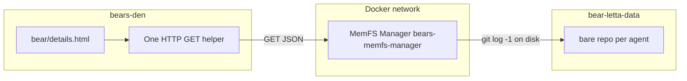

# Bear private memory (MemFS Manager head) — overview UI

The human-readable service name is **MemFS Manager**. The Docker service stays `bears-memfs-manager`, with default URL `http://bears-memfs-manager:8285`.

## Architecture choice (MemFS Manager + local `git`, not Letta or codepool)

- **Use MemFS Manager** (compose `bears-memfs-manager`, [`services/api/`](services/api/)): it already owns `MEMFS_BASE` / `find_or_create_repo` and the same paths Letta serves over smart-HTTP.
- **Run `git` in that service** against the **bare** `repo.git` path. No new dependencies; the process already shells out to `git http-backend`.
- **Do not** route this through the Letta server: `/v1/git/*` is the **smart-HTTP** pack protocol, not a stable way to get `log` / `ls-tree` without implementing a full git client in Den.
- **Do not** use **codepool** for reads: its `~/.letta` tree is a **client mirror** for the harness, not the canonical server volume, and it is not required to be colocated with data.

**Optional follow-up (not in this slice):** if you ever need file-level listing, the same **MemFS Manager** process can add `ls-tree` + per-path metadata using local `git` only.

### Simplifications (same functionality)

| Heavier shape | Lighter shape |
|---------------|---------------|
| New `MemfsManagementClient` + `Option<Arc<...>>` in `AppState` | Reuse **existing** `reqwest::Client` from [`LettaClient`](services/den/src/core/letta/client.rs) (add a small `http_client()` if missing) and a **single** `async fn fetch_memfs_head(...)` in a small module (e.g. `memfs_manager_head.rs`) or co-located with the bear page — **no** extra Arc in app state. |
| Second env var `MEMFS_MANAGEMENT_BASE_URL` | **Only** `LETTA_MEMFS_SERVICE_URL` (already used for Letta ↔ MemFS Manager); append fixed path in code, e.g. `/v1/management/agents/{id}/head`. |
| `MEMFS_MANAGEMENT_TOKEN` on v1 | **Omit** until you need auth beyond Docker private network; add later with no API shape change. |
| Bearer + Den-side token plumbing | Dropped for v1. |

## MemFS Manager: management API (MVP = latest commit only)

- **New path namespace** (does not conflict with existing `/git/{agent_id}/state.git/...` or `/health`), e.g. `GET /v1/management/agents/{agent_id}/head`.
- **Query / headers:** support `X-Organization-Id` (default `org-default`, same as today) to resolve `.../{org_id}/{agent_id}/repo.git`.
- **Response (JSON):** e.g. `{ "commit": "<sha>", "date": "<iso8601 or raw git>", "message": "<subject or full>", "ref": "main" }` — parse from `git -C <bare> log -1 --format=...` on the default branch (or `HEAD` if defined for bare).

**Read-only, no seed-on-GET:** the current `find_or_create_repo` in [`services/api/`](services/api/) **creates** a seeded repo when missing. For management reads, add a **resolve-only** helper that returns `None` if no usable bare repo exists, and return **404** with a small JSON error — avoid creating repositories when an operator opens bear details.

**Auth:** for v1, same as today — MemFS Manager is internal. Optional bearer can be a later hardening step.

**Tests:** at minimum document manual `curl` for `/health` and the new route; add Python tests only if quick.

## Den: config, fetch, page

- **Config** ([`services/den/src/config.rs`](services/den/src/config.rs)): optional `letta_memfs_service_url` (or reuse existing name used by preflight) — **same** variable the stack already has; default host after rename is `http://bears-memfs-manager:8285`, nothing new to invent as long as Den reads that env. When empty, skip the call (UI shows “not configured”).
- **HTTP:** add `fetch_memfs_head` / `MemfsHead` (Rust `PascalCase` for types, `snake_case` for fns) in one file under [`services/den/src/core/`](services/den/src/core/) plus a serde row for JSON; wire `http` from [`LettaClient`](services/den/src/core/letta/client.rs) (expose `&reqwest::Client` with a one-line getter if it is not public today).
- **No** new `AppState` field: pass `&state.letta` into the fetch or call a helper on `AppState` that uses `self.letta.http_client()`.
- **Wire in** [`render_bear_details_page`](services/den/src/web/bear_management.rs): if Letta is enabled, `agent_id` present, and `letta_memfs_service_url` set, `await` head (soft failure to `memfs_error` string). Pass `memfs_head` / `memfs_error` / `memfs_skipped` as needed.
- **UI** ([`services/den/src/web/templates/bear/details.html`](services/den/src/web/templates/bear/details.html)): new subsection **"Private memory (git)"** or under the existing **Memory** card:
  - If URL not configured: short hint (same pattern as "Letta is not configured").
  - If error: one line error.
  - If 404 / no data: "No repository yet" (Letta on-disk `memfs` path never seeded for this agent—optional link to deploy docs).
  - If success: show **commit sha (short)**, **date**, **message** only — **no** file names, no blob content (per your MVP).

## Compose and docs

- **[`docker-compose.yaml`](docker-compose.yaml):** on **`bears-den`**, set `LETTA_MEMFS_SERVICE_URL=http://bears-memfs-manager:8285` (same as preflight / Letta / MemFS Manager — one variable for the whole stack).
- **[`services/den/.env.example`](services/den/.env.example)** / deploy docs: document that **Den** can read `LETTA_MEMFS_SERVICE_URL` for this readout; feature is **optional** if unset.
- **[`services/den/src/web/ROUTES.md`](services/den/src/web/ROUTES.md):** no new route; bear details only.

## Explicitly out of scope (later iteration)

- Listing **all files** with **size** and **per-file last change** (requires `git ls-tree -l` and possibly `git log -1 -- <path>` per file or a single `log` with name-status — heavier response and UI).
- Exposing **file content** in Den.
