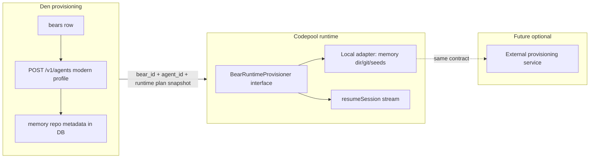

# Modern Letta agents + codepool memfs invariants

## Current state

- **Provisioning** lives in [`den/src/core/bears/provision.rs`](den/src/core/bears/provision.rs): after a `bears` row exists, [`LettaClient::create_agent`](den/src/core/letta/client.rs) sends only `name`, `system`, `model`, `agent_type`, `tool_ids`. It does **not** set `include_base_tools` / memfs-related flags documented on [Create agent](https://docs.letta.com/api-reference/agents/create).
- **Sync** ([`den/src/core/bears/sync.rs`](den/src/core/bears/sync.rs)) calls [`patch_agent`](den/src/core/letta/client.rs) with the same minimal field set, then `recompile_agent`.
- **Chat** goes Den → [`CodePoolClient::post_conversation_messages_streaming`](den/src/core/codepool/client.rs) → codepool [`ConversationSessionPool::streamUserMessage`](codepool/src/pool.ts) → `@letta-ai/letta-code-sdk` `resumeSession`. There is **no** per-bear working directory or git step today.

## Target behavior (aligned with your guidance)

### Provision-time concerns (multi-track architecture)

Split **control-plane** work (Letta API, persisted in Den) from **runtime workspace** work (filesystem, git, seeds, SDK env) so more provision-time steps can be added without tangling chat code.

| Concern | Typical owner today | Notes |
|--------|---------------------|--------|
| Agent identity + model + `agent_type` | Den (`provision` / `sync`) | Already centralized |
| Tool attachment + legacy filtering | Den + `LettaClient` | `tool_ids`, `include_base_tools`; may grow (e.g. tool rules) |
| Memfs / Letta server flags | Den | API fields on create/patch |
| Per-bear workspace on disk | Codepool via **provisioner abstraction** | Extractable to another service later |
| Future: MCP / secrets / non-Letta tool config | TBD | Model as additional **plan fields** + optional future `ToolingProvisioner` or extra steps—not buried in `pool.ts` |

Den remains the **source of truth** for policy; the chat/codepool path receives a **snapshot** (`BearRuntimePlan` or equivalent) so a future provisioning service can be fed the same JSON Den would send.

### 1) Letta API: “`letta --new-agent` + `--memfs`” parity

- **Confirm fields against the deployed Letta image** (`letta/letta:latest` in [`docker-compose.yaml`](docker-compose.yaml)): the public Create agent docs include `include_base_tools` and `include_base_tool_rules`; memfs may appear under a different name or a newer field—verify with your server version (inspect OpenAPI or a test `POST` in staging) before hard-coding.
- **Extend** [`LettaClient::create_agent`](den/src/core/letta/client.rs) and [`patch_agent`](den/src/core/letta/client.rs) to send, at minimum:
  - `include_base_tools: false` so Letta does **not** auto-attach “core memory” tools (per API text: core_memory-related functions).
  - Explicit `tool_ids` built from Den’s selected tools **after** filtering out legacy tools by **tool name** from `GET /v1/tools/` (parser already has `name` → [`LettaToolOption::label`](den/src/core/letta/client.rs)).
- **Legacy tool names to exclude** (by exact or normalized match on Letta’s `name`): `memory_apply_patch`, `core_memory_append`, `core_memory_replace` (extend list if your Letta build exposes variants).
- **Default agent profile**: stop relying on empty `agent_type` + implicit base tools. Pick a single default in forms ([`LETTA_AGENT_TYPE_ROWS`](den/src/web/bear_create_support.rs)) that matches what Letta Code uses for modern agents once verified (likely `letta_v1_agent` or server default **with** explicit tool list—confirm in staging).
- **Apply the same policy** in `sync_bear_to_letta` so edits do not reintroduce legacy tools.

Optional follow-up (if product needs it): store `include_base_tools` / memfs flags in the DB for drift ([`compute_letta_drift`](den/src/core/bears/letta_drift.rs))—only if Letta returns them on `GET /v1/agents/{id}` in a stable way.

### 2) Den: memory repo metadata + “runtime config”

- Add **narrow** columns or a small JSON blob on `bears` for what codepool needs (exact shape after you decide repo strategy), e.g.:
  - Git remote URL (if clones are from a remote), default branch/ref, or “local-only” flag.
  - Optional seed manifest version / template id.
- In **`provision_bear_if_configured`**: create Letta agent first, then persist memory-repo fields (even if “unconfigured” defaults). Keep ordering deterministic: DB row → Letta agent id → memory metadata.

### 3) Codepool: abstract provisioning, then local memory implementation

You selected **codepool-side volume** semantics for the first implementation, but memory init must be **extractable** into a separate provisioning service later.

**3a) Interface (stable boundary)**

Introduce a small **`BearRuntimeProvisioner`** (name indicative; adjust to taste) in its own module tree—**not** inlined in [`pool.ts`](codepool/src/pool.ts):

- **Input**: `RuntimeProvisioningContext` (e.g. `bearId`, `agentId`, `conversationId` if needed) + **`BearRuntimePlan`**—a versioned, JSON-serializable snapshot from Den (memory root suffix policy, optional git remote/ref, seed template id, future hooks). Same shape can later be POSTed to an external service.
- **Output**: `EnsureResult` with everything the session needs: resolved **`memoryDir`**, optional **`cwd`** for the SDK, **`env`** overrides (or a single `process.env` patch object), and opaque **`metadata`** for logging.
- **Contract**: `ensure(ctx, plan): Promise<EnsureResult>`; failures throw or return structured errors—no partial session.

[`ConversationSessionPool`](codepool/src/pool.ts) (and the HTTP handler) depend **only** on this interface (constructor injection or factory from [`server.ts`](codepool/src/server.ts)). **No** direct `fs` / `git` imports in `pool.ts`.

**3b) Default adapter: local filesystem memory workspace**

Implement **`LocalFilesystemMemoryProvisioner`** (or similar) in e.g. [`codepool/src/provisioning/local-memory.ts`](codepool/src/provisioning/local-memory.ts) that performs today’s concrete steps:

- **Path**: e.g. `${BEAR_MEMORY_ROOT}/${bear_id}/`. Expose `BEAR_MEMORY_ROOT` in deploy docs / [`docker-compose.yaml`](docker-compose.yaml) with a **named volume** or bind mount.
- **`ensure_memory_dir`**: create dir, verify writable.
- **`ensure_memory_repo`**: `git init` or `git clone` from plan; verify valid worktree (`git rev-parse`); define behavior when remote is empty.
- **`ensure_memory_seed_files`**: copy seeds per Letta Code / SDK layout (confirm subdirectory for `@letta-ai/letta-code-sdk@0.1.14`).
- Map result to `EnsureResult.cwd` / `env` for `resumeSession`.

**3c) Future extraction**

- Add env e.g. `BEAR_RUNTIME_PROVISIONER=local` (default) vs `http`—second mode uses an HTTP client with the **same** request/response types, calling a separate service that runs the same logic (or extended logic). Codepool’s pool and routes stay unchanged.
- Keep **types** in a dedicated package or folder (`codepool/src/provisioning/types.ts`) so they can be published or duplicated trivially for the external service.

**3d) Other provision-time concerns (tools, etc.)**

- **Tool configuration** stays primarily on the **Den / Letta** path (`tool_ids`, PATCH agent, future `tool_rules`). When runtime needs tool-related env (e.g. API keys for custom tools), add optional fields to `BearRuntimePlan` and handle them either in the same provisioner (if env must be set before SDK start) or in a **second** pluggable step with the same pattern—avoid special-casing in the pool.
- Document extension: new concerns = new plan fields + optional new adapter or additional method on the provisioner interface only if the contract stays one place.

### 4) Den → codepool request contract

- Extend [`CodePoolClient::post_conversation_messages_streaming`](den/src/core/codepool/client.rs) and the handler in [`den/src/web/v1/mod.rs`](den/src/web/v1/mod.rs) to pass **`bear_id`** and a **`BearRuntimePlan`** snapshot (memory + future fields) in the JSON body—same payload shape a future standalone provisioner could accept.
- Update codepool [`server.ts`](codepool/src/server.ts) route for `POST /v1/conversations/:id/messages` to parse the body, call **`provisioner.ensure(...)`**, then pass `EnsureResult` into the pool / session factory (not raw paths).

### 5) Invariants and failure modes

- If any ensure step fails: return **5xx with a clear error** (do not open a half-broken session). Log `bear_id`, `agent_id`, and path.
- Add a lightweight **readiness** check: optional `GET` on codepool (or extend `/health`) that verifies `BEAR_MEMORY_ROOT` exists and is writable.

### 6) Rollout

- **New bears**: get the modern profile automatically at provision time.
- **Existing bears**: one-time admin/ops path—`sync_bear_to_letta` with new PATCH body, or a small migration script that PATCHes each agent—plus a **one-time** filesystem bootstrap for existing `bear_id`s on the codepool volume.

## Files likely touched

| Area | Files |
|------|--------|
| Letta HTTP | [`den/src/core/letta/client.rs`](den/src/core/letta/client.rs) |
| Provision/sync | [`den/src/core/bears/provision.rs`](den/src/core/bears/provision.rs), [`den/src/core/bears/sync.rs`](den/src/core/bears/sync.rs) |
| Tool filtering | New small helper (e.g. `den/src/core/letta/tool_policy.rs`) + call sites |
| DB | New migration under [`den/migrations/`](den/migrations/) |
| Codepool | [`codepool/src/pool.ts`](codepool/src/pool.ts), [`codepool/src/server.ts`](codepool/src/server.ts), [`codepool/src/provisioning/types.ts`](codepool/src/provisioning/types.ts), [`codepool/src/provisioning/local-memory.ts`](codepool/src/provisioning/local-memory.ts), [`codepool/src/provisioning/index.ts`](codepool/src/provisioning/index.ts) (wire default provisioner) |
| Den API | [`den/src/core/codepool/client.rs`](den/src/core/codepool/client.rs), [`den/src/web/v1/mod.rs`](den/src/web/v1/mod.rs) |
| Deploy | [`docker-compose.yaml`](docker-compose.yaml), [`codepool/COOLIFY_DEPLOY.md`](codepool/COOLIFY_DEPLOY.md) |

## Risk / verification

- **Letta version skew**: memfs flags must match your server; verify with a staging agent before enforcing in production.
- **SDK cwd requirements**: wrong working directory will make memfs seeds invisible to the agent even if files exist on disk.
- **Security**: if `memory_repo` uses credentials, store via existing secrets patterns (not in `bears` plaintext unless operator-approved).
