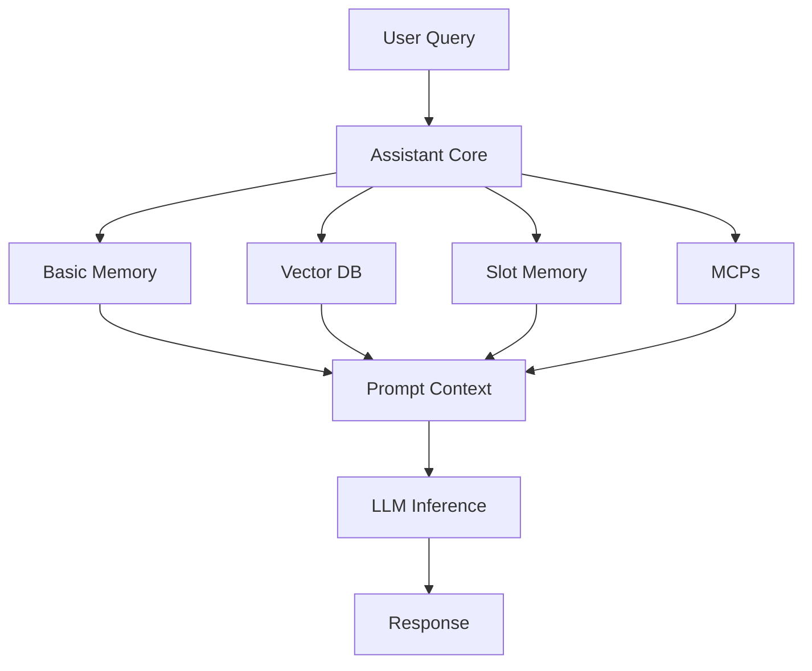
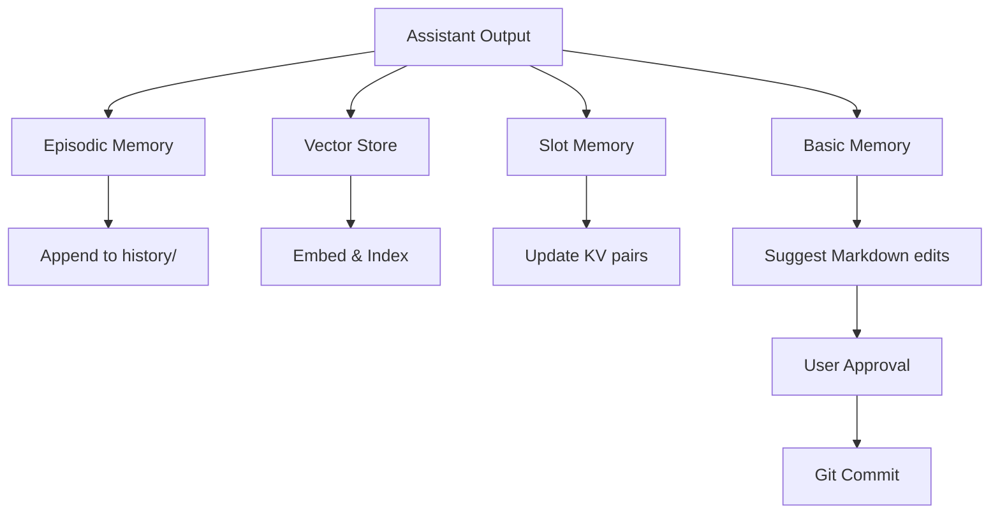

# Memory Architecture Specification

> **Update:** Shared knowledge is **Cabinet (Outline)** via **Den**. **Letta memory** (blocks, conversations) is separate. See repo [`docs/planning/PLAN.md`](../../docs/planning/PLAN.md).

## Overview

Each **bear** (Letta agent) reasons over:

- **Letta native memory** (blocks, conversation state, built-in tools)  
- **Cabinet** (Outline) — shared knowledge, human-editable UI, **bear** tools via Den  
- **Large corpora** (RAG, MCPs) as needed

---

## Memory System Components

### 1. Basic Memory (Symbolic/Curated)

**Purpose**: Human-editable long-term facts, preferences, relationships, and procedural knowledge

**Implementation**:
- Format: Markdown with optional YAML frontmatter
- Storage: Git-tracked repository (local or remote)
- Location: `memories/` directory with `personal/` and `shared/` subdirectories
- Access: Direct file reads, Git-versioned edits

**Structure**:
```
memories/
├── personal/
│   ├── shannon/
│   │   ├── preferences.md
│   │   ├── skills.md
│   │   └── goals.md
│   └── you/
│       ├── preferences.md
│       └── projects.md
└── shared/
    ├── household.md
    ├── relationships.md
    └── events.md
```

**Example Content**:
```markdown
---
user: shannon
category: preferences
updated: 2025-10-05
---

## Personal Preferences
- Name: Shannon
- Preferred editor: Obsidian
- Communication style: Direct, technical

## Life Events
- 2025-08: Moved to Amsterdam
- 2025-09: Started new project on agentic systems
```

**Operations**:
- Read: Load relevant files based on user context and query
- Write: **Bear** (assistant) suggests edits → user approves → Git commit
- Search: Full-text search across Markdown files
- Version: Git history tracks all changes with timestamps

---

### 2. Semantic Memory (Vector Store)

**Purpose**: Dense vector retrieval over large text corpora for semantic search

**Implementation**:
- Tool: Qdrant (primary), Weaviate, or Pinecone (alternatives)
- Embedding Model: Configurable via Letta/OpenAI (or route embeddings through Bifrost if you extend `services/bifrost/config.json`)
- Chunk Size: 512-1024 tokens with 128-token overlap
- Metadata: Source, timestamp, user, tags

**Indexed Sources**:
- Chunked and embedded versions of:
  - Email archives (Maildir format)
  - Chat logs (JSONL)
  - Bookmarked pages (full text extraction)
  - Journal entries
  - Meeting transcripts
  - Code documentation

**Storage Structure**:
```
Collection: bears_memory
├── Vectors: Dense embeddings (768 or 1536 dimensions)
├── Metadata:
│   ├── source: "email" | "chat" | "bookmark" | "journal"
│   ├── user: "shannon" | "you" | "shared"
│   ├── timestamp: ISO 8601
│   ├── tags: ["travel", "work", "health"]
│   └── content_hash: SHA256
└── Payload: Original text chunk
```

**Query Flow**:
```
User Query → Embed Query → Vector Search (top-k=10) → Rerank → Context Injection
```

**Operations**:
- Index: Batch embed and upsert documents
- Search: Semantic similarity search with metadata filters
- Update: Re-embed on content changes
- Prune: Remove outdated or low-relevance vectors

---

### 3. Slot Memory (Key-Value Store)

**Purpose**: Fast access to structured metadata and frequently accessed values

**Implementation**:
- Format: JSON document store or Redis-compatible KV store
- Scope: Per-user and shared slots
- Persistence: Named Docker volume

**Schema**:
```json
{
  "user.shannon.name": "Shannon",
  "user.shannon.city": "Amsterdam",
  "user.shannon.timezone": "Europe/Amsterdam",
  "user.you.name": "Hans",
  "shared.household.location": "Amsterdam",
  "agent.current_project": "bears-stack",
  "agent.current_goal": "Initialize memory system",
  "agent.last_interaction": "2025-10-05T16:51:00Z"
}
```

**Access Patterns**:
- Read: O(1) lookup by key
- Write: Atomic updates with optional TTL
- List: Prefix scan for related keys
- Watch: Subscribe to key changes (optional)

**Use Cases**:
- User profile data (name, preferences, location)
- **Bear** state (current goal, active project)
- Session context (last interaction, conversation state)
- Feature flags and configuration

---

### 4. Episodic Memory

**Purpose**: Chronological logs of interactions, thoughts, and events for timeline reconstruction

**Implementation**:
- Format: Structured JSON or Markdown logs
- Storage: `history/` directory, Git-versioned
- Indexing: Optional vector embeddings for semantic search over episodes

**Structure**:
```
history/
├── 2025/
│   ├── 10/
│   │   ├── 2025-10-05-session-001.md
│   │   └── 2025-10-05-session-002.json
│   └── 09/
└── index.json  # Metadata index for fast lookups
```

**Episode Schema** (JSON):
```json
{
  "session_id": "2025-10-05-session-001",
  "timestamp": "2025-10-05T16:51:00Z",
  "user": "shannon",
  "project": "bears-stack",
  "interactions": [
    {
      "role": "user",
      "content": "Initialize the project brief",
      "timestamp": "2025-10-05T16:41:00Z"
    },
    {
      "role": "assistant",
      "content": "I'll help you initialize the project brief...",
      "timestamp": "2025-10-05T16:41:05Z",
      "tools_used": ["read_file", "write_to_file"]
    }
  ],
  "summary": "Initialized BEARS Stack project brief",
  "tags": ["setup", "documentation"]
}
```

**Operations**:
- Append: Add new interactions to current session
- Query: Search by date range, user, project, or tags
- Summarize: **Bear**-generated summaries of sessions
- Promote: Extract key facts to Basic Memory

---

### 5. Modular Content Providers (MCPs)

**Purpose**: Queryable interfaces to large external data sources

**Architecture**: Each MCP is a microservice with a standard query API

**Supported Sources**:

| Source    | Format        | Storage           | Query Interface                              |
|-----------|---------------|-------------------|----------------------------------------------|
| Emails    | Maildir/IMAP  | File system/API   | `email.search("from:shannon travel")`        |
| Bookmarks | JSON/SQLite   | Database          | `bookmarks.tagged("design")`                 |
| Chat Logs | JSONL         | File system       | `chats.with("mom", before="2012")`           |
| Calendar  | ICS/CalDAV    | File system/API   | `calendar.events_between("2024-01", "2024-03")` |
| Notes     | Markdown      | File system       | `notes.search("amsterdam", tag="travel")`    |

**MCP Interface** (REST API):
```
POST /mcp/{source}/query
{
  "query": "from:shannon travel",
  "filters": {
    "date_range": ["2024-01-01", "2024-12-31"],
    "tags": ["travel"]
  },
  "limit": 10
}

Response:
{
  "results": [...],
  "total": 42,
  "next_cursor": "..."
}
```

**Integration**:
- MCPs can be queried directly by **bears** via tool calls
- MCP results can be embedded and indexed into vector store
- **Bears** can summarize MCP data and promote to Basic Memory

---

## Memory Interaction Flows

### Inference-Time Read (Query Processing)



**Process**:
1. User submits query with context (user ID, project)
2. Load relevant Basic Memory files (personal + shared)
3. Perform semantic search in Vector DB (top-k=10)
4. Fetch relevant slots (user profile, **bear** state)
5. Optionally query MCPs for additional context
6. Assemble context and inject into LLM prompt
7. Generate response

### Post-Interaction Write (Memory Updates)



**Process**:
1. Log interaction to Episodic Memory (JSON/Markdown)
2. Extract key facts and embed into Vector Store
3. Update Slot Memory (agent state, session context)
4. Generate suggested edits to Basic Memory
5. Present suggestions to user for approval
6. On approval, commit changes to Git

---

## Sync and Distillation Patterns

### Memory Promotion

**Goal**: Move important information from ephemeral to permanent memory

**Flow**:
1. **Bear** identifies significant facts in conversation
2. Suggests promotion to Basic Memory with proposed location
3. User reviews and approves/edits
4. Commit to Git with descriptive message

**Example**:
```
Episodic: "Shannon mentioned preferring async communication"
         ↓
Suggested: Add to memories/personal/shannon/preferences.md
         ↓
User Approval
         ↓
Git Commit: "Add Shannon's communication preference"
```

### Re-embedding on Edit

**Trigger**: Git commit to `memories/` directory

**Process**:
1. Detect changed files via Git hooks
2. Extract modified chunks
3. Re-embed with updated content
4. Update vector store with new embeddings
5. Preserve metadata (source, timestamp)

### Conflict Resolution

**Scenario**: Multiple sources provide conflicting information

**Strategy**:
1. Flag conflicts for user review
2. Present sources with timestamps
3. User selects authoritative source
4. Update Basic Memory and re-embed

**Example**:
```
Conflict Detected:
- Basic Memory: "Shannon lives in Amsterdam" (2025-08-01)
- Email: "Moving to Berlin next month" (2025-09-15)

Action: Flag for user review
```

### Metadata Tagging

**Purpose**: Enable thematic indexing and retrieval

**Implementation**:
- YAML frontmatter in Markdown files
- Tags in vector store metadata
- Hierarchical tag structure

**Example Tags**:
```yaml
tags:
  - travel
  - travel/europe
  - travel/amsterdam
  - health
  - work/project/bears-stack
```

---

## Implementation Details

### Stack sketch (conceptual)

```yaml
# See bears-depoy: Bifrost, Letta, Open WebUI; Den + Outline for Cabinet (PLAN.md)
services:
  bifrost: { ... }
  letta: { depends_on: [bifrost] }
  # outline:, den: per deployment
```

### Cabinet (Outline)

Shared docs and search—humans edit in Outline; **bears** via Den Cabinet tools.

---

## Future Enhancements

### Phase 1 (Current)
- Letta per‑**bear** memory blocks + conversations
- Cabinet (Outline) for shared knowledge (via Den when deployed)

### Phase 2 (Next)
- **Bear**-based summarizers for MCP data
- Memory promotion UI for human approval
- Time-aware vector embeddings with temporal decay
- Conflict detection and resolution workflows

### Phase 3 (Future)
- Web interface to browse and edit memory
- Multi-modal memory (images, audio)
- Federated memory across devices
- Privacy-preserving memory sharing

---

## Related Documentation

- [`project_brief.md`](project_brief.md) - Overall project goals and scope
- [`README.md`](README.md) - Memory bank overview  
- Repo [`docs/planning/PLAN.md`](../../docs/planning/PLAN.md) — **bear** terminology, Den provisioning, users↔bears
- Docker Compose configuration: `../docker-compose.yaml`
- Bifrost configuration: `services/bifrost/config.json` (repo root)