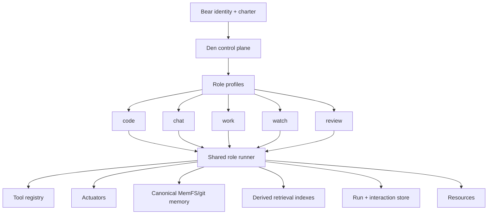

# Letta Migration Plan

## Purpose

This document proposes a phased migration path for BEARS to move off the deprecated Letta API server and Letta Code dependencies while preserving current behavior, minimizing operational risk, and keeping migration reversible where possible.

It is based on the dependency inventory in [`../architecture/letta-dependency-matrix.md`](../architecture/letta-dependency-matrix.md) and uses the terminology from [`../decisions/adr-0024-terminology-actuators-resources-and-role-names.md`](../decisions/adr-0024-terminology-actuators-resources-and-role-names.md).

## Terminology note

This plan uses the current canonical role names:

| Legacy name | Canonical name |
|---|---|
| `pair` | `code` |
| `chat` | `chat` |
| `review` | `review` |
| `work` | `work` |
| `watch` | `watch` |

Existing code, data, migrations, and compatibility shims may still use legacy names during the transition. New architecture and product language should prefer the canonical names.

Other terminology used in this plan:

- **Bear runtime**: the Den-owned runtime model for one durable Bear identity.
- **Role**: a named responsibility profile within a Bear runtime.
- **Role profile** or **role descriptor**: durable Den-owned configuration for a role, including model policy, prompt contract, tools, memory scope, resource policy, autonomy policy, and audit behavior.
- **Role run context**: ephemeral execution state for one role invocation, turn, task, workflow step, or session continuation.
- **Actuator**: an execution surface that can act for a role, such as the ACP-connected coding environment that exposes file, process, terminal, browser, and related capabilities.
- **Resource**: the canonical target a role is acting on, reasoning over, planning around, or organizing memory around, such as a repository, service, subsystem, conversation, artifact set, or external system boundary.
- **Provider binding**: an implementation-level reference to an external provider object, kept at provider boundaries rather than treated as core Bear identity.

## Executive summary

BEARS should not treat this migration as a simple vector-store replacement, nor as a migration from Letta agents to a different set of provider-managed agents.

It also should not overcorrect into building a large, permanent, generalized runtime-provider platform if the real destination is clear.

The target architecture is a **Den-native multi-role Bear runtime**:

> A Bear is one durable identity with a charter. Roles such as `code`, `chat`, `work`, `watch`, and `review` are Den-owned profiles and execution contexts. They define memory access, tools, actuators, resources, autonomy, model policy, and audit behavior. They are not distinct provider-managed agents.

The long-term destination should be understood as:

- **Den-native runtime** as the durable target architecture
- **Letta compatibility boundaries/adapters** as temporary migration scaffolding
- **no commitment** to a broad long-term ecosystem of symmetric runtime providers unless a real future need emerges

The current repository depends on Letta primarily for:

1. **runtime execution and conversation/run lifecycle**
2. **provider-managed role identity and configuration sync**
3. **Codepool-backed Letta Code harness behavior for `chat` and `work`**
4. **conversation/admin read models and diagnostics**
5. **some storage, git, and retrieval/index assumptions around Letta APIs and archives**

Canonical Bear memory already appears to live primarily in MemFS/git role branches and `core/`, which is an advantage. The recommended migration strategy is therefore:

1. **contain** Letta behind explicit provider boundaries
2. **move persistence ownership** for interactions, runs, approvals, and diagnostics into Den
3. **extract the shared Den-native role runner from the `code`/ACP path** rather than treating `code` as a late one-off migration
4. **migrate roles by execution mode and risk surface**, not by old Letta runtime family
5. **replace provisioning/registry semantics** with Den-owned role profiles, role run contexts, and provider bindings
6. **replace Letta Code / Codepool dependencies** for `chat` and `work`
7. **replace Letta Archives and git/storage assumptions** with BEARS-owned retrieval and MemFS flows

## Migration goals

### Primary goals

- Remove operational dependency on the Letta API server and Letta Code harnesses.
- Preserve BEARS role semantics and current user-visible behavior.
- Preserve the single-Bear, multi-role mental model rather than introducing new provider-managed agent identities.
- Keep canonical memory in BEARS-owned systems.
- Maintain `code`/ACP actuator safety, approval, cancellation, and concurrency semantics.
- Preserve or improve observability and debuggability.

### Secondary goals

- Make role runtime behavior explicit and testable.
- Reduce hidden state and cross-service coupling.
- Enable Qdrant or another owned retrieval layer without entangling it with runtime state.
- Allow per-role migration by execution mode and risk surface rather than all-at-once cutover.
- Improve operator-facing terminology by replacing legacy agent/provisioning language with role profile, role run, actuator, resource, and provider binding language.

### Non-goals

These should **not** be treated as first-order migration goals for phase 1:

- replacing every Letta-adjacent concept with Qdrant
- redesigning all BEARS role semantics
- reworking MemFS branch policy from scratch
- fully unifying `code`/`chat`/`review`/`work`/`watch` execution behavior at the start
- renaming every legacy code symbol and persisted enum value in one hard cutover

## Steering principle for implementation

The migration should build only enough abstraction to:

- contain Letta-specific behavior so it stops spreading
- make coexistence and rollback explicit during migration
- allow Den-native runtime pieces to replace Letta incrementally
- avoid re-encoding provider-managed identity as the conceptual core of the system

The migration should **not** assume a need for a large, permanent, generalized runtime-provider framework unless a concrete post-Letta requirement justifies it.

In practice, the preferred framing is:

- **Den-native runtime** as the destination
- **Letta compatibility path** as transitional infrastructure
- **migration seams** where needed, rather than symmetric long-term provider architecture

## Core migration principles

### 1. Roles are not provider-managed agents

The migration should make this explicit in docs, UI, APIs, and schemas:

- A Bear is the durable assistant identity.
- Roles are Den-owned profiles and policy boundaries.
- Role run contexts are ephemeral execution state.
- Provider bindings are implementation details, not core domain identity.

This is the main conceptual migration away from Letta-era architecture. It prevents the system from replacing `letta_agent_id` with another provider-shaped identity that would recreate the same coupling.

### 2. Separate runtime from memory from retrieval

These concerns should be explicitly different in the target architecture:

- **runtime**: model loop, tools, actuators, approvals, streaming, cancellation, run state
- **memory**: canonical role/core durable state in MemFS/git
- **retrieval**: derived embeddings/indexes over canonical sources and resources

Letta currently spans parts of all three. The migration should split them cleanly.

### 3. Den should own the control plane

Den already appears to be the best place to own:

- Bear registry and role profiles
- role run and session policy state
- approvals
- work planning and workflow state
- interaction metadata
- auditability
- resource orientation
- memory governance and promotion flows

The migration should continue in that direction.

### 4. Migrate by execution mode and risk surface, not old runtime family

The old split was:

- **API-direct**: legacy `pair`, `review`, `watch`
- **harness-backed**: legacy `chat`, `work`

That split reflects Letta implementation history. The migration should instead reason about execution modes and risk surfaces:

- **interactive code collaboration**: `code`, through an ACP actuator
- **interactive conversation**: `chat`
- **background or semi-autonomous task execution**: `work`
- **event observation and monitoring**: `watch`
- **memory review, synthesis, and governance**: `review`

The `code` path should be treated as the reference implementation to extract from, because the future roles are expected to derive from the work already done there.

### 5. Prefer dual-write and compatibility periods over hard cutovers

Where feasible, migration should first add BEARS-owned data models and write to them alongside Letta-backed execution before switching reads and then switching execution.

Compatibility aliases may be required for legacy role names, persistent values, and external integrations. They should be explicit routing-boundary shims, not advertised model-facing terminology.

## Current-state assessment

### Canonical roles and legacy compatibility

The target role names are:

- `code` for legacy `pair`
- `chat` for legacy `chat`
- `review` for legacy `review`
- `work`
- `watch`

During migration, implementation code may need to accept both canonical and legacy values. New docs, UI labels, model-facing tool descriptions, and operator language should prefer the canonical names.

### API-direct-like roles

Canonical roles:

- `code` (legacy `pair`)
- `review` (legacy `review`)
- `watch`

Current behavior:

- Den uses Letta conversations and runs as execution substrate for parts of these roles.
- Den adds policy, tool mediation, and workflow control around that runtime.
- The `code` role, through the ACP actuator, has especially strong Letta-specific recovery, approval, cancellation, and continuation logic.
- The `code` path already contains important Den-owned patterns that should be generalized into the shared role runner.

### Harness-backed roles

Canonical roles:

- `chat` (legacy `chat`)
- `work`

Current behavior:

- Den uses Codepool as the runtime boundary.
- Codepool is currently configured as a Letta Code harness.
- Letta remains the real runtime dependency behind the harness.

### Memory

Current durable memory source of truth appears to be:

- MemFS/git role branches
- `core/` and role-local branches
- Den-managed memory tooling and governance

This is helpful because it means migration can focus first on runtime and state orchestration.

## Target architecture

The target is a Den-owned multi-role Bear runtime:

### Den-owned control plane

Den should own:

- Bear registry and role profiles
- role run/session metadata and event state
- run cancellation state
- approval state machines
- policy gating
- actuator grants and resource permissions
- workflow/plan state
- memory governance and promotion flows
- provider bindings as implementation details

### Runtime service(s)

The migration should explicitly leverage Den's existing optional-worker / selectively enabled service model. One Den binary can then expose different capability mixes by environment and migration phase without forcing hard deployment forks.

This should be understood as an operational deployment pattern, not evidence that Den needs a large permanent runtime-provider platform. The intended destination remains a Den-native runtime, with Letta retained only behind temporary compatibility seams during migration.

This is useful during migration because it allows:

- Letta-compatibility providers and Den-native runtime providers to coexist temporarily
- dual-write projectors and read-model workers to be enabled only where needed
- `watch` / `review` workers or scheduled loops to be enabled independently from interactive API surfaces
- migration/backfill jobs to run as opt-in worker capabilities rather than as one-off binaries
- low-risk rollback by disabling a worker or provider path without replacing the deployed artifact

A runtime implementation should own:

- model invocation
- streaming responses
- tool-call loop
- continuation after tool results
- approval pauses/resumes
- summarization/compaction
- role run lifecycle

The desired end state is a shared Den-native role runner. During migration, this may still involve:

- Den-native execution for roles that have already moved
- Codepool-next or equivalent for harness-style execution until `chat` and `work` are migrated
- temporary Letta provider bindings only at compatibility boundaries

### MemFS manager

MemFS manager should own:

- canonical git-backed role/core repositories
- resource-oriented memory and workspace organization
- role-scoped or run-scoped workspace views
- direct git operations previously routed through Letta

The old provider-owned view framing should migrate toward role/run/resource workspace view terminology.

### Retrieval/index layer

Qdrant or another owned system should own:

- derived semantic indexes over canonical sources
- retrieval APIs for context assembly
- optional interaction-summary retrieval later

Retrieval should stay behind descriptor-owned model-facing tools such as `memory_search`, rather than being baked into role logic.

## Migration scorecard and success metrics

Progress through the phases should be evaluated with explicit metrics rather than judgment alone. Exit criteria already describe what must be true architecturally; this section adds suggested operational measures.

### Cross-cutting success metrics

Suggested metrics to capture from phase 0 onward:

- **response latency parity**: p50/p95 end-to-end latency by role and execution mode compared to the Letta-backed baseline
- **stream continuity**: percentage of runs that stream first token/event successfully and percentage that complete streaming without truncation or duplicate segments
- **tool continuation correctness**: percentage of tool-call runs that successfully resume and complete after tool results are returned
- **approval round-trip correctness**: percentage of approval-gated runs that pause, resume, and complete without bypass or duplicate execution
- **cancellation correctness**: percentage of cancelled runs that stop producing model/tool side effects after cancellation is recorded
- **interaction projection consistency**: rate at which Den-owned interaction/read-model projections match Letta-backed source data during dual-write periods
- **session recovery success**: percentage of interrupted sessions that can be resumed or safely terminated according to policy
- **operator-debuggability**: percentage of production incidents where Den-owned logs and state are sufficient without querying Letta directly
- **role-level migration coverage**: percentage of traffic for each role running on the target runtime path

### Role-specific parity indicators

#### `code`

- first-token latency and full-turn latency under ACP
- tool request/response continuation success
- Ask / Plan / Write gate correctness
- pending approval correctness
- cancellation and active-turn cleanup correctness under concurrent load
- recovery rate for poisoned or interrupted sessions

#### `chat`

- turn latency and stream quality parity
- conversation title/archive/history consistency
- summarization/compaction correctness
- session continuity across reconnects or web reloads

#### `work`

- task completion rate
- policy-gated tool execution correctness
- background run recovery and retry behavior
- autonomy boundary compliance

#### `watch`

- event ingestion-to-output latency
- deduplication correctness
- observation persistence correctness
- alert/noise quality where applicable

#### `review`

- memory-read completeness across intended scopes
- governance/approval flow correctness
- promotion/review audit trail completeness
- synthesis quality against staging baselines

### Suggested rollout thresholds

Thresholds will vary by role, but the rollout policy should define target envelopes before cutover, for example:

- parity or better for p95 latency within an agreed tolerance
- no unresolved correctness regressions for approvals, cancellations, and tool continuation
- Den read models matching Letta-backed data above an agreed threshold during dual-write
- no sev-1/sev-2 migration incidents for a defined soak period before expanding traffic

## Compatibility and aliasing policy

Migration should make compatibility handling explicit instead of allowing aliases to spread through ad hoc conditional logic.

### Compatibility rules

1. **Canonical role names** in new docs, UI labels, model-facing descriptors, and new internal abstractions are:
   - `code`
   - `chat`
   - `work`
   - `watch`
   - `review`

2. **Accepted legacy aliases** during transition are:
   - `pair` → `code`
   - `chat` → `chat`
   - `review` → `review`

3. **Canonicalization should happen at routing and persistence boundaries** where legacy values may still arrive from existing clients, jobs, or stored data.

4. **Core runtime logic should operate on canonical role values** once inputs have been normalized.

5. **Provider-specific identifiers and legacy names should not be exposed as the conceptual source of truth** in new model-facing tools or operator-facing architecture docs.

### Suggested implementation guidance

- centralize alias resolution in one descriptor resolver or normalization layer
- avoid scattered `match` statements for legacy role aliases across the codebase
- add tests that verify accepted input aliases normalize to a single canonical role value
- annotate compatibility fields and branches with expected removal criteria

### Alias sunset criteria

Legacy aliases can be retired only when all of the following are true:

- no supported external client or persisted workflow still emits legacy role names
- migrated read/write paths canonicalize or backfill legacy data safely
- operator/admin workflows no longer depend on legacy labels
- migration telemetry shows no meaningful incoming legacy-name traffic for a defined period

## Historical data migration and backfill strategy

Dual-write alone is not enough. The migration also needs a deliberate plan for historical interaction and runtime data.

### Recommended principles

- preserve auditability over perfect one-time normalization
- prefer immutable import or projection of historical events where practical
- keep provenance indicating whether records originated in Letta, Den dual-write, or Den-native execution
- avoid blocking runtime migration on a perfect historical import if lazy-read compatibility is sufficient for older data

### Suggested historical data approach

1. **Recent and user-visible history**
   - prioritize backfill or projection for recent `chat` and `code` sessions that are likely to be viewed or resumed
   - preserve titles, archive state, run markers, tool events, and approval events where available

2. **Older or low-value history**
   - allow on-demand compatibility reads from Letta or imported archives during transition
   - backfill only summary/index metadata if full event import is too expensive initially

3. **ID mapping and provenance**
   - maintain mapping tables or provenance fields linking Den-owned entities to legacy Letta conversation/run/message identifiers
   - record import time, source system, and import version for audit/debug purposes

4. **Admin and diagnostics continuity**
   - ensure operators can still pivot from new Den identifiers to legacy provider identifiers while compatibility remains in place
   - keep replay/debug tools aware of mixed-origin histories during migration

### Questions to answer during implementation

- which Letta-backed records must be fully imported versus lazily read
- whether old tool-call payloads require normalization into the new schema
- how archived/deleted state should be represented when source semantics differ
- what minimum fidelity is required for compliance, audit, and incident response

## Testing and validation strategy

Migration risk is dominated by behavior mismatches, not only by compile-time integration errors. Validation should therefore include behavioral, concurrency, and failure-path testing.

### Test layers

#### 1. Unit and interface tests

- verify provider-neutral interfaces and adapters
- verify canonicalization of role names and provider bindings
- verify persistence schema serialization and event envelopes

#### 2. Contract tests

- provider-neutral role runner contract tests
- tool and actuator registry contract tests
- interaction/run store contract tests
- retrieval service contract tests

These should be runnable against both Letta-backed compatibility implementations and Den-native implementations where practical.

#### 3. Transcript and replay tests

- replay captured Letta-era sessions against the Den-native runner in staging
- compare tool-call ordering, pause/resume behavior, final status, and user-visible output envelopes
- keep golden traces for critical `code` ACP turns and representative `chat`, `review`, `watch`, and `work` flows

#### 4. Concurrency and load tests

Especially for `code` and `work`:

- simultaneous sessions per Bear
- tool execution overlap
- cancellation during tool wait
- cancellation during stream emission
- repeated resume attempts
- active-turn cleanup under contention

#### 5. Failure-injection and chaos tests

- dropped tool results
- delayed approval responses
- provider timeouts
- partial stream interruption
- persistence write failures during dual-write
- stale lock or stuck-run conditions

### Staging acceptance guidance

Before each production cutover step, staging should demonstrate:

- parity on representative transcripts
- no unresolved correctness failures for approvals/cancellation/tool continuation
- sufficient observability to debug discrepancies without ad hoc provider inspection

## Operational rollout and rollback controls

Migration should be designed for reversible rollout at multiple scopes.

### Recommended controls

- **feature flags** for major runtime paths and persistence readers/writers
- **optional worker/service enablement** so one Den binary can selectively run compatibility providers, native runtime workers, projectors, review/watch loops, or migration jobs by environment
- **per-role routing controls** to move roles independently
- **per-Bear allowlists** for early canarying
- **per-session fallback** where feasible for interactive surfaces
- **shadow mode** for write/read comparison without user-visible cutover
- **canary mode** with explicit percentage-based or allowlisted traffic expansion

### Rollout mechanics

For each cutover-capable phase, define:

- what traffic enters shadow mode
- what traffic is eligible for canary mode
- how rollback is triggered
- what telemetry dashboards are required
- who owns the go/no-go decision

### Suggested rollback triggers

Examples:

- approval state inconsistencies
- cancellation correctness failures
- repeated tool continuation failures
- Den/Letta projection divergence above threshold during dual-write
- severe latency regressions beyond agreed tolerance
- admin/debug read-path failures that block incident response

### Operational readiness artifacts

Before broad rollout, prepare:

- dashboards by role and execution mode
- alerts for correctness and latency regressions
- runbooks for provider fallback and traffic re-routing
- incident checklists for mixed-origin history issues
- support guidance for operators during compatibility periods

## Security and policy invariants

Certain guarantees must not regress during migration, even temporarily.

### Must-preserve invariants

- trusted human identity must come from Den/ACP authenticated state, not from chat text
- tool policy must remain server-authoritative
- approval-gated actions must not execute before approval is recorded
- resumed runs must re-check applicable policy state before continuing
- actuator permissions must remain scoped to approved resources and session policy
- cancellation must prevent further side effects after the authoritative cancellation point
- dual-write or replay paths must not cause duplicate tool execution or duplicate approval fulfillment
- model-facing tools must not gain broader memory/resource scope because of compatibility shortcuts

### Recommended verification approach

- encode invariants as integration tests where possible
- add runtime assertions and audit logs around approval/cancellation boundaries
- explicitly review any fallback path that bypasses the shared runner or Den persistence

## Likely end-state runtime topology

The migration plan allows for transitional hybrids, but the target picture should be explicit enough to guide implementation.

The important bias here is that the end state should look like **Den-native runtime plus temporary compatibility adapters retired over time**, not like a permanent federation of equal runtime providers.

More bluntly: phase 0 should not create a broad, symmetric, long-lived `provider` abstraction layer for runtime execution. Letta is something BEARS is removing, not a peer architecture that needs to be preserved conceptually. If a temporary seam uses provider-like language at a boundary, that seam should stay narrow, compatibility-scoped, and obviously transitional.

### Likely end state

- **Den owns the control plane** for Bear identity, role profiles, policy, approvals, workflow state, and interaction/run persistence.
- **A single Den binary may still expose different capability mixes by configuration**, for example API surfaces, web/admin surfaces, native runtime workers, compatibility providers, projection workers, and migration jobs. Optional-worker deployment should remain an operational pattern, but not the domain model itself.
- **A shared role-runner contract** defines model loop, tool loop, streaming, pause/resume, cancellation, and persistence hooks.
- **Transitional compatibility implementations may exist during migration**, but they should be treated as temporary adapters behind Den-owned contracts rather than as permanent peer runtimes that define the architecture.
- **Actuators** such as ACP remain explicit execution surfaces, not implicit properties of a provider runtime.
- **Codepool**, if retained, should either become a BEARS-native execution service behind the shared contracts or shrink into a compatibility adapter rather than a distinct conceptual runtime family.
- **MemFS/git and retrieval services** remain separate owned systems behind explicit interfaces.

### Architectural guardrails

- shared concepts should be Bear, role profile, role run, actuator, resource, compatibility binding where temporarily needed, and interaction/run store
- avoid new architecture that requires a role to be represented primarily as an external provider object
- avoid coupling retrieval/index implementation choices to runtime execution contracts

## Ownership, dependencies, and critical path

The plan will be easier to execute if workstreams and sequencing constraints are explicit.

### Likely workstreams

1. **abstraction and terminology workstream**
   - Den-native runtime contracts with narrow compatibility seams
   - canonical naming and alias handling
   - instrumentation

2. **Den persistence workstream**
   - interaction/run schema
   - dual-write paths
   - admin/UI read models

3. **shared role-runner workstream**
   - extraction from `code`
   - common event and tool protocol
   - approval/cancellation lifecycle

4. **role migration workstream**
   - `watch`
   - `review`
   - `code`
   - `chat` / `work`

5. **MemFS and retrieval workstream**
   - direct git APIs
   - retrieval/index replacement
   - invalidation hooks/jobs

6. **operations and retirement workstream**
   - rollout controls
   - dashboards/runbooks
   - infrastructure cleanup

### Critical path dependencies

At a high level:

- abstraction boundaries should land before broad migration work
- Den-owned persistence should begin before most runtime cutovers
- shared role-runner extraction should precede `watch`/`review`/`code` migration completion
- `chat`/`work` migration depends on decisions about Codepool evolution or replacement
- Letta retirement should wait until read paths, runtime paths, and historical access needs are satisfied

## Recommended internal abstractions

The first implementation step should be to define narrow migration seams that isolate Letta and avoid creating new provider-shaped agent identity. These seams should be judged by whether they help Den-native runtime replace Letta incrementally, not by how completely they generalize across hypothetical runtime providers.

In particular, prefer Den-native contracts such as role profile registry, role runner, interaction/run store, actuator registry, and retrieval service. If compatibility with Letta requires an adapter or binding record, keep that concern visibly in compatibility modules and persistence boundaries rather than elevating `provider` into the organizing concept of the target runtime.

### 1. Role profile registry

Responsibilities:

- create/update/delete Den-owned role profiles for a Bear
- persist role descriptor settings and policy hashes
- persist execution mode and temporary compatibility-binding references where needed during migration
- expose diagnostics and status
- compare desired role profile config with applied config

Suggested concepts:

- `role`: `code`, `chat`, `work`, `watch`, or `review`
- `role_profile_id`
- `execution_mode`: interactive, background, event, governance, harness, etc.
- `runtime_mode`: `den_native` as the target, with temporary compatibility values only where migration still requires them
- `compatibility_binding_ref`: opaque legacy/external reference, replacing generic reliance on `letta_agent_id`
- `config_hash`
- `policy_hash`
- `status`
- `last_reconciled_at`

### 2. Role runner

Responsibilities:

- start a role run or continue an existing session
- assemble prompt, resource, memory, and retrieval context
- stream events/tokens
- request and resume tool execution
- route actions through actuators when required
- track pending approvals
- cancel safely
- compact/summarize

The role runner should be shared by roles, with behavior specialized by role profile and execution mode.

### 3. Interaction and run store

Responsibilities:

- persist thread/session metadata where applicable
- persist message envelopes/events/tool calls/tool results/approvals
- persist role run lifecycle markers
- support title/archive/delete for conversational surfaces
- provide admin/UI read APIs
- support replay/debugging and migration fallback

This store should cover conversational and non-conversational roles. `conversation` can remain as a UI-facing or compatibility concept, but the core model should not assume every role run is a chat thread.

### 4. Tool and actuator registry

Responsibilities:

- store canonical BEARS tool descriptors
- resolve tool availability by role/profile/policy/resource
- resolve actuator capabilities and permissions
- avoid dependence on Letta-specific tool ids as the canonical source
- preserve model-facing provider names such as `session_info`, `memory_browse`, `memory_read`, `memory_search`, `memory_write_entry`, `web_fetch`, `web_search`, and `fs_edit_file`

### 5. Retrieval service

Responsibilities:

- index canonical sources and resources
- answer retrieval requests independent of runtime engine
- support replacement of Letta Archives without changing model-facing role tools

## Phased migration plan

## Phase 0 — preparation and containment

### Objective

Stop Letta from being an ambient assumption and confine it to explicit compatibility boundaries that can be removed as Den-native runtime ownership expands.

### Work items

1. Introduce explicit traits/interfaces for:
   - role profile registry
   - role runner
   - interaction and run store
   - tool and actuator registry
   - retrieval service

2. Refactor Letta integration behind those interfaces.

3. Replace direct Letta-centric naming in internal core logic where appropriate:
   - favor `compatibility_binding_ref` or another explicitly transitional compatibility term over `letta_agent_id` in generic paths
   - favor `role_profile_id` and `role_run_id` over provider-shaped role identity
   - keep legacy fields as compatibility shims until cutover
   - avoid introducing new permanent generic concepts such as `runtime_provider` unless a concrete non-Letta post-migration need exists

4. Add instrumentation around all Letta interactions:
   - endpoint called
   - role and execution mode
   - provider binding used
   - latency
   - failure mode
   - correlation ids / run ids

5. Add terminology compatibility guidance:
   - accept legacy role names at routing and persistence boundaries where needed
   - emit canonical role names in new docs, UI, and model-facing descriptors
   - avoid advertising legacy role names or provider-branded names to models

6. Define optional-worker/service-toggle rollout policy for migration components:
   - which capabilities can run in the same Den binary
   - which workers are safe to enable independently
   - which shared-state writers require singleton or idempotent behavior
   - which compatibility workers are temporary and how they will be retired

### Deliverables

- internal abstraction layer merged
- Letta becomes a contained compatibility implementation rather than ambient architecture
- improved observability for migration planning
- terminology compatibility path documented

### Exit criteria

- major call sites no longer directly depend on `LettaClient` semantics outside compatibility layers
- replacement implementation could be added without touching UI or role logic everywhere
- new docs and API surfaces avoid new generic agent/provisioning terminology

## Phase 1 — Den-owned interaction and run persistence

### Objective

Make Den the source of truth for interaction metadata and run tracking before changing execution.

### Work items

1. Add Den tables for:
   - interaction sessions or conversations
   - role context associations
   - messages/events
   - tool calls
   - tool results
   - approvals
   - runs
   - run cancellation state
   - resource references where applicable

2. Start dual-writing metadata during Letta-backed execution:
   - new sessions/conversations
   - titles
   - archived state
   - messages/events
   - run lifecycle markers
   - tool and approval events

3. Repoint admin/UI reads where possible to Den-owned data instead of Letta list/read endpoints.

4. Preserve compatibility providers for existing Letta-backed histories during transition.

### Deliverables

- Den-owned interaction read model
- Den-owned run ledger
- admin/UI less coupled to Letta

### Exit criteria

- UI can render recent `chat` and `code` interaction lists from Den
- Den can answer thread title/archive/delete state from its own store
- run and approval state is queryable without asking Letta first

### Rollback strategy

- continue reading Letta as fallback if Den projections are incomplete
- dual-write remains non-destructive

## Phase 2 — extract shared Den-native role runner from `code`

### Objective

Use the existing `code`/ACP path as the reference implementation for the shared Den-native role runner.

### Why `code` is the reference path

The `code` role already exercises the hardest runtime invariants:

- streaming interactive turns
- server-mediated tool calls
- actuator-mediated file/process/terminal/browser actions
- Ask / Plan / Write gating
- approval state
- continuation after tool execution
- cancellation and active-turn cleanup
- session identity from the ACP token
- workspace/resource context

The future roles should derive from these Den-owned mechanics instead of preserving old Letta runtime families.

### Work items

1. Document current `code`/ACP actuator invariants from implementation and tests.

2. Extract shared role-runner interfaces from the `code` path:
   - prompt/context assembly
   - event streaming
   - tool request/result protocol
   - approval state machine
   - cancellation semantics
   - run ids and request ids
   - persistence hooks

3. Implement a Den-native role runner capable of executing `code` canary sessions behind a feature flag.

4. Preserve compatibility with existing ACP behavior while moving logic behind Den-native role-runner interfaces and narrow Letta compatibility adapters.

5. Build parity tests for known Letta-era failure modes.

### Deliverables

- shared Den-native role-runner skeleton
- documented `code` actuator invariants
- canary-capable `code` execution path
- compatibility tests for streaming, approvals, tool continuations, and cancellation

### Exit criteria

- a `code` session can complete through the Den-native role runner in a controlled/canary environment
- the shared runner abstractions are usable by non-ACP roles
- existing ACP sessions remain stable on the compatibility path

### Rollback strategy

- maintain per-session or per-Bear provider fallback during rollout
- keep old Letta-backed execution path until Den-native parity is proven

## Phase 3 — migrate `watch` and `review` onto the shared role runner

### Objective

Prove the shared runner on lower-risk non-ACP execution modes before broad user-facing rollout.

### Why these roles next

`watch` and `review` are good early migrations because:

- `watch` is narrow and event-driven
- `review` exercises memory governance and synthesis without the full ACP actuator surface
- both are less directly user-interactive than `code` and `chat`
- both help validate memory, retrieval, workflow, and persistence behavior

### Work items

1. Implement `watch` execution on the shared runner:
   - event input ingestion
   - context retrieval from relevant resources and `core/`
   - model call
   - tool mediation
   - event/run persistence in Den

2. Implement `review` execution on the shared runner:
   - multi-branch read context assembly
   - narrow tool roster
   - review/approval/write flows
   - summarization and memory-promotion hooks

3. Replace Letta-dependent reflection, defragmentation, or observation logic with explicit Den-native workflows or scheduled jobs.

4. Compare outputs and operational logs against Letta-backed baselines in staging.

### Deliverables

- `watch` running without Letta
- `review` running without Letta
- explicit review and observation orchestration in Den

### Exit criteria

- `watch` and `review` can execute end-to-end with Den-native runtime
- no Letta API dependency remains for these execution paths
- memory governance remains visible and auditable

## Phase 4 — production rollout for `code`

### Objective

Move the ACP actuator path fully off the Letta execution substrate after shared-runner parity is proven.

### Why this remains high risk

`code` is the highest-risk interactive role because it depends on strict handling for:

- pending approvals
- tool-return continuations
- run cancellation
- concurrent session hygiene
- poisoned conversation recovery
- trusted human identity from ACP token state
- actuator permissions and resource boundaries

### Work items

1. Complete Den-native `code` runtime parity:
   - stream-safe incremental responses
   - server-mediated tool call requests
   - actuator execution protocol
   - approval state machine
   - continuation after tool execution
   - run ids / request ids / cancellation semantics

2. Preserve `code` policy semantics:
   - Ask / Plan / Write gating
   - pending permissions
   - pending plan approvals
   - active turn cleanup and cancellation safety

3. Perform shadow or canary rollout for low-risk sessions first.

4. Remove Letta-specific ACP runtime logic from core session paths after rollout.

### Deliverables

- production Den-native `code` runtime
- removal of Letta-specific ACP runtime logic from core session paths

### Exit criteria

- ACP actuator sessions can run without Letta
- session cancellation and tool continuation are reliable under concurrency
- trusted human identity continues to come from Den/ACP state, not inferred chat text

### Rollback strategy

- maintain per-session or per-Bear provider fallback to Letta during rollout
- keep migration flags until concurrency and cancellation behavior has been exercised in production-like conditions

## Phase 5 — replace provisioning with role profiles and provider bindings

### Objective

Stop creating or synchronizing Letta agents as canonical role runtime identity, and ensure any remaining external references are treated as temporary compatibility bindings rather than a permanent provider abstraction layer.

### Work items

1. Generalize `bear_agents` or equivalent runtime metadata into role-profile and compatibility-binding concepts.

2. Replace generic internal assumptions that a role runtime is a provider-managed agent.

3. Migrate provisioning/sync code to:
   - compute desired role profile config
   - apply provider-specific setup only through provider boundaries
   - persist provider-neutral role profile metadata
   - persist provider bindings only where a temporary provider still requires them

4. Update admin/UI language:
   - “provision missing agents” → “initialize role profiles”
   - “role agent id” → “role profile id” or “provider binding” depending on context
   - “agent health” → “role runtime health”

5. Keep Letta provider bindings for any remaining roles until harness migration is complete.

### Deliverables

- provider-neutral role profile registry
- per-role execution mode control
- reduced reliance on `letta_agent_id`
- operator-facing terminology aligned with the terminology ADR

### Exit criteria

- Den-native roles no longer require Letta agent provisioning
- Den can reconcile role profile config without Letta-specific patch/recompile semantics
- no new generic path treats provider agent identity as Bear role identity

## Phase 6 — replace Codepool / Letta Code dependency for `chat` and `work`

### Objective

Remove the indirect Letta dependency that remains through Codepool.

### Two viable paths

#### Option A: evolve Codepool into a BEARS-native harness

Pros:

- preserves Den-facing interface
- smaller blast radius for Den web/chat routes
- keeps warm-runtime/session management in a dedicated service
- can expose actuator-like capabilities for controlled task execution

Cons:

- still requires substantial runtime reimplementation inside Codepool
- risks preserving Letta-era concepts if not governed by role profiles and provider bindings

#### Option B: replace Codepool's Letta-specific role with a new runtime service

Pros:

- cleaner long-term architecture
- avoids preserving Letta Code-specific assumptions
- can be designed directly around role runs, resources, actuators, and tool descriptors

Cons:

- larger integration change up front

### Recommended direction

Prefer **Option A as a bridge** if delivery speed matters, but design toward **Option B semantics** so Codepool does not become a permanent compatibility layer for Letta-era concepts.

### Work items

1. Inventory exactly what Codepool depends on Letta for:
   - interaction state
   - skills loading
   - harness startup lifecycle
   - channel behavior
   - MemFS local mirror assumptions
   - provider-managed identity assumptions

2. Implement replacement backend behavior under the existing Den-facing API.

3. Migrate `chat` first or `work` first depending on operational risk:
   - `chat` has more direct user experience impact
   - `work` has more policy/tooling/autonomy risk

4. Align Codepool or its successor with the shared role runner contracts where practical.

5. Remove Letta Code harness YAML generation once no longer needed.

### Deliverables

- `chat` and `work` running without Letta Code
- Codepool or successor runtime no longer requires `LETTA_BASE_URL`
- Den-facing semantics expressed in terms of role runs, resources, actuators, and tools

### Exit criteria

- `chat`/`work` traffic no longer transitively depends on Letta
- Codepool or successor service no longer advertises Letta-era provider identity as core role identity

## Phase 7 — MemFS/resource workspace and retrieval replacement

### Objective

Remove the remaining Letta-shaped storage and indexing assumptions.

### Work items

1. Replace Letta `/v1/git/*` proxy assumptions with direct MemFS/git APIs.

2. Move any cache/index invalidation behavior to explicit jobs or hooks.

3. Replace Letta Archives with Qdrant or another owned retrieval/index service.

4. Remove Letta-specific filesystem layout assumptions where practical.

5. Rename provider-owned workspace view terminology toward role/run/resource workspace views.

6. Ensure retrieval remains derived from canonical memory and resources, not the source of truth.

### Deliverables

- direct MemFS/git ownership by BEARS services
- owned retrieval/index layer
- no Letta-shaped storage coupling required
- workspace view terminology aligned with roles, runs, and resources

### Exit criteria

- no runtime or indexing path requires Letta
- Letta-specific infra can be shut down
- model-facing memory tools do not expose retrieval implementation names

## Phase 8 — retirement and cleanup

### Objective

Fully remove Letta from the stack and codebase.

### Work items

1. Remove:
   - `bears-letta`
   - `bears-letta-postgres`
   - Letta env vars
   - Letta-specific health checks
   - Letta backup jobs
   - Letta-specific docs and comments

2. Delete dead provider code and compatibility shims.

3. Backfill any remaining interaction/runtime data from Letta if needed.

4. Update docs, operational runbooks, deployment templates, and admin UI.

5. Remove or retire legacy role-name aliases only after compatibility requirements are satisfied.

### Exit criteria

- no production path depends on Letta
- infra and docs no longer mention Letta except in migration history
- canonical docs use `code`, `chat`, `work`, `watch`, and `review`

## Data model recommendations

### Interaction and run store

Recommended Den-owned entities:

- `interaction_session` or `conversation`
- `interaction_participant` or role-context association
- `message`
- `message_event`
- `tool_call`
- `tool_result`
- `approval_request`
- `approval_response`
- `role_run`
- `run_cancellation`
- `resource_ref`

This should preserve enough fidelity to support:

- ACP actuator session continuity
- web chat history
- admin diagnostics
- replay/debugging
- migration fallback
- non-conversational role runs

### Role profile registry

Recommended fields or concepts:

- `bear_id`
- `role`
- `role_profile_id`
- `execution_mode`
- avoid introducing long-lived generic names like `runtime_provider` unless a concrete post-Letta need exists
- prefer explicitly transitional names such as `compatibility_binding_ref` when the field exists only to bridge legacy/external runtime state
- `profile_config_hash`
- `runtime_policy_hash`
- `tool_policy_hash`
- `actuator_policy_hash`
- `resource_policy_hash`
- `status`
- `last_reconciled_at`
- `last_error`

This allows per-role migration without forcing all roles onto one backend and without treating provider identity as core Bear role identity.

### Provider bindings

Provider binding records should be clearly separated from role profiles.

Recommended fields or concepts:

- `provider_binding_id`
- `bear_id`
- `role_profile_id`
- `provider`
- `provider_kind`
- `external_ref`
- `status`
- `created_at`
- `last_checked_at`
- `last_error`

Provider bindings are transitional for Letta and useful for future external providers, but they should not leak into model-facing tool names, role semantics, or durable Bear identity.

## Risks and mitigations

### Risk: ACP actuator regression during `code` migration

Mitigation:

- treat `code` as the reference path to extract from, but keep production cutover controlled
- dual-write interaction and run state early
- preserve fallback provider binding during rollout
- build explicit concurrency/cancellation/approval tests

### Risk: Codepool migration drags on

Mitigation:

- treat role-runner migration and Codepool migration as separate workstreams
- allow temporary hybrid operation by execution mode
- prevent Codepool compatibility work from reintroducing provider-managed role identity

### Risk: UI/admin regressions from read-model transition

Mitigation:

- dual-write and verify Den projections before switching reads
- keep Letta-backed reads as temporary fallback
- update labels early so operators can distinguish role profiles from provider bindings

### Risk: hidden Letta side effects around MemFS/git or indexing

Mitigation:

- instrument current `/v1/git` and role-view flows
- make invalidation/index refresh explicit in BEARS services
- rename workspace views away from provider-owned framing as behavior is migrated

### Risk: skill handling diverges across execution modes

Mitigation:

- define a provider-neutral skill projection model before replacing providers
- keep skill manifest as source of truth
- resolve tools and skills through descriptors rather than provider-specific ids

### Risk: terminology migration causes compatibility bugs

Mitigation:

- accept legacy role names at routing and persistence boundaries during transition
- canonicalize to `code`, `chat`, `work`, `watch`, and `review` internally where safe
- make alias handling explicit and temporary
- avoid scattered hardcoded alias `match` arms when a descriptor resolver can be used

## Milestones

A practical milestone sequence:

1. **M1** — abstraction layer introduced, Letta isolated, terminology compatibility documented
2. **M2** — Den-owned interaction/run store dual-write enabled
3. **M3** — shared role runner extracted from the `code`/ACP path
4. **M4** — `watch` and `review` on Den-native runtime
5. **M5** — production `code` path on Den-native runtime
6. **M6** — Den-native role profile registry in place, with any remaining Letta/external bindings clearly compatibility-scoped
7. **M7** — `chat`/`work` no longer depend on Letta Code
8. **M8** — MemFS/resource workspace and retrieval cleanup complete
9. **M9** — Letta infra retired

## Recommended immediate next steps

1. Define only the narrow migration seams that are immediately useful in code:
   - Den-native role runner extraction points
   - interaction and run store boundaries
   - Letta compatibility boundaries that stop Letta-specific logic from spreading
   - tool and actuator registry seams where needed

2. Design Den-owned schema for interactions/runs/tool calls/approvals/resource references.

3. Document current `code`/ACP actuator runtime invariants from `api/acp.rs` so parity targets are explicit.

4. Extract the shared Den-native role-runner contracts from the `code` path before migrating additional roles.

5. Inventory Codepool's Letta-specific contracts in similar detail to the Den dependency matrix.

6. Build `watch` and `review` as early non-ACP users of the shared Den-native role runner.

## Decision summary

The recommended path is:

- **not** a big-bang replacement
- **not** a Qdrant-first migration
- **not** a replacement of Letta agents with another set of provider-managed agents
- **yes** to one durable Bear identity with Den-owned role profiles and role run contexts
- **yes** to deriving the shared runtime from the existing `code`/ACP work
- **yes** to Den-owned runtime and persistence abstractions
- **yes** to narrow migration seams and compatibility boundaries
- **no** to overbuilding a permanent generalized runtime-provider framework without a concrete post-Letta need
- **yes** to dual-write transition state
- **yes** to migration by execution mode and risk surface
- **yes** to a separate harness migration for `chat` and `work`

This path matches the current repo structure while moving the architecture toward roles acting through actuators on resources, and minimizes the risk of destabilizing ACP and chat flows while progressively removing Letta from the system.
