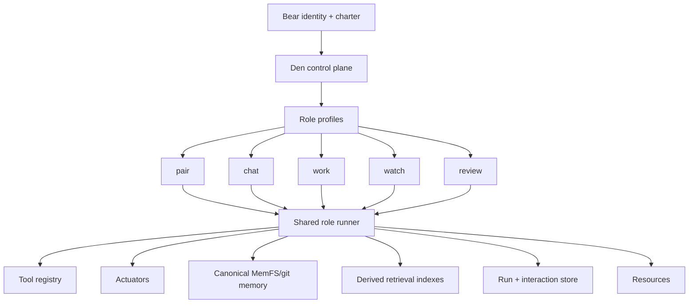

# Letta Migration Plan

## Purpose

This document proposes a phased migration path for BEARS to move off the deprecated Letta API server and Letta Code dependencies while preserving current behavior, minimizing operational risk, and keeping migration reversible where possible.

It is based on the dependency inventory in [`../architecture/letta-dependency-matrix.md`](../architecture/letta-dependency-matrix.md) and uses the terminology from [`../decisions/adr-0024-terminology-actuators-resources-and-role-names.md`](../decisions/adr-0024-terminology-actuators-resources-and-role-names.md).

## Terminology note

This plan uses the current canonical role names from [bear roles](../architecture/bear-roles.md): `pair`, `chat`, `review`, `work`, and `watch`.

Earlier migration drafts explored renaming `pair` to `code`, and some implementation notes may still reflect that abandoned direction. Those references should now be read as referring to the `pair` role. New architecture and product language should keep `pair` as the stable name.

Other terminology used in this plan:

- **Bear runtime**: the Den-owned runtime model for one durable Bear identity.
- **Role**: a named responsibility profile within a Bear runtime.
- **Role profile** or **role descriptor**: durable Den-owned configuration for a role, including model policy, prompt contract, tools, memory scope, resource policy, autonomy policy, and audit behavior.
- **Role run context**: ephemeral execution state for one role invocation, turn, task, workflow step, or session continuation.
- **Actuator**: an execution surface that can act for a role, such as the ACP-connected coding environment that exposes file, process, terminal, browser, and related capabilities.
- **Resource**: the canonical target a role is acting on, reasoning over, planning around, or organizing memory around, such as a repository, service, subsystem, conversation, artifact set, or external system boundary.
- **Provider binding**: an implementation-level reference to an external provider object, kept at provider boundaries rather than treated as core Bear identity.

## How to use this document

- Use the **parity matrix** to understand what Letta responsibilities must be replaced.
- Use the **repo coverage review** to see which parts already have design support and which still need docs.
- Use the **step-by-step implementation plan** for build order.
- Use the **phased migration plan** for rollout grouping and exit gates.

## Executive summary

BEARS should not treat this migration as a simple vector-store replacement, nor as a migration from Letta agents to a different set of provider-managed agents.

It also should not overcorrect into building a large, permanent, generalized runtime-provider platform if the real destination is clear.

The target architecture is a **Den-native multi-role Bear runtime**:

> A Bear is one durable identity with a charter. Roles such as `pair`, `chat`, `work`, `watch`, and `review` are Den-owned profiles and execution contexts. They define memory access, tools, actuators, resources, autonomy, model policy, and audit behavior. They are not distinct provider-managed agents.

The long-term destination should be understood as:

- **Den-native runtime** as the durable target architecture
- **Letta compatibility boundaries/adapters** as temporary migration scaffolding
- **no commitment** to a broad long-term ecosystem of symmetric runtime providers unless a real future need emerges

The current repository depends on Letta primarily for:

1. **runtime execution and conversation/run lifecycle**
2. **provider-managed role identity and configuration sync**
3. **Codepool-backed Letta Code harness behavior for `chat` and `work`**
4. **conversation/admin read models and diagnostics**
5. **some storage, git, and retrieval/index assumptions around Letta APIs and archives**

Canonical Bear memory already appears to live primarily in MemFS/git role branches and `core/`, which is an advantage. The recommended migration strategy is therefore:

1. **contain** Letta behind explicit provider boundaries
2. **move persistence ownership** for interactions, runs, approvals, and diagnostics into Den
3. **extract the shared Den-native role runner from the `pair`/ACP path** rather than treating `pair` as a late one-off migration
4. **migrate roles by execution mode and risk surface**, not by old Letta runtime family
5. **replace provisioning/registry semantics** with Den-owned role profiles, role run contexts, and provider bindings
6. **replace Letta Code / Codepool dependencies** for `chat` and `work`
7. **replace Letta Archives and git/storage assumptions** with BEARS-owned retrieval and MemFS flows

## Migration goals

### Primary goals

- Remove operational dependency on the Letta API server and Letta Code harnesses.
- Preserve BEARS role semantics and current user-visible behavior.
- Preserve the single-Bear, multi-role mental model rather than introducing new provider-managed agent identities.
- Keep canonical memory in BEARS-owned systems.
- Maintain `pair`/ACP actuator safety, approval, cancellation, and concurrency semantics.
- Preserve or improve observability and debuggability.

### Secondary goals

- Make role runtime behavior explicit and testable.
- Reduce hidden state and cross-service coupling.
- Enable Qdrant or another owned retrieval layer without entangling it with runtime state.
- Allow per-role migration by execution mode and risk surface rather than all-at-once cutover.
- Improve operator-facing terminology by replacing legacy agent/provisioning language with role profile, role run, actuator, resource, and provider binding language.

### Non-goals

These should **not** be treated as first-order migration goals for phase 1:

- replacing every Letta-adjacent concept with Qdrant
- redesigning all BEARS role semantics
- reworking MemFS branch policy from scratch
- fully unifying `pair`/`chat`/`review`/`work`/`watch` execution behavior at the start
- renaming every legacy code symbol and persisted enum value in one hard cutover

## Steering principle for implementation

The migration should build only enough abstraction to:

- contain Letta-specific behavior so it stops spreading
- make coexistence and rollback explicit during migration
- allow Den-native runtime pieces to replace Letta incrementally
- avoid re-encoding provider-managed identity as the conceptual core of the system

The migration should **not** assume a need for a large, permanent, generalized runtime-provider framework unless a concrete post-Letta requirement justifies it.

In practice, the preferred framing is:

- **Den-native runtime** as the destination
- **Letta compatibility path** as transitional infrastructure
- **migration seams** where needed, rather than symmetric long-term provider architecture

## Core migration principles

### 1. Roles are not provider-managed agents

The migration should make this explicit in docs, UI, APIs, and schemas:

- A Bear is the durable assistant identity.
- Roles are Den-owned profiles and policy boundaries.
- Role run contexts are ephemeral execution state.
- Provider bindings are implementation details, not core domain identity.

This is the main conceptual migration away from Letta-era architecture. It prevents the system from replacing `letta_agent_id` with another provider-shaped identity that would recreate the same coupling.

### 2. Separate runtime from memory from retrieval

These concerns should be explicitly different in the target architecture:

- **runtime**: model loop, tools, actuators, approvals, streaming, cancellation, run state
- **memory**: canonical role/core durable state in MemFS/git
- **retrieval**: derived embeddings/indexes over canonical sources and resources

Letta currently spans parts of all three. The migration should split them cleanly.

### 3. Den should own the control plane

Den already appears to be the best place to own:

- Bear registry and role profiles
- role run and session policy state
- approvals
- work planning and workflow state
- interaction metadata
- auditability
- resource orientation
- memory governance and promotion flows

The migration should continue in that direction.

### 4. Migrate by execution mode and risk surface, not old runtime family

The old split was:

- **API-direct**: legacy `pair`, `review`, `watch`
- **harness-backed**: legacy `chat`, `work`

That split reflects Letta implementation history. The migration should instead reason about execution modes and risk surfaces:

- **interactive collaboration in tools and coding environments**: `pair`, through an ACP actuator
- **interactive conversation**: `chat`
- **background or semi-autonomous task execution**: `work`
- **event observation and monitoring**: `watch`
- **memory review, synthesis, and governance**: `review`

The `pair` path should be treated as the reference implementation to extract from, because the future roles are expected to derive from the work already done there.

### 5. Prefer dual-write and compatibility periods over hard cutovers

Where feasible, migration should first add BEARS-owned data models and write to them alongside Letta-backed execution before switching reads and then switching execution.

Compatibility aliases may be required for legacy role names, persistent values, and external integrations. They should be explicit routing-boundary shims, not advertised model-facing terminology.

## Letta API-server feature parity matrix

Before maturing this plan further, BEARS should treat Letta migration as replacement of a concrete feature surface, not just a general move away from provider-managed agents. The Letta API server appears to provide a bundle of runtime, memory, retrieval, configuration, tool, and operational capabilities that must each land with a clear BEARS owner and migration strategy.

The list below is intended to be complete enough for planning. It should be updated as repository audits find narrower Letta-coupled behaviors, but major new feature families should be rare after this point.

| Letta feature family | Responsibilities Letta currently serves | BEARS / Den replacement owner | Current plan coverage | Planning note |
|---|---|---|---|---|
| Agent object lifecycle | Create/update/delete/list agent resources; persist agent state; import/export; templates and starting configurations | Den Bear registry, role profiles, migration/import tooling | Partial | Expand provider-binding migration into an explicit Bear/role lifecycle parity track, including import/export expectations where needed for backfill or rollback. |
| Conversation transcript store | Persist ordered messages, agent responses, and conversation history; support history reads and resumed state | Den interaction store and conversation read models | Partial | Current plan mentions interaction metadata and read models, but should explicitly require transcript storage, message ordering, idempotency/dedup support where needed, and resume/replay semantics. |
| Turn/run execution lifecycle | Submit messages; execute runs; stream events; continue after tool calls; settle approvals; cancel active turns; recover stale runs | Shared Den-native role runner plus role-specific adapters | Strong | Already central to the plan; keep parity tests focused on streaming, continuation, approval settlement, cancellation hygiene, and failure semantics. |
| Editable in-context memory blocks | Persist editable memory blocks attached to agents; compile them into prompts; allow API and agent-side mutation | Bear memory model, role-local/core memory tools, prompt compiler | Weak | The plan talks about canonical memory broadly, but should explicitly replace Letta's block semantics: attachment, mutability, prompt inclusion, and auditability. |
| Archival / recall memory | Store long-lived facts outside the immediate prompt; let agents write to archival memory and search it later | Den retrieval/index services over canonical Bear memory and curated sources | Partial | Make archival-memory replacement explicit as a product surface, not just "retrieval" in general. Define write paths, retrieval semantics, and ownership boundaries. |
| Source / passage ingestion APIs | Register external sources, chunk content into passages, batch ingest/update/delete indexed material, preserve provenance | Den ingestion/index pipeline plus canonical source records | Weak | Current plan mentions Letta Archives replacement but not enough about ingestion APIs. Add explicit source registration, chunking, provenance, update, and deletion requirements. |
| Conversation compaction / summarization | Summarize or compact transcripts under context pressure; preserve continuity after compaction | Den context assembly and compaction subsystem | Weak | This must become a first-class replacement workstream. Define compaction triggers, summary artifacts, replayability, and interaction with transcript storage and retrieval. |
| Tool registry and tool execution model | Store tool schemas; expose them to models; execute server-side tools; support client-side/external tools and MCP-style patterns | Den tool registry, role policy, ACP/client mediation, runtime adapters | Partial | Current plan covers tool mediation, but should explicitly call out schema management, execution classes, continuation semantics, and model-visible tool assembly as Letta parity surfaces. |
| Model / provider / embedding configuration | Persist model choice, provider handles, embedding config, advanced runtime settings, and compaction settings | Den role profiles, provider bindings, retrieval config, runtime policy | Partial | Expand configuration parity to include model settings, embedding settings, compaction policy, and other runtime knobs currently hidden inside Letta-managed agent config. |
| Identity and attachment associations | Associate identities with agents and blocks; support user/application-level mappings and attachment relationships | Den auth/membership, Bear identity model, role/work-surface attachments | Weak | We may not replicate Letta's exact identity objects, but we should replace the responsibilities they served: attachment, ownership, mapping, and safe scoping. |
| Background memory-management jobs | Run asynchronous memory maintenance such as background summarization or archival management | Den workers / Reflection / maintenance services | Weak | Decide explicitly which Letta background behaviors BEARS needs: compaction, indexing, memory cleanup, summarization, or archival writes. |
| Admin, diagnostics, and operational read models | Inspect agent state, recent interactions, failures, diagnostics, and operational health | Den admin/API read models and observability stack | Strong | Already recognized in the plan; ensure migration phases preserve operator visibility and debugging parity, not only end-user behavior. |
| Authentication and tenant boundary assumptions | Gate access to agent state and APIs; support application-layer user-to-agent mapping patterns | Den auth, membership, and Bear routing | Partial | Den already owns auth, but the migration plan should explicitly preserve Letta-served isolation responsibilities when replacing API server endpoints. |
| Migration / backfill utilities | Export/import existing state, strip or retain history selectively, map legacy ids to new stores, support rollback windows | Den migration tooling, compatibility adapters, backfill jobs | Weak | Add a deliberate migration-tooling track so parity includes the practical mechanics of moving off Letta safely. |

## Feature-family implications for the migration plan

The parity matrix implies several concrete upgrades to this plan:

1. **Make transcript storage a named deliverable.** Distinguish transcript/event storage from run state, read models, summaries, memory, and retrieval indexes.
2. **Add a context-compaction subsystem.** Treat compaction/summarization as its own replacement workstream, with parity and recovery criteria.
3. **Add explicit block-memory replacement.** Describe how editable in-context memory will map to BEARS memory structures and prompt compilation.
4. **Split retrieval into ingestion and recall.** Replacing Letta Archives means both indexed storage pipelines and query-time retrieval semantics, not just a future vector DB mention.
5. **Make tool-surface parity explicit.** Document server-side, client-side, and externally mediated tool classes and how they appear to models and operators.
6. **Add migration-tooling scope.** Safe cutover depends on export/import, backfill, id mapping, and rollback-aware dual-write periods.

## Existing repo coverage vs missing design treatment

This matrix now maps reasonably well to a subset of existing docs, but coverage is uneven. Some feature families already have a dedicated design home, while others are only mentioned incidentally inside broader migration or memory documents.

| Letta feature family | Existing docs with meaningful coverage | Coverage assessment | Missing or weak treatment |
|---|---|---|---|
| Agent object lifecycle | `docs/architecture/bear-roles.md`, `docs/architecture/bears-and-den.md`, `docs/architecture/den-conversation-runtime-schema.md`, `docs/architecture/role-vocabulary.md` | Partial | We have role-profile and Bear-identity framing, but no dedicated design for import/export, template migration, or exact replacement of Letta agent-resource lifecycle APIs. |
| Conversation transcript store | `docs/architecture/den-conversation-runtime-schema.md`, `docs/architecture/acp-runtime-contract.md`, `docs/architecture/identity-and-membership.md` | Strong | Transcript/read-model separation is described well, but transcript retention, dedup/idempotency, and cross-surface replay policy are still not gathered into one explicit transcript design note. |
| Turn/run execution lifecycle | `docs/architecture/acp-runtime-contract.md`, `docs/architecture/den-conversation-runtime-schema.md`, `docs/architecture/acp-runtime-invariants.md`, `docs/architecture/bear-channel-and-acp.md` | Strong | Good ACP/runtime coverage exists. Remaining gap is broader non-ACP shared role-runner design parity across `chat`, `review`, `watch`, and `work`. |
| Editable in-context memory blocks | `docs/architecture/memory-model.md`, `docs/architecture/workflow-state-overview.md` | Weak | We describe canonical memory and retrieval, but we do not yet have a dedicated replacement design for Letta-style editable prompt blocks, attachment semantics, or block compilation into runtime context. |
| Archival / recall memory | `docs/architecture/memory-model.md`, `docs/architecture/reflection-system.md`, `docs/architecture/reflection-run-taxonomy.md` | Partial | Retrieval is recognized, but the plan still leans on Letta Archives. We lack a BEARS-owned replacement design for archival write/query semantics and lifecycle after Letta removal. |
| Source / passage ingestion APIs | `docs/architecture/memory-model.md` | Weak | Passage/source ingestion is only discussed as part of current Letta Archive usage. We do not yet have a dedicated ingestion pipeline design covering chunking, provenance, updates, deletes, or source records. |
| Conversation compaction / summarization | `docs/architecture/den-conversation-runtime-schema.md`, `docs/architecture/acp-runtime-contract.md`, `docs/architecture/workflow-state-overview.md` | Weak | Compaction is acknowledged, but there is no dedicated design for summarization triggers, artifacts, replay behavior, or transcript/summary/archive interactions. |
| Tool registry and tool execution model | `docs/architecture/capabilities-and-skills.md`, `docs/architecture/bear-environment-tool-contract.md`, `docs/architecture/acp-runtime-contract.md`, `docs/architecture/bear-channel-and-acp.md` | Partial | Tool concepts and ACP mediation are documented, but we still lack a unified cross-role tool-registry design covering model-visible schemas, execution classes, and parity with Letta-managed tool metadata. |
| Model / provider / embedding configuration | `docs/architecture/role-vocabulary.md`, `docs/architecture/bears-and-den.md`, `docs/architecture/den-conversation-runtime-schema.md` | Partial | Provider bindings are covered conceptually, but there is no focused doc for runtime/model/embedding settings parity, including compaction policy and advanced per-role config surfaces. |
| Identity and attachment associations | `docs/architecture/identity-and-membership.md`, `docs/architecture/agent-and-bear-environments.md`, `docs/architecture/memory-model.md` | Partial | Human membership and work-surface attachment are documented, but not a direct replacement design for Letta identity/block attachment responsibilities and migration mapping. |
| Background memory-management jobs | `docs/architecture/reflection-system.md`, `docs/architecture/reflection-run-taxonomy.md`, `docs/architecture/planning.md` | Partial | Reflection gives us a home for maintenance behavior, but we have not yet made an explicit call on which Letta background memory-management jobs must exist in BEARS and which can be dropped. |
| Admin, diagnostics, and operational read models | `docs/architecture/den-conversation-runtime-schema.md`, `docs/architecture/acp-runtime-invariants.md`, `docs/architecture/acp-troubleshooting.md`, `docs/architecture/bears-and-den.md` | Strong | This area is comparatively well covered; the main remaining need is to keep admin/read-model expectations explicit during phased cutover. |
| Authentication and tenant boundary assumptions | `docs/architecture/identity-and-membership.md`, `docs/architecture/bear-channel-and-acp.md`, `docs/architecture/bears-and-den.md` | Strong | Den ownership is clear. Remaining work is implementation/migration detail rather than missing conceptual docs. |
| Migration / backfill utilities | `docs/guides/letta-migration-plan.md`, `docs/architecture/den-conversation-runtime-schema.md`, `docs/architecture/letta-dependency-matrix.md` | Weak | The migration guide references dual-write and compatibility, but we do not yet have a dedicated migration/backfill design note describing export/import, verification, rollback windows, and id remapping mechanics. |

## Highest-priority missing design docs or upgrades

The most obvious gaps after this mapping are:

1. **Editable prompt-memory replacement** — either a new dedicated doc or a major expansion of `memory-model.md` to define block-like runtime memory and prompt-compilation semantics.
2. **Context compaction and summarization** — now covered directionally by [ADR-0032: Den Context Compaction Architecture](../decisions/adr-0032-den-context-compaction-architecture.md) and the implementation sequence in [DEN Context Compaction Implementation Plan](../roadmap/DEN_CONTEXT_COMPACTION_IMPLEMENTATION_PLAN.md), but likely still requiring follow-on refinement as transcript/read-model and retrieval work land.
3. **Retrieval ingestion and archival replacement** — a design doc covering source records, passage generation, provenance, update/delete behavior, and search semantics after Letta Archives are gone.
4. **Migration/backfill mechanics** — a dedicated note for export/import, dual-write verification, identifier mapping, replay, and rollback strategy.
5. **Unified tool-registry/runtime config parity** — either new docs or expansions that make Letta tool/config replacement explicit across all roles, not only ACP.

## Current-state assessment

### Canonical roles and legacy compatibility

The target role names are:

- `pair`
- `chat`
- `review`
- `work`
- `watch`

Some implementation code may still carry compatibility or abandoned-draft references to `code` for the same role. New docs, UI labels, model-facing tool descriptions, and operator language should prefer `pair`.

### API-direct-like roles

Canonical roles:

- `pair`
- `review`
- `watch`

Current behavior:

- Den uses Letta conversations and runs as execution substrate for parts of these roles.
- Den adds policy, tool mediation, and workflow control around that runtime.
- The `pair` role, through the ACP actuator, has especially strong Letta-specific recovery, approval, cancellation, and continuation logic.
- The `pair` path already contains important Den-owned patterns that should be generalized into the shared role runner.

### Harness-backed roles

Canonical roles:

- `chat` (legacy `chat`)
- `work`

Current behavior:

- Den uses Codepool as the runtime boundary.
- Codepool is currently configured as a Letta Code harness.
- Letta remains the real runtime dependency behind the harness.

### Memory

Current durable memory source of truth appears to be:

- MemFS/git role branches
- `core/` and role-local branches
- Den-managed memory tooling and governance

This is helpful because it means migration can focus first on runtime and state orchestration.

## Target architecture

The target is a Den-owned multi-role Bear runtime:

### Den-owned control plane

Den should own:

- Bear registry and role profiles
- role run/session metadata and event state
- run cancellation state
- approval state machines
- policy gating
- actuator grants and resource permissions
- workflow/plan state
- memory governance and promotion flows
- provider bindings as implementation details

### Runtime service(s)

The migration should explicitly leverage Den's existing optional-worker / selectively enabled service model. One Den binary can then expose different capability mixes by environment and migration phase without forcing hard deployment forks.

This should be understood as an operational deployment pattern, not evidence that Den needs a large permanent runtime-provider platform. The intended destination remains a Den-native runtime, with Letta retained only behind temporary compatibility seams during migration.

This is useful during migration because it allows:

- Letta-compatibility providers and Den-native runtime providers to coexist temporarily
- dual-write projectors and read-model workers to be enabled only where needed
- `watch` / `review` workers or scheduled loops to be enabled independently from interactive API surfaces
- migration/backfill jobs to run as opt-in worker capabilities rather than as one-off binaries
- low-risk rollback by disabling a worker or provider path without replacing the deployed artifact

A runtime implementation should own:

- model invocation
- streaming responses
- tool-call loop
- continuation after tool results
- approval pauses/resumes
- summarization/compaction
- role run lifecycle

The desired end state is a shared Den-native role runner. During migration, this may still involve:

- Den-native execution for roles that have already moved
- Codepool-next or equivalent for harness-style execution until `chat` and `work` are migrated
- temporary Letta provider bindings only at compatibility boundaries

### MemFS manager

MemFS manager should own:

- canonical git-backed role/core repositories
- resource-oriented memory and workspace organization
- role-scoped or run-scoped workspace views
- direct git operations previously routed through Letta

The old provider-owned view framing should migrate toward role/run/resource workspace view terminology.

### Retrieval/index layer

Qdrant or another owned system should own:

- derived semantic indexes over canonical sources
- retrieval APIs for context assembly
- optional interaction-summary retrieval later

Retrieval should stay behind descriptor-owned model-facing tools such as `memory_search`, rather than being baked into role logic.

## Migration scorecard and success metrics

Progress through the phases should be evaluated with explicit metrics rather than judgment alone. Exit criteria already describe what must be true architecturally; this section adds suggested operational measures.

### Cross-cutting success metrics

Suggested metrics to capture from phase 0 onward:

- **response latency parity**: p50/p95 end-to-end latency by role and execution mode compared to the Letta-backed baseline
- **stream continuity**: percentage of runs that stream first token/event successfully and percentage that complete streaming without truncation or duplicate segments
- **tool continuation correctness**: percentage of tool-call runs that successfully resume and complete after tool results are returned
- **approval round-trip correctness**: percentage of approval-gated runs that pause, resume, and complete without bypass or duplicate execution
- **cancellation correctness**: percentage of cancelled runs that stop producing model/tool side effects after cancellation is recorded
- **interaction projection consistency**: rate at which Den-owned interaction/read-model projections match Letta-backed source data during dual-write periods
- **session recovery success**: percentage of interrupted sessions that can be resumed or safely terminated according to policy
- **operator-debuggability**: percentage of production incidents where Den-owned logs and state are sufficient without querying Letta directly
- **role-level migration coverage**: percentage of traffic for each role running on the target runtime path

### Role-specific parity indicators

#### `pair`

- first-token latency and full-turn latency under ACP
- tool request/response continuation success
- Ask / Plan / Write gate correctness
- pending approval correctness
- cancellation and active-turn cleanup correctness under concurrent load
- recovery rate for poisoned or interrupted sessions

#### `chat`

- turn latency and stream quality parity
- conversation title/archive/history consistency
- summarization/compaction correctness
- session continuity across reconnects or web reloads

#### `work`

- task completion rate
- policy-gated tool execution correctness
- background run recovery and retry behavior
- autonomy boundary compliance

#### `watch`

- event ingestion-to-output latency
- deduplication correctness
- observation persistence correctness
- alert/noise quality where applicable

#### `review`

- memory-read completeness across intended scopes
- governance/approval flow correctness
- promotion/review audit trail completeness
- synthesis quality against staging baselines

### Suggested rollout thresholds

Thresholds will vary by role, but the rollout policy should define target envelopes before cutover, for example:

- parity or better for p95 latency within an agreed tolerance
- no unresolved correctness regressions for approvals, cancellations, and tool continuation
- Den read models matching Letta-backed data above an agreed threshold during dual-write
- no sev-1/sev-2 migration incidents for a defined soak period before expanding traffic

## Compatibility and aliasing policy

Migration should make compatibility handling explicit instead of allowing aliases to spread through ad hoc conditional logic.

### Compatibility rules

1. **Current canonical role names** in new docs, UI labels, model-facing descriptors, and new internal abstractions are:
   - `pair`
   - `chat`
   - `work`
   - `watch`
   - `review`

2. **Accepted legacy aliases** during transition are:
   - abandoned draft alias: `pair` → `pair`
   - `chat` → `chat`
   - `review` → `review`

3. **Canonicalization should happen at routing and persistence boundaries** where legacy values may still arrive from existing clients, jobs, or stored data.

4. **Core runtime logic should operate on canonical role values** once inputs have been normalized.

5. **Provider-specific identifiers and legacy names should not be exposed as the conceptual source of truth** in new model-facing tools or operator-facing architecture docs.

### Suggested implementation guidance

- centralize alias resolution in one descriptor resolver or normalization layer
- avoid scattered `match` statements for legacy role aliases across the codebase
- add tests that verify accepted input aliases normalize to a single canonical role value
- annotate compatibility fields and branches with expected removal criteria

### Alias sunset criteria

Legacy aliases can be retired only when all of the following are true:

- no supported external client or persisted workflow still emits legacy role names
- migrated read/write paths canonicalize or backfill legacy data safely
- operator/admin workflows no longer depend on legacy labels
- migration telemetry shows no meaningful incoming legacy-name traffic for a defined period

## Historical data migration and backfill strategy

Dual-write alone is not enough. The migration also needs a deliberate plan for historical interaction and runtime data.

### Recommended principles

- preserve auditability over perfect one-time normalization
- prefer immutable import or projection of historical events where practical
- keep provenance indicating whether records originated in Letta, Den dual-write, or Den-native execution
- avoid blocking runtime migration on a perfect historical import if lazy-read compatibility is sufficient for older data

### Suggested historical data approach

1. **Recent and user-visible history**
   - prioritize backfill or projection for recent `chat` and `pair` sessions that are likely to be viewed or resumed
   - preserve titles, archive state, run markers, tool events, and approval events where available

2. **Older or low-value history**
   - allow on-demand compatibility reads from Letta or imported archives during transition
   - backfill only summary/index metadata if full event import is too expensive initially

3. **ID mapping and provenance**
   - maintain mapping tables or provenance fields linking Den-owned entities to legacy Letta conversation/run/message identifiers
   - record import time, source system, and import version for audit/debug purposes

4. **Admin and diagnostics continuity**
   - ensure operators can still pivot from new Den identifiers to legacy provider identifiers while compatibility remains in place
   - keep replay/debug tools aware of mixed-origin histories during migration

### Questions to answer during implementation

- which Letta-backed records must be fully imported versus lazily read
- whether old tool-call payloads require normalization into the new schema
- how archived/deleted state should be represented when source semantics differ
- what minimum fidelity is required for compliance, audit, and incident response

## Testing and validation strategy

Migration risk is dominated by behavior mismatches, not only by compile-time integration errors. Validation should therefore include behavioral, concurrency, and failure-path testing.

### Test layers

#### 1. Unit and interface tests

- verify provider-neutral interfaces and adapters
- verify canonicalization of role names and provider bindings
- verify persistence schema serialization and event envelopes

#### 2. Contract tests

- provider-neutral role runner contract tests
- tool and actuator registry contract tests
- interaction/run store contract tests
- retrieval service contract tests

These should be runnable against both Letta-backed compatibility implementations and Den-native implementations where practical.

#### 3. Transcript and replay tests

- replay captured Letta-era sessions against the Den-native runner in staging
- compare tool-call ordering, pause/resume behavior, final status, and user-visible output envelopes
- keep golden traces for critical `pair` ACP turns and representative `chat`, `review`, `watch`, and `work` flows

#### 4. Concurrency and load tests

Especially for `pair` and `work`:

- simultaneous sessions per Bear
- tool execution overlap
- cancellation during tool wait
- cancellation during stream emission
- repeated resume attempts
- active-turn cleanup under contention

#### 5. Failure-injection and chaos tests

- dropped tool results
- delayed approval responses
- provider timeouts
- partial stream interruption
- persistence write failures during dual-write
- stale lock or stuck-run conditions

### Staging acceptance guidance

Before each production cutover step, staging should demonstrate:

- parity on representative transcripts
- no unresolved correctness failures for approvals/cancellation/tool continuation
- sufficient observability to debug discrepancies without ad hoc provider inspection

## Operational rollout and rollback controls

Migration should be designed for reversible rollout at multiple scopes.

### Recommended controls

- **feature flags** for major runtime paths and persistence readers/writers
- **optional worker/service enablement** so one Den binary can selectively run compatibility providers, native runtime workers, projectors, review/watch loops, or migration jobs by environment
- **per-role routing controls** to move roles independently
- **per-Bear allowlists** for early canarying
- **per-session fallback** where feasible for interactive surfaces
- **shadow mode** for write/read comparison without user-visible cutover
- **canary mode** with explicit percentage-based or allowlisted traffic expansion

### Rollout mechanics

For each cutover-capable phase, define:

- what traffic enters shadow mode
- what traffic is eligible for canary mode
- how rollback is triggered
- what telemetry dashboards are required
- who owns the go/no-go decision

### Suggested rollback triggers

Examples:

- approval state inconsistencies
- cancellation correctness failures
- repeated tool continuation failures
- Den/Letta projection divergence above threshold during dual-write
- severe latency regressions beyond agreed tolerance
- admin/debug read-path failures that block incident response

### Operational readiness artifacts

Before broad rollout, prepare:

- dashboards by role and execution mode
- alerts for correctness and latency regressions
- runbooks for provider fallback and traffic re-routing
- incident checklists for mixed-origin history issues
- support guidance for operators during compatibility periods

## Security and policy invariants

Certain guarantees must not regress during migration, even temporarily.

### Must-preserve invariants

- trusted human identity must come from Den/ACP authenticated state, not from chat text
- tool policy must remain server-authoritative
- approval-gated actions must not execute before approval is recorded
- resumed runs must re-check applicable policy state before continuing
- actuator permissions must remain scoped to approved resources and session policy
- cancellation must prevent further side effects after the authoritative cancellation point
- dual-write or replay paths must not cause duplicate tool execution or duplicate approval fulfillment
- model-facing tools must not gain broader memory/resource scope because of compatibility shortcuts

### Recommended verification approach

- encode invariants as integration tests where possible
- add runtime assertions and audit logs around approval/cancellation boundaries
- explicitly review any fallback path that bypasses the shared runner or Den persistence

## Likely end-state runtime topology

The migration plan allows for transitional hybrids, but the target picture should be explicit enough to guide implementation.

The important bias here is that the end state should look like **Den-native runtime plus temporary compatibility adapters retired over time**, not like a permanent federation of equal runtime providers.

More bluntly: phase 0 should not create a broad, symmetric, long-lived `provider` abstraction layer for runtime execution. Letta is something BEARS is removing, not a peer architecture that needs to be preserved conceptually. If a temporary seam uses provider-like language at a boundary, that seam should stay narrow, compatibility-scoped, and obviously transitional.

### Likely end state

- **Den owns the control plane** for Bear identity, role profiles, policy, approvals, workflow state, and interaction/run persistence.
- **A single Den binary may still expose different capability mixes by configuration**, for example API surfaces, web/admin surfaces, native runtime workers, compatibility providers, projection workers, and migration jobs. Optional-worker deployment should remain an operational pattern, but not the domain model itself.
- **A shared role-runner contract** defines model loop, tool loop, streaming, pause/resume, cancellation, and persistence hooks.
- **Transitional compatibility implementations may exist during migration**, but they should be treated as temporary adapters behind Den-owned contracts rather than as permanent peer runtimes that define the architecture.
- **Actuators** such as ACP remain explicit execution surfaces, not implicit properties of a provider runtime.
- **Codepool**, if retained, should either become a BEARS-native execution service behind the shared contracts or shrink into a compatibility adapter rather than a distinct conceptual runtime family.
- **MemFS/git and retrieval services** remain separate owned systems behind explicit interfaces.

### Architectural guardrails

- shared concepts should be Bear, role profile, role run, actuator, resource, compatibility binding where temporarily needed, and interaction/run store
- avoid new architecture that requires a role to be represented primarily as an external provider object
- avoid coupling retrieval/index implementation choices to runtime execution contracts

## Ownership, dependencies, and critical path

The plan will be easier to execute if workstreams and sequencing constraints are explicit.

### Likely workstreams

1. **abstraction and terminology workstream**
   - Den-native runtime contracts with narrow compatibility seams
   - canonical naming and alias handling
   - instrumentation

2. **Den persistence workstream**
   - interaction/run schema
   - dual-write paths
   - admin/UI read models

3. **shared role-runner workstream**
   - extraction from `pair`
   - common event and tool protocol
   - approval/cancellation lifecycle

4. **role migration workstream**
   - `watch`
   - `review`
   - `pair`
   - `chat` / `work`

5. **MemFS and retrieval workstream**
   - direct git APIs
   - retrieval/index replacement
   - invalidation hooks/jobs

6. **operations and retirement workstream**
   - rollout controls
   - dashboards/runbooks
   - infrastructure cleanup

### Critical path dependencies

At a high level:

- abstraction boundaries should land before broad migration work
- Den-owned persistence should begin before most runtime cutovers
- shared role-runner extraction should precede `watch`/`review`/`pair` migration completion
- `chat`/`work` migration depends on decisions about Codepool evolution or replacement
- Letta retirement should wait until read paths, runtime paths, and historical access needs are satisfied

## Recommended internal abstractions

The first implementation step should be to define narrow migration seams that isolate Letta and avoid creating new provider-shaped agent identity. These seams should be judged by whether they help Den-native runtime replace Letta incrementally, not by how completely they generalize across hypothetical runtime providers.

In particular, prefer Den-native contracts such as role profile registry, role runner, interaction/run store, actuator registry, and retrieval service. If compatibility with Letta requires an adapter or binding record, keep that concern visibly in compatibility modules and persistence boundaries rather than elevating `provider` into the organizing concept of the target runtime.

### 1. Role profile registry

Responsibilities:

- create/update/delete Den-owned role profiles for a Bear
- persist role descriptor settings and policy hashes
- persist execution mode and temporary compatibility-binding references where needed during migration
- expose diagnostics and status
- compare desired role profile config with applied config

Suggested concepts:

- `role`: `pair`, `chat`, `work`, `watch`, or `review`
- `role_profile_id`
- `execution_mode`: interactive, background, event, governance, harness, etc.
- `runtime_mode`: `den_native` as the target, with temporary compatibility values only where migration still requires them
- `compatibility_binding_ref`: opaque legacy/external reference, replacing generic reliance on `letta_agent_id`
- `config_hash`
- `policy_hash`
- `status`
- `last_reconciled_at`

### 2. Role runner

Responsibilities:

- start a role run or continue an existing session
- assemble prompt, resource, memory, and retrieval context
- stream events/tokens
- request and resume tool execution
- route actions through actuators when required
- track pending approvals
- cancel safely
- compact/summarize

The role runner should be shared by roles, with behavior specialized by role profile and execution mode.

### 3. Interaction and run store

Responsibilities:

- persist thread/session metadata where applicable
- persist message envelopes/events/tool calls/tool results/approvals
- persist role run lifecycle markers
- support title/archive/delete for conversational surfaces
- provide admin/UI read APIs
- support replay/debugging and migration fallback

This store should cover conversational and non-conversational roles. `conversation` can remain as a UI-facing or compatibility concept, but the core model should not assume every role run is a chat thread.

### 4. Tool and actuator registry

Responsibilities:

- store canonical BEARS tool descriptors
- resolve tool availability by role/profile/policy/resource
- resolve actuator capabilities and permissions
- avoid dependence on Letta-specific tool ids as the canonical source
- preserve model-facing provider names such as `session_info`, `memory_browse`, `memory_read`, `memory_search`, `memory_write_entry`, `web_fetch`, `web_search`, and `fs_edit_file`

### 5. Retrieval service

Responsibilities:

- index canonical sources and resources
- answer retrieval requests independent of runtime engine
- support replacement of Letta Archives without changing model-facing role tools

## Phased migration plan

## Step-by-step implementation plan

This step list is the practical implementation ordering that should guide work inside the broader phased plan below. The goal is to make dependency-breaking work happen in the right sequence: first establish Den-owned data and contracts, then replace Letta-served feature families one by one, and only then remove compatibility paths.

### Step 1 — freeze the replacement surface and assign owners

- Treat the Letta API-server feature parity matrix in this document as the migration scope baseline.
- For each feature family, record the intended primary owner: role runner, interaction store, memory subsystem, retrieval subsystem, auth/routing, or migration tooling.
- Confirm which Letta behaviors are required parity, which are compatibility-only during transition, and which can be intentionally dropped.
- Record open questions as explicit migration decisions instead of leaving them implicit in implementation tickets.

**Outputs**

- an accepted parity matrix
- named subsystem owners for each feature family
- a decision list for intentionally dropped or deferred Letta behaviors

### Step 2 — establish Den-owned contracts and containment seams

- Land the runtime, interaction-store, retrieval, and configuration abstractions described in this plan.
- Refactor Letta-specific logic behind compatibility adapters so new work stops depending directly on Letta client semantics.
- Preserve legacy identifiers only as compatibility fields at boundaries.
- Add tracing and diagnostics around remaining Letta calls so migration can be measured and audited.

**Outputs**

- explicit compatibility seams
- provider-neutral Den interfaces
- observability around all remaining Letta dependencies

### Step 3 — make Den the source of truth for transcript and run state

- Implement Den-owned conversation, run, tool-call, approval, and event storage.
- Dual-write from Letta-backed execution into Den-owned stores.
- Move user-facing and admin read paths to Den-owned projections where feasible.
- Define transcript retention, message identity, replay, and read-model expectations explicitly.

**Outputs**

- Den-owned transcript/event ledger
- Den-owned run/approval/tool state
- read models that no longer require Letta as the first read source

### Step 4 — define and implement prompt-state memory replacement

- Specify how Letta-style editable memory blocks map into BEARS memory structures.
- Define attachment/scoping rules for block-like runtime memory versus canonical role/core memory.
- Define how prompt-state memory is compiled into turn context and how mutations are audited.
- Implement the minimum viable block-replacement path for one role before broad rollout.

**Outputs**

- explicit prompt-memory design
- auditable block-like runtime memory behavior
- first production-capable block replacement path

### Step 5 — define context assembly, compaction, and summarization

- Create a dedicated compaction design covering triggers, summary artifacts, replay behavior, and recovery after context reduction.
- Define the relationship between transcript, summaries, prompt-state memory, and retrieval indexes.
- Implement compaction behind Den-owned context assembly, not as a Letta-specific side effect.
- Add parity tests for resume and long-running conversation continuity.

**Outputs**

- context-compaction subsystem design
- summary artifact model
- tested resume/continuity behavior after compaction

### Step 6 — replace the `pair` runtime path with the shared Den-native role runner

- Use the ACP `pair` path as the reference implementation for shared role-runner behavior.
- Preserve existing streaming, approval, continuation, cancellation, and workspace-context invariants.
- Run canaries behind feature flags and compare behavior against the compatibility path.
- Keep rollback and per-session fallback available until parity is established.

**Outputs**

- shared Den-native role runner
- canaryable `pair` execution path
- parity test coverage for the hardest Letta-era runtime behaviors

### Step 7 — migrate lower-risk roles onto the shared runner

- Move `watch` and `review` onto the shared runner after `pair` parity is credible.
- Validate that event-driven and review-oriented flows work without ACP-specific assumptions.
- Capture any remaining role-specific gaps before moving `chat` and `work`.

**Outputs**

- multi-role confidence in the shared runner
- narrowed list of role-specific exceptions

### Step 8 — replace retrieval, archives, and ingestion pipelines

- Design and implement BEARS-owned source registration, passage generation/chunking, provenance tracking, update/delete semantics, and query paths.
- Replace Letta Archives as the operational retrieval substrate.
- Define retrieval policy across Bear-global, role-local, and work-surface-local scopes.
- Ensure retrieval remains derived from canonical sources rather than becoming the source of truth.

**Outputs**

- BEARS-owned ingestion/index pipeline
- archival retrieval replacement
- explicit retrieval policy and provenance model

### Step 9 — replace provisioning/configuration semantics and harness-backed runtime dependencies

- Move role configuration, provider bindings, model settings, embedding settings, and related runtime configuration into Den-owned role profiles.
- Replace the remaining Codepool / Letta Code assumptions for `chat` and `work`.
- Ensure tool metadata, model-visible tool schemas, and runtime config surfaces are Den-owned.

**Outputs**

- Den-owned role-profile and configuration model
- removal path for Letta-backed provisioning assumptions
- reduced dependency on Letta Code / Codepool behavior

### Step 10 — build migration, backfill, and rollback tooling for cutover

- Implement export/import, id mapping, dual-write verification, replay, and rollback-aware cutover tooling.
- Define operator runbooks for partial failures, reconciliation, and backfill retries.
- Prove that legacy Letta-backed state can be inspected and migrated without losing auditability.

**Outputs**

- migration/backfill toolchain
- verification and rollback procedures
- operator-ready cutover plan

### Step 11 — cut over reads, then writes, then execution defaults

- Move read paths first where Den-owned data is already authoritative.
- Move write authority next once dual-write verification is stable.
- Only switch execution defaults after transcript, memory, compaction, retrieval, and role-runner parity are demonstrated.
- Keep feature-flagged rollback available until production behavior is stable.

**Outputs**

- staged cutover sequence with explicit gates
- production validation criteria before Letta retirement

### Step 12 — retire compatibility paths and remove Letta-specific assumptions

- Remove obsolete Letta compatibility fields, adapters, and fallback paths once rollback windows close.
- Delete stale naming, internal assumptions, and admin dependencies that only existed for the compatibility period.
- Re-run the parity matrix as a retirement checklist before declaring Letta removed.

**Outputs**

- Letta compatibility removed or minimized to intentional residual integrations
- parity checklist closed out
- post-migration cleanup complete

## Phase 0 — preparation and containment

**Primary implementation steps:** Step 1 (freeze the replacement surface and assign owners) and Step 2 (establish Den-owned contracts and containment seams).

### Objective

Stop Letta from being an ambient assumption and confine it to explicit compatibility boundaries that can be removed as Den-native runtime ownership expands.

### Phase checklist

- land provider-neutral Den interfaces for runtime, storage, tools, retrieval, and configuration
- move Letta logic behind compatibility adapters
- normalize internal terminology toward role profiles, role runs, and compatibility bindings
- add tracing and rollout controls for remaining Letta dependencies

### Exit criteria

- major call sites no longer directly depend on `LettaClient` semantics outside compatibility layers
- replacement implementation could be added without touching UI or role logic everywhere
- new docs and API surfaces avoid new generic agent/provisioning terminology

## Phase 1 — Den-owned interaction and run persistence

**Primary implementation step:** Step 3 (make Den the source of truth for transcript and run state).

### Objective

Make Den the source of truth for interaction metadata and run tracking before changing execution.

### Phase checklist

- land Den-owned conversation, event, run, tool-call, and approval records
- dual-write Letta-backed execution into Den-owned stores
- repoint admin and user-facing reads to Den projections where stable
- keep fallback reads available while projections mature

### Exit criteria

- UI can render recent `chat` and `pair` interaction lists from Den
- Den can answer thread title/archive/delete state from its own store
- run and approval state is queryable without asking Letta first
- dual-write remains non-destructive and rollback-safe

## Phase 2 — extract shared Den-native role runner from `pair`

**Primary implementation steps:** Step 4 (define and implement prompt-state memory replacement), Step 5 (define context assembly, compaction, and summarization), and Step 6 (replace the `pair` runtime path with the shared Den-native role runner).

### Objective

Use the existing `pair`/ACP path as the reference implementation for the shared Den-native role runner.

### Why `pair` is the reference path

The `pair` role already exercises the hardest runtime invariants:

- streaming interactive turns
- server-mediated tool calls
- actuator-mediated file/process/terminal/browser actions
- Ask / Plan / Write gating
- approval state
- continuation after tool execution
- cancellation and active-turn cleanup
- session identity from the ACP token
- workspace/resource context

The future roles should derive from these Den-owned mechanics instead of preserving old Letta runtime families.

### Phase checklist

- define prompt-state memory replacement and prompt-compilation behavior needed by the runner
- define context assembly and compaction behavior needed for long-lived sessions
- extract shared role-runner interfaces from the `pair` path
- run `pair` canaries behind feature flags with parity tests and rollback

### Exit criteria

- a `pair` session can complete through the Den-native role runner in a controlled/canary environment
- the shared runner abstractions are usable by non-ACP roles
- existing ACP sessions remain stable on the compatibility path

## Phase 3 — migrate `watch` and `review` onto the shared role runner

**Primary implementation step:** Step 7 (migrate lower-risk roles onto the shared runner).

### Objective

Prove the shared runner on lower-risk non-ACP execution modes before broad user-facing rollout.

### Why these roles next

`watch` and `review` are good early migrations because:

- `watch` is narrow and event-driven
- `review` exercises memory governance and synthesis without the full ACP actuator surface
- both are less directly user-interactive than `pair` and `chat`
- both help validate memory, retrieval, workflow, and persistence behavior

### Phase checklist

- run `watch` end-to-end on the shared runner with Den-owned persistence
- run `review` end-to-end on the shared runner with memory-governance visibility intact
- replace Letta-dependent reflection or observation glue with explicit Den workflows or jobs
- compare staging behavior against Letta-backed baselines

### Exit criteria

- `watch` and `review` can execute end-to-end with Den-native runtime
- no Letta API dependency remains for these execution paths
- memory governance remains visible and auditable

## Phase 4 — production rollout for `pair`

**Primary implementation step:** Step 11 (cut over reads, then writes, then execution defaults) for the highest-risk interactive role.

### Objective

Move the ACP actuator path fully off the Letta execution substrate after shared-runner parity is proven.

### Why this remains high risk

`pair` is the highest-risk interactive role because it depends on strict handling for:

- pending approvals
- tool-return continuations
- run cancellation
- concurrent session hygiene
- poisoned conversation recovery
- trusted human identity from ACP token state
- actuator permissions and resource boundaries

### Phase checklist

- complete production-level `pair` parity for streaming, tools, approvals, continuation, and cancellation
- preserve Ask / Plan / Write and permission-gating semantics during cutover
- roll out through shadow or canary traffic before making Den-native execution default
- keep per-session or per-Bear rollback available until production behavior is stable

### Exit criteria

- ACP actuator sessions can run without Letta
- session cancellation and tool continuation are reliable under concurrency
- trusted human identity continues to come from Den/ACP state, not inferred chat text

## Phase 5 — replace provisioning with role profiles and provider bindings

**Primary implementation step:** Step 9 (replace provisioning/configuration semantics and harness-backed runtime dependencies), focused on role-profile identity and configuration ownership.

### Objective

Stop creating or synchronizing Letta agents as canonical role runtime identity, and ensure any remaining external references are treated as temporary compatibility bindings rather than a permanent provider abstraction layer.

### Phase checklist

- generalize provider-managed runtime metadata into role profiles and compatibility bindings
- replace internal assumptions that role identity equals provider agent identity
- move configuration reconciliation behind Den-owned role-profile semantics
- update operator-facing language to match the role terminology model

### Exit criteria

- Den-native roles no longer require Letta agent provisioning
- Den can reconcile role profile config without Letta-specific patch/recompile semantics
- no new generic path treats provider agent identity as Bear role identity

## Phase 6 — replace Codepool / Letta Code dependency for `chat` and `work`

**Primary implementation steps:** Step 7 (migrate lower-risk roles onto the shared runner) as precedent, Step 9 (replace provisioning/configuration semantics and harness-backed runtime dependencies), and Step 11 (stage cutover by reads, writes, then execution defaults).

### Objective

Remove the indirect Letta dependency that remains through Codepool.

### Decision note

Prefer evolving Codepool as a bridge only if it accelerates delivery without preserving Letta-era concepts as permanent architecture. The long-term target should still be role-run, resource, actuator, and tool semantics owned by Den.

### Phase checklist

- inventory the exact Letta dependencies that still flow through Codepool
- implement replacement backend behavior behind the existing Den-facing contract or a successor with equivalent semantics
- choose migration order between `chat` and `work` based on operational risk
- remove Letta Code harness generation and provider-specific assumptions once replacement paths are stable

### Exit criteria

- `chat`/`work` traffic no longer transitively depends on Letta
- Codepool or successor service no longer advertises Letta-era provider identity as core role identity

## Phase 7 — MemFS/resource workspace and retrieval replacement

**Primary implementation step:** Step 8 (replace retrieval, archives, and ingestion pipelines), with supporting configuration work from Step 9.

### Objective

Remove the remaining Letta-shaped storage and indexing assumptions.

### Phase checklist

- replace Letta-shaped git or workspace proxy assumptions with direct MemFS/git ownership
- move invalidation and indexing behavior into explicit jobs or hooks
- replace Letta Archives with a BEARS-owned ingestion and retrieval service
- keep retrieval derived from canonical memory and resources rather than becoming the source of truth

### Exit criteria

- no runtime or indexing path requires Letta
- Letta-specific infra can be shut down
- model-facing memory tools do not expose retrieval implementation names

## Phase 8 — retirement and cleanup

**Primary implementation steps:** Step 10 (build migration, backfill, and rollback tooling), Step 11 (complete staged cutover), and Step 12 (retire compatibility paths and remove Letta-specific assumptions).

### Objective

Fully remove Letta from the stack and codebase.

### Phase checklist

- complete backfill, verification, and rollback-window closure
- remove Letta packages, env vars, jobs, health checks, and compatibility shims
- update docs, runbooks, deployment templates, and admin UI
- retire legacy aliases only after compatibility obligations are satisfied

### Exit criteria

- no production path depends on Letta
- infra and docs no longer mention Letta except in migration history
- canonical docs use `pair`, `chat`, `work`, `watch`, and `review`

## Data model recommendations

### Interaction and run store

Recommended Den-owned entities:

- `interaction_session` or `conversation`
- `interaction_participant` or role-context association
- `message`
- `message_event`
- `tool_call`
- `tool_result`
- `approval_request`
- `approval_response`
- `role_run`
- `run_cancellation`
- `resource_ref`

This should preserve enough fidelity to support:

- ACP actuator session continuity
- web chat history
- admin diagnostics
- replay/debugging
- migration fallback
- non-conversational role runs

### Role profile registry

Recommended fields or concepts:

- `bear_id`
- `role`
- `role_profile_id`
- `execution_mode`
- avoid introducing long-lived generic names like `runtime_provider` unless a concrete post-Letta need exists
- prefer explicitly transitional names such as `compatibility_binding_ref` when the field exists only to bridge legacy/external runtime state
- `profile_config_hash`
- `runtime_policy_hash`
- `tool_policy_hash`
- `actuator_policy_hash`
- `resource_policy_hash`
- `status`
- `last_reconciled_at`
- `last_error`

This allows per-role migration without forcing all roles onto one backend and without treating provider identity as core Bear role identity.

### Provider bindings

Provider binding records should be clearly separated from role profiles.

Recommended fields or concepts:

- `provider_binding_id`
- `bear_id`
- `role_profile_id`
- `provider`
- `provider_kind`
- `external_ref`
- `status`
- `created_at`
- `last_checked_at`
- `last_error`

Provider bindings are transitional for Letta and useful for future external providers, but they should not leak into model-facing tool names, role semantics, or durable Bear identity.

## Risks and mitigations

### Risk: ACP actuator regression during `pair` migration

Mitigation:

- treat `pair` as the reference path to extract from, but keep production cutover controlled
- dual-write interaction and run state early
- preserve fallback provider binding during rollout
- build explicit concurrency/cancellation/approval tests

### Risk: Codepool migration drags on

Mitigation:

- treat role-runner migration and Codepool migration as separate workstreams
- allow temporary hybrid operation by execution mode
- prevent Codepool compatibility work from reintroducing provider-managed role identity

### Risk: UI/admin regressions from read-model transition

Mitigation:

- dual-write and verify Den projections before switching reads
- keep Letta-backed reads as temporary fallback
- update labels early so operators can distinguish role profiles from provider bindings

### Risk: hidden Letta side effects around MemFS/git or indexing

Mitigation:

- instrument current `/v1/git` and role-view flows
- make invalidation/index refresh explicit in BEARS services
- rename workspace views away from provider-owned framing as behavior is migrated

### Risk: skill handling diverges across execution modes

Mitigation:

- define a provider-neutral skill projection model before replacing providers
- keep skill manifest as source of truth
- resolve tools and skills through descriptors rather than provider-specific ids

### Risk: terminology migration causes compatibility bugs

Mitigation:

- accept legacy role names at routing and persistence boundaries during transition
- canonicalize to `pair`, `chat`, `work`, `watch`, and `review` internally where safe
- make alias handling explicit and temporary
- avoid scattered hardcoded alias `match` arms when a descriptor resolver can be used

## Milestones

A practical milestone sequence:

1. **M1** — abstraction layer introduced, Letta isolated, terminology compatibility documented
2. **M2** — Den-owned interaction/run store dual-write enabled
3. **M3** — shared role runner extracted from the `pair`/ACP path
4. **M4** — `watch` and `review` on Den-native runtime
5. **M5** — production `pair` path on Den-native runtime
6. **M6** — Den-native role profile registry in place, with any remaining Letta/external bindings clearly compatibility-scoped
7. **M7** — `chat`/`work` no longer depend on Letta Code
8. **M8** — MemFS/resource workspace and retrieval cleanup complete
9. **M9** — Letta infra retired

## Recommended immediate next steps

1. Define only the narrow migration seams that are immediately useful in code:
   - Den-native role runner extraction points
   - interaction and run store boundaries
   - Letta compatibility boundaries that stop Letta-specific logic from spreading
   - tool and actuator registry seams where needed

2. Design Den-owned schema for interactions/runs/tool calls/approvals/resource references.

3. Document current `pair`/ACP actuator runtime invariants from `api/acp.rs` so parity targets are explicit.

4. Extract the shared Den-native role-runner contracts from the `pair` path before migrating additional roles.

5. Inventory Codepool's Letta-specific contracts in similar detail to the Den dependency matrix.

6. Build `watch` and `review` as early non-ACP users of the shared Den-native role runner.

## Decision summary

The recommended path is:

- **not** a big-bang replacement
- **not** a Qdrant-first migration
- **not** a replacement of Letta agents with another set of provider-managed agents
- **yes** to one durable Bear identity with Den-owned role profiles and role run contexts
- **yes** to deriving the shared runtime from the existing `pair`/ACP work
- **yes** to Den-owned runtime and persistence abstractions
- **yes** to narrow migration seams and compatibility boundaries
- **no** to overbuilding a permanent generalized runtime-provider framework without a concrete post-Letta need
- **yes** to dual-write transition state
- **yes** to migration by execution mode and risk surface
- **yes** to a separate harness migration for `chat` and `work`

This path matches the current repo structure while moving the architecture toward roles acting through actuators on resources, and minimizes the risk of destabilizing ACP and chat flows while progressively removing Letta from the system.
