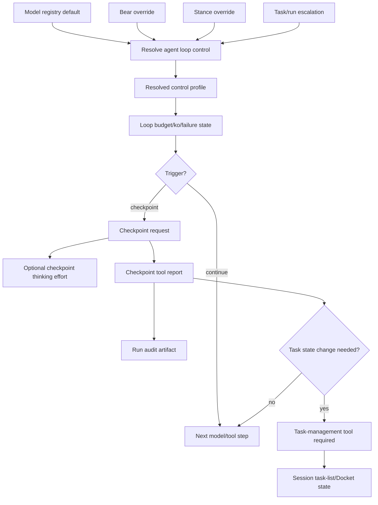

# Agent Loop Control Implementation Plan

## Status

In progress. Implements [ADR-0050 — Agent Loop Control, Adaptive Budgets, and Runtime Checkpoints](../decisions/adr-0050-agent-loop-control-adaptive-budgets-and-runtime-checkpoints.md), and depends on the task-list/Docket boundaries in [ADR-0045](../decisions/adr-0045-session-task-lists-and-docket-checkout.md) and [ADR-0034](../decisions/adr-0034-jobs-and-tasks-work-management.md). The runtime state axes and required invariants live in [Den state machine inventory](../architecture/den-state-machine-inventory.md); loop-control work that changes focus, orientation, completion, obligations, budgets, or governance must update that inventory in the same change.

> **Companion plan (2026-07-06, revised 2026-07-13):** [AGENT_LOOP_CONTROL_GROUNDING_AND_TUNING_PLAN.md](AGENT_LOOP_CONTROL_GROUNDING_AND_TUNING_PLAN.md) delivers the ADR-0050 amendment — surface-declared grounding probes (§7c), context/token budget as a loop dimension (§11), and a persisted replayable ledger/offline tuning harness. Because Den is still pre-release, development is staged but completed loop-control slices are active by default once tested; feature flags and long observation-only rollout periods are not the normal delivery mechanism. Land the companion plan's ledger foundation early; it is the measurement loop the rest of this plan is tuned against.

### Architecture revision — 2026-07-16

> **This revision supersedes the plan's prior product model of conversation-scoped “focused Jobs,” `/focus`, and `ResolvedFocus`.** Those sections describe implementation already present or underway, not the target architecture. Do not extend that model; migrate it deliberately.

### Continuation-authority revision — 2026-08-20

> **This revision supersedes conflicting wording below that describes a Pair run as non-authorizing, makes a selected current task sufficient for execution, or treats Docket execution persistence as compatibility-only for continuation.** Do not extend the current partial execution-session or scheduler-observation-delivery design until it is reconciled with the canonical attempt model below.

A selected session current task is an objective, **not** an execution claim. Tasked Pair and Work runs may continue autonomously only through a Docket-owned, durable execution attempt. Docket owns the outer task-tree/attempt loop for both owners; Pair and Work own their local model/tool loops.

```text
Docket: select eligible task -> authorize/continue attempt -> receive durable fact
      -> continue | advance | retry | pause | stop | await user

Pair/Work runtime: run the authorized bounded attempt; choose prompts and tools;
                   enforce control at safe boundaries; report facts/outcomes
```

The owner policy is deliberately asymmetric only at the user-interaction boundary:

- **Pair:** may report `awaiting_user` with a precise unresolved question. Its attempt is paused without being settled; Docket does not resume it until an authenticated user response or explicit resume makes it eligible again.
- **Work:** has no user-input path. Its terminal, retry, timeout, and escalation outcomes are governed by Docket Job/task policy.

Docket does not compose prompts, select individual tools, or control model-token turns. It controls authorization epochs and durable continuation at meaningful boundaries: attempt start/resume, task settlement, task-relevant lifecycle changes, and before broad/destructive work when an epoch may have changed.

A canonical execution attempt must have one task, one owner (`PairSession` or `WorkRun`), a monotonic fencing epoch, and one durable lifecycle:

```text
authorized -> running -> paused | awaiting_user | stopping -> settled | released
```

An active selected task without a matching authorized/running/paused attempt is not execution and must not be represented as active implementation work. A runtime may not silently select another task; after every bounded attempt outcome, Docket decides the next eligible continuation or releases the owner.

The loop-control object is a **session current task**, not a focus mode:

```text
Session ── current task? ──► task-oriented loop behavior
Worker run ── explicit Docket Job assignment ──► work-execution behavior
Docket Job ── optional durable outcome/task-tree container
```

### Canonical-attempt foundation — required before further scheduler delivery

The next implementation milestone is a design-and-foundation slice, not delivery
of the existing scheduler-observation outbox. It must establish the one durable
object Docket uses to control outer continuation for both Pair and Work.

```rust
enum ExecutionAttemptOwner {
    PairSession { session_id: SessionId, pair_run_id: PairRunId },
    WorkRun { work_run_id: WorkRunId },
}

enum ExecutionAttemptState {
    Authorized,
    Running,
    Paused,
    AwaitingUser,
    Stopping,
    Settled,
    Released,
}
```

The precise Rust names/schema may differ, but the following contract is
non-negotiable:

The implementation-facing transition, fencing, recovery, and legacy-mapping
contract is [Canonical Docket execution attempts](../design/docket-execution-attempts.md).
Work rejection checkpoint correlation and acknowledgement are specified in
[Docket Work checkpoint control](../design/docket-work-checkpoint-control.md).

1. Docket atomically authorizes one attempt for one eligible task, owner, and
   monotonic fencing epoch. Current-task selection alone cannot do this.
2. The owner can start or resume local inner-loop work only with that attempt.
   It reports bounded facts/outcomes; it cannot pick the next task.
3. Docket atomically accepts settlement, pause, `awaiting_user`, stop, or
   release, then determines the next eligible continuation. A Pair
   `awaiting_user` attempt is ineligible until authenticated user input or
   explicit resume is recorded.
4. Recovery reconciles every partial transition: no ownerless running attempt,
   no selected task presented as executing without an attempt, and no two
   live attempts for the same exclusive owner/task scope.
5. **Completed (pre-release):** `docket_execution_sessions` and the
   scheduler-observation outbox were removed after Pair/Work ownership,
   projections, diagnostics, and tests were rebased to canonical attempt
   identity. They are not compatibility inputs or runtime fallbacks.

The persistence and authority replacement is complete in pre-release:
canonical attempts now cover Pair and Work authorization, fencing, bounded
outcomes, owner-loss release, projections, and diagnostics; the legacy
execution-session and scheduler-observation tables/APIs are gone. Remaining
work is behavioral hardening and the other loop-control roadmap phases, not
legacy-state reconciliation or observation rebasing.

| Task | Done when |
| --- | --- |
| Specify canonical attempt transitions | **Complete.** Transition table defines actor, transaction boundary, idempotency key, fencing behavior, valid outcomes, and recovery for Pair and Work. |
| Persist attempts | **Complete.** Docket persistence enforces owner/task identity, active-attempt uniqueness, immutable fencing epochs, and auditable timestamps. |
| Gate Pair and Work | **Complete.** Start/resume/dispatch requires an authorized attempt; task selection remains an objective-only operation. |
| Report outcomes | **Complete.** Pair and Work report typed bounded outcomes; Pair supports precise `awaiting_user`. Docket, not the runtime, advances/retries/settles task-tree work. |
| Reconcile legacy state | **Complete (pre-release deletion).** Legacy execution-session state and fallbacks were removed rather than reconciled. |
| Rebase observations | **Complete (pre-release deletion).** The legacy scheduler-observation outbox was removed rather than rebased. |
| Validate failures | **In progress.** Core fencing, duplicate, start, owner-loss, and focused Pair/Work paths are covered; continue adding database-backed recovery coverage as remaining attempt transitions change. |

**Exit gate:** Docket can prove, from durable state, why each autonomous Pair or
Work continuation is allowed, who owns it, and what outcome makes the next
continuation eligible. Pair can autonomously proceed through an active task
tree, but pauses only for a durable safety/authority condition or a precise
user question.

### Pair session-title attempt indicator — appended 2026-08-23

The Pair session-title prefix is deliberately only glanceable semantic sugar:
it answers whether the session is currently working on a task. It is not a
focus mode, task selection indicator, Job indicator, execution authority
claim, or a source of durable state.

The ACP/session-title projection must derive its prefix exclusively from the
canonical Docket attempt for that Pair session/owner:

| Canonical attempt state | Prefix |
| --- | --- |
| `Running` | `▶️ ` |
| `Paused` | `⏸️ ` |
| no attempt, or `Authorized`, `AwaitingUser`, `Stopping`, `Settled`, or `Released` | none |

A selected current task never affects this projection by itself. In particular,
a ready-but-not-started task, a completed task left selected during
reconciliation, an `awaiting_user` attempt, and any stale or unknown attempt
state have **no prefix**. Unknown/error is fail-closed: remove the indicator
rather than implying execution.

#### Implementation slice

1. Replace the ACP adapter's legacy unconditional `⌖ ` focus-title decoration
   and `publish_focus_title_update` coupling with a small pure
   `attempt_title_prefix(state)` projection. Preserve the user-authored bare
   title separately; every publish must strip any prior managed indicator
   before applying the current one, so repeated updates cannot stack prefixes.
2. Read attempt state from Docket's canonical attempt projection keyed to the
   Pair session/owner correlation, not from `/focus`, selected-task state, Job
   status, run status, or model-loop events. A title update must occur after a
   successfully durable attempt transition and during session recovery/
   reconciliation; the title write remains best-effort and cannot affect the
   transition result.
3. Remove the remaining legacy focus terminology and behavior from this title
   path (`FOCUS_TITLE_PREFIX`, `project_focused_acp_title`, and the
   focus-triggered-only publish). Keep any `/focus` compatibility command only
   if separately required, but it must neither add a title prefix nor imply
   execution.
4. Add focused adapter tests: `Running` adds exactly `▶️ `; `Paused` adds
   exactly `⏸️ `; every other enumerated state and absent/unknown state removes
   the prefix; transitions `Running -> Paused -> Settled` produce
   `▶️ -> ⏸️ -> bare`; and pre-prefixed user/session titles are normalized
   without duplication. Add an integration test that task selection alone
   leaves the title bare.

This is a projection-only change. It creates no new durable session field,
requires no new dependency, and must not participate in Docket scheduling or
attempt authorization.

#### Pair outer-loop implementation status — 2026-08-21 (reconciled 2026-08-22)

**Implemented Pair bounded-slice path.** The canonical-attempt start boundary
is now in BearWire: `session.current_task.start` allocates the Pair `run_id`
and creates/starts the exact Docket Pair attempt before the native stream is
spawned (`405e9348`). A selected current task remains an objective only; the
attempt and its fence epoch authorize the run.

The authoritative bounded-progress source is the native Pair session-stream
technical-budget boundary (`den-runtime`, `session_stream.rs`), not model text,
`TurnCompleted`, the ACP adapter, or a client projection (`5554af0f`). It emits
typed `RuntimeSemanticEvent::BoundedSlice` only for classified technical budget
limits. Terminal events, client/approval waits, interruptions, and
`awaiting_user` retain distinct paths.

BearWire reports that bounded slice as fenced Docket `Progress` for the exact
attempt. It re-enters the **same Pair run** only when Docket returns `Continue`
(`4407878c`); `AwaitUser` and `Stop` do not schedule a successor. The native
continuation is typed `RuntimeContinuation::DocketBoundedSlice`, carries no
local task-selection or scheduler input, and does not call generic `run.start`
or create another attempt. Terminal outcomes are separately reported and cannot
be confused with bounded progress.

Focused coverage exists for the terminal/bounded distinction, native bounded
slice classification, typed continuation input, and the Continue-only
rescheduling decision. The remaining Pair work is broader canonical-attempt
migration/recovery validation—not implementation of this bounded-slice bridge.
In particular, retain open work for all required durable attempt transitions,
user-interrupt/approval/block yield coverage, legacy-state reconciliation, and
Work's corresponding attempt/continuation path. Do not claim those complete
from the Pair slice.

#### In-scope dependency expansion and real blocking

An active Docket task must not be reported as blocked merely because execution
uncovers a concrete, implementable dependency omitted from its original task
breakdown. When the missing capability is within the approved roadmap scope,
requires no external action, and has a safe inferable design, Docket creates a
bounded child task with explicit completion criteria, completes that dependency,
and resumes its parent continuation automatically. The child task preserves the
causal record; it is not a new source of scheduler authority.

A task may yield as **blocked** only when the next safe action depends on an
external approval/action, a material product or architecture decision that the
roadmap does not already resolve, or information that cannot safely be inferred.
This distinction applies to Pair, Work, and any model: a progress report that
identifies an in-scope control-plane prerequisite is a decomposition event, not
a terminal conversational yield.

Focused regressions for the Docket continuation manager must prove that an
in-scope prerequisite creates and executes a child task before the parent is
resumed, while a genuine approval/decision/external-action dependency yields
without speculative work.

### Pair planning and execution gate

A Pair session has at most one session-connected root task. Its ordinary task
status is the only planning gate: **planning mode is derived**, never persisted
as an independent mode.

```text
session-connected root is draft
    => planning mode; construct, edit, reorder, and remove its task tree
    => no current execution task and no Pair execution run

root is non-draft + an executable task is explicitly selected current
    => Pair task-oriented objective
    => eligible for Docket to authorize or resume a Pair execution attempt
```

Children may be fully specified and non-draft while their session-connected
root remains `draft`; the draft ancestor makes them non-executable. Selection
for execution must reject a draft task or a task beneath a draft ancestor.
A UI-only navigation highlight must not call the durable current-task selection
operation.

`ready` means eligible to execute, not an implicit start command. A deliberate
**start** operation may atomically move the root out of `draft`, select the
first executable task, and ask Docket to authorize its first Pair execution
attempt, but a generic status edit must not do so incidentally. The current
task remains the session objective; the Docket-owned attempt, not the presence
of a Pair run, authorizes autonomous implementation. A Pair run records local
bounded execution/checkpoint history for one attempt. A non-draft,
session-connected current task must have an authorized attempt and persisted
Pair run before entering implementation execution. `RunPaused` is valid only
when it identifies both that run and a Docket attempt in `paused` or
`awaiting_user`; a missing attempt/run is execution-initialization failure,
not a runless pause. A run that hits a budget boundary reports a bounded
outcome to Docket; Docket may continue the same attempt or authorize a
successor slice without asking the user to say "continue."

- A Pair session has zero or one current task. It is session-owned. Having a current task gives the session its objective; it neither creates a worker nor changes trust/permissions. It also does not itself authorize autonomous implementation: Docket must create or resume the matching Pair execution attempt.
- A Work loop has one bounded, explicit Docket Job assignment. Docket authorizes its execution attempts and decides outer continuation within that Job's approved task tree; Work owns only the inner model/tool loop for its assigned attempt.
- **Pair terminal settlement is Docket-attempt mediated and independent of delivery.** Pair reports a proposed completed, no-change, blocked, cancelled, or `awaiting_user` outcome against its authorized attempt. Docket atomically records/accepts the canonical task-journal outcome or pauses the attempt awaiting a precise user question. Commit delivery is runtime-owned post-settlement evidence, separate and retryable; it cannot reopen or invalidate an accepted outcome. Stronger artifact/publication gates belong to an explicit Work or release delivery contract.
- A Docket Job is for explicitly requested durable planning/tracking, journals, recovery, delivery contracts, or isolated background execution. Do not create one merely to give Pair ordinary work.
- **Pair works its current task directly by default.** Task delegation is deferred; do not expose `delegate_task` until its real end-to-end lifecycle, shared Pair/Work execution path, and workspace-safety requirements can ship together. See [Task delegation lifecycle plan](TASK_DELEGATION_LIFECYCLE_PLAN.md).
- Docket `dispatch_work` is isolated-sandbox execution only. Remove its public `local` target and all defaults/UX that treat local execution as Docket dispatch.
- Delegation and dispatch are explicit and do not alter Pair's current task. Pair should not create Jobs or dispatch them unless the user requests durable tracking, a plan/workstream, or background execution.

Migration requirements:

1. Replace `ConversationSnapshot.durable_focus_pointer` and `ResolvedFocus` with a resolved session-owned `current_task` model.
2. Replace client-facing Focus/Focused UI and `/focus` with current-task projection and task assignment/clear actions. Do not retain a distinct “Focused” permission/mode.
3. Bind every WorkRun to one explicit Docket Job. Work execution may advance that Job's approved task tree; it does not require or derive a per-task sandbox assignment, and it never follows conversation focus.
4. Preserve existing focus records only as migration input/compatibility state; they must not remain a second canonical continuation authority.
5. Update the state-machine inventory, prompts, tool surfaces, diagnostics, and tests in the same implementation slice. A task's current/assigned state—not cached prompts or task-list projections—is the sole continuation input.

### Current implementation status — 2026-07-15

Recent slices have moved the plan through the governance/focus/orientation foundation and through the first replayable measurement spine. We are intentionally stopping short of a full policy simulator; the current replay layer is a transcript-free comparison/summary harness for tuning real recorded decisions. Broad policy-driven enforcement is still future work:

- **Docket dispatch sandbox-only slice complete:** `dispatch_work` no longer accepts a local target, attached-workspace inputs, or dirty-worktree reporting. It always creates an isolated sandbox run and no longer emits the attached-armature dispatch event. Local subagent delegation remains a separate future capability.
- **Pair current-task authority is implemented:** `client_sessions.current_task_id` persists Pair's optional selected session task. Runtime resolution gives a valid session-anchored selection precedence over legacy Docket execution compatibility state. Pair exposes explicit `select_current_task` / `den.task.select` controls to select an actionable session task or clear the selection; invalid, foreign, blocked, cancelled, and terminal task selections are rejected. Apparent conversational redirection is confirmation-first: Pair must propose and ask rather than silently select, clear, replace, complete, or create a task.
- **Current-task client projection is implemented for BearWire and ACP:** both project an optional `current_task` only for an explicit valid Pair selection; neither infers one from the next pending task, legacy execution, or Work state. ACP's agent-plan projection is scoped to the selected task: it lists that task's in-order siblings when it is a child, or just that task when it is root-level.
- **Work Job binding is implemented:** every Work run is durably scoped to one Docket Job, and its optional `executing_task_id` is an in-run progress checkpoint constrained to that Job's task tree. Work task choice never replaces the Job assignment and Pair task selection never affects an active Work run.
- **Legacy Docket-execution persistence is retired in pre-release:** canonical Pair and Work attempt/fence state is the only continuation authority. `docket_execution_sessions` and the scheduler-observation outbox have been removed; no migration compatibility projection remains.
- **Legacy `/focus` UX is migration-only:** armature's exact-UUID `/focus <job_id>` path and focus-shaped diagnostics remain only until current-task projection and explicit assignment/clear actions replace them. Do not add matching, elicitation, or new product affordances to `/focus`.
- **Orientation/control migration is implemented for the canonical runtime paths:** Pair derives task orientation only from its resolved explicit current task; a Docket-backed Pair task remains task-oriented rather than acquiring Work execution authority. Work derives `DocketExecution` only from its explicit active Job assignment. Closed freeform continues to suppress task-definition/delegation tools when `may_define_task = false`; existing child-count/depth and immutable-execution decomposition limits remain in force.
- **Diagnostics/history need terminology and authority cleanup:** existing Docket events and conversation history may continue to explain legacy execution/focus transitions during migration, but new projections must report current task, Work assigned Job, and any Work in-run progress task separately. Do not introduce a new heavy diagnostics table merely to preserve focus history.
- **Checkpoint protocol is enforced enough for normal development:** runtime can request structured `checkpoint` tool calls with typed next-action fields, and enforce mode now requires a pending checkpoint to be answered through the checkpoint tool before another non-checkpoint tool call or final answer. The assistant-text/fenced-JSON fallback path has been removed. Artifact retention is still future work.
- **Replay/measurement spine landed at the useful-minimum level:** the companion plan's transcript-free `bear_loop_control_ledger` exists and records checkpoint requests, context-budget pressure decisions, and grounding-probe results with typed metadata/evidence refs. Runtime now has pure replay helpers for typed decision observations, per-turn aggregates, expected-turn/profile comparisons, profile summaries, DB-backed `run_id -> profile summary` loading, profile-level reason counts, turn-level reason comparison, and checkpoint profile fingerprints. No full policy simulator is planned unless real tuning needs outgrow these comparisons.
- **Context budget is integrated as the first real loop budget dimension:** latest ADR-0047 context-budget reports are carried in `TurnBudgetState`, near/over-budget pressure can be written to the ledger, near-budget pressure emits a loop-control diagnostic, and active overflow recovery attempts emergency compaction before stopping an over-budget model call. Low-budget checkpoint gating now distinguishes real budget-pressure warnings from KO/failure warnings. Code review currently supports deferring checkpoint-before-growth until recorded evidence shows compact-first behavior is insufficient.
- **Grounding probes are integrated at the generic MVP level:** mutation-like tool results now produce grounding-probe decisions tied to tool-call evidence refs, and failed probe signals prevent mutation replenishment/checkpoint reset. Tool-observation lookup now requires matching tool-call attribution instead of falling back to an ambiguous run-level probe signal. The MVP producer deliberately uses tool status/error-shaped content; stronger read-after-write or diff probes should be added only for surfaces where recorded runs show this is too weak.
- **Interrupted Pair delivery is terminalized separately from run settlement:** if an initial model stream ends without a semantic terminal event or a client-wait boundary, BearWire persists a durable `run.interrupted` event with `retryable: true` and a safe retry message. Pair clients treat that event as terminal for the current delivery, clear their running state, and preserve the underlying Pair run as `running` for reconciliation/retry. Reconnect recovery recognizes the same event. This prevents a completed or interrupted turn from leaving the conversation visibly running while avoiding a false completed/failed run settlement.
- **Initial checkpoint/KO tuning has started from live recorded behavior:** light/standard exploratory-read checkpoint cadence has been relaxed to reduce noisy `over_exploration` checkpoints during bounded roadmap-directed investigation, checkpoint decisions now persist a stable profile fingerprint for profile-aware tuning, while careful/strict profiles, failure thresholds, same-signature KO thresholds, and hard-stop paths remain unchanged.

### Implementation review and adjustments

- Prefer **events over new state tables** for diagnostics. Focus and task-definition history fit well as existing Docket events; orientation transitions should use an existing conversation/BearWire event stream or similarly lightweight log rather than a new heavy table.
- Keep **Docket attempt history** and diagnostics separate. Canonical
  `docket_execution_attempts` is the sole continuation authority; a selected
  current task remains Pair's objective. Events explain how objective,
  attempt, orientation, and assignment changed over time.
- Treat `/focus` strictly as a compatibility UX layer while it exists. Do not improve matching or add new callers; replace it with current-task projection plus explicit set/clear/assignment actions.
- Do not build a generic `FocusTarget`. The target architecture needs a typed session current-task reference (session-local or Docket task) and a separate typed Work Job assignment; they are not interchangeable.
- Keep broad budget enforcement behind the replay/tuning spine. The ledger/replay slices are now in place; next budget/checkpoint changes should either be replayable through the existing summary/comparison helpers or recorded as typed loop-control decisions.
- Reconcile this plan with the grounding/tuning companion before Phase 3/4 enforcement. Context-pressure and grounding signals now have ledger hooks and enough replay support to compare observed behavior against expected decision/profile shapes. Prefer those small comparisons over building a speculative policy simulator.

### Deployment, defaults, and later tuning

Den's single-user UAT instance is a release/interaction check, not a statistically meaningful tuning corpus. It must not block delivery of the tested control policy or trigger speculative threshold changes. The current profiles and thresholds are therefore the **sensible tested defaults** until production data shows a concrete problem.

The transcript-free `bear_loop_control_ledger` is the production measurement path. It is written for real decisions already—checkpoint requests, context-budget pressure, and grounding-probe outcomes—and stores typed metadata/evidence references rather than user or assistant text. Production deployment must retain that write path and make the existing time-bounded profile summary available to the operator. No UAT-only or additional telemetry pipeline is required.

Tuning is deliberately deferred until a production window contains enough decisions to compare profiles and reason distributions. A later tuning proposal must name its window, sample size, affected profile(s), observed reason/control/orientation distribution, and a bounded reversible profile delta. Do not change a threshold merely because UAT produced too little data.

Recommended next slices:

1. **Ship and verify production ledger collection.** Confirm deployed normal turns write the existing transcript-free ledger and that an operator can obtain a time-bounded recent profile summary. This is an operational verification, not a request to tune from the sole-user UAT corpus.
2. **Keep the tested defaults active.** Treat the current light/standard exploratory cadence, careful/strict behavior, failure thresholds, same-signature KO floors, and hard-stop paths as the release defaults. Repair concrete correctness defects found in UAT, but do not retune on anecdote.
3. **Evaluate production summaries when a meaningful corpus exists.** Compare reason distributions/profile summaries and only then propose the smallest reversible checkpoint/KO profile adjustment supported by the data.
4. **Refine context-budget policy with recorded production evidence.** Add checkpoint-before-growth only where summaries show emergency compact-first behavior is insufficient.
5. **Strengthen grounding probes only where attribution-backed production runs show the generic MVP is too weak.** Keep a new probe surface-specific rather than adding another generic fallback.
6. **Only add replay machinery when a concrete production tuning question needs it.** The current no-simulator harness has profile reason counts, turn-level reason comparison, and profile fingerprints. Avoid a full policy simulator unless those summaries/comparators prove insufficient.

### Roadmap item — collapse state authority dimensions

The current [Den state machine inventory](../architecture/den-state-machine-inventory.md) is deliberately explicit, but several axes should be simplified before loop-control enforcement grows more complicated. The goal is not one giant enum; it is fewer canonical owners and more derived projections.

Target canonical runtime objects:

1. **`ActorContext`** is the resolved actor/access input for the run: Bear identity, user membership/access, and trust profile. It is not a derivation engine: membership may constrain authority, but must not silently change trust profile, and trust profile must not imply user access.
2. **`ConversationSnapshot`** owns durable conversation inputs captured for the turn/run, including model-selection snapshot and Pair's persisted current-task reference. Ordinary policy decisions use the snapshot; mid-run changes enter through typed transitions rather than ad hoc row reads.
3. **`TurnAuthority`** is the compiled authority view for a turn. It consumes trust/profile defaults, governance, session permission mode, workplan/approval state, armature capabilities, and tool descriptors, then produces mutation/execution gates, allowed tool classes, and approval requirements. Governance remains a run-supervision input; `TurnAuthority` owns only the derived permission surface.
4. **`ResolvedCurrentTask`** is Pair's only task input to completion policy; **`WorkAssignment`** is Work's only task-execution input. The former resolves Pair's persisted session current-task reference, while the latter resolves the WorkRun's explicit Job assignment and optional in-run task. Cached task lists and prompt/client diagnostics may inform display/model context, but cannot manufacture continuation.
5. **`TurnRunState`** owns lifecycle plus active wait reason. Waiting states should structurally carry their obligation handles. Terminal transitions should close/cancel open obligations transactionally and idempotently so late results are ignored by construction; retrying terminalization must not reopen obligations, schedule another continuation, or change a previously settled terminal outcome except through an explicit recovery transition.
6. **`RunControl`** owns budgets, checkpoint state, failure/KO counters, retry policy, and recovery disposition. It may decide or record recovery, but lifecycle changes still occur through `TurnRunState`, and recovery must not mutate focus or authority except via explicit typed transitions.

Derivation direction is one-way:

```text
ActorContext
ConversationSnapshot
Session/client capability snapshot
Docket/workplan state
Tool descriptors
Governance
        │
        ▼
TurnAuthority ───────► tool routing / prompt authority block / client projection

ConversationSnapshot.current_task
        │
        ▼
ResolvedSessionTask ──► Pair completion policy / task-orientation prompt projection

WorkRun.assignment
        │
        ▼
ResolvedWorkAssignment ► Work completion policy / execution prompt projection

TurnRunState + obligations
        │
        ▼
continuation / wait / terminal behavior

RunControl
        │
        ▼
budget / checkpoint / retry decisions
```

Projections do not feed back into authority. A cached task-list projection cannot itself be a current-task or assignment source; at most it can be reused as a display/cache optimization after identity/version checks against the canonical record.

Demote these from state authorities to projections/caches or owned subrecords:

- active-task display, derived from `ResolvedSessionTask` or `ResolvedWorkAssignment` plus task state;
- cached task lists and operational-status labels;
- prompt/context/compaction state, as prompt projection over canonical runtime objects;
- model choice as an input/capability snapshot, not an authority source;
- work surface/sandbox state, owned by Docket `WorkRun` rather than Pair's current task;
- standalone recovery state, folded into `RunControl`.

Do not collapse these boundaries:

- trust profile vs governance;
- session current task vs Work assignment vs work surface;
- authority vs prompt/client labels;
- user membership/access vs trust profile.

Anti-goals:

- do not introduce a monolithic `EffectiveTurnState` object that every subsystem mutates;
- do not make prompt/client labels canonical state;
- do not let cached projections participate in completion or permission decisions;
- do not make model selection, compaction, title updates, or current-task display updates authority sources;
- do not collapse trust profile into governance or governance into permission mode.

Implementation slices:

| Slice | Done when |
| --- | --- |
| Introduce authority compiler seam | Tool routing, prompt assembly, and client projection all consume the same `TurnAuthority` result for write/mutation decisions, and no separate prompt/client/session-mode path can independently expand allowed tool classes. |
| Make current-task completion input explicit | Completion policy accepts the resolved session current task or Work assignment only. Cached task-list projections are not accepted by the completion API and cannot manufacture continuation state. |
| Reify wait reasons in turn-run state | Waiting `TurnRunState` variants carry obligation ids, and terminal transitions reject or close open obligations transactionally and idempotently. |
| Move work-surface ownership to WorkRun | Sandbox/workspace/branch state is resolved through Docket work execution records, not the Pair session task. |
| Demote projection-only axes | Prompt, compaction, client labels, and cached task lists cannot create current tasks, assignments, permissions, obligations, or governance. |
| Update inventory/tests | The state-machine inventory documents the reduced authority model and keeps seam tests for stale current-task/assignment records, submitted plans, terminal obligations, late results, and projection-only state. |

Exit gate: a turn's mutation authority, task-driven continuation, and active obligations each have exactly one canonical owner, with projections unable to expand authority or manufacture work.

## Goal

Give Den a typed **agent loop control** layer that governs tool-using turns across model calls and tool results: when to continue, checkpoint, retry, warn, stop, escalate thinking effort, or require task-state reconciliation.

The implementation must make Bear runs more efficient and auditable without letting runtime checkpoint prose become task state, memory, or ordinary conversation history.

## Scope

In scope:

- progressive agent loop control levels (`light`, `standard`, `careful`, `strict`),
- governance as the continuation-pressure input (`interactive`, `grace`, `autonomous_continuation`, `observational`, `frozen`),
- session current tasks and explicit Work assignments as objective inputs for continuation,
- objective orientation as the current outcome state (`freeform`, `task_oriented`, `work_execution`),
- freeform task-definition policy that controls whether the model may be told it can define a task and leave freeform mode,
- model default control levels,
- Bear-level and stance-level overrides mirroring model selection,
- task/run escalation for risk, difficulty, or governance,
- profile-owned budgets, ko/failure thresholds, checkpoint triggers, and task-gate behavior,
- optional checkpoint-turn thinking-level escalation,
- structured checkpoint artifacts/events,
- audit-oriented checkpoint retention for `work` runs,
- explicit projection/replay/history boundaries.

Out of scope:

- replacing Docket task/job state with checkpoint artifacts,
- using checkpoint prose to satisfy task gates,
- free-form transcript parsing to detect loops,
- hardcoded per-model runtime behavior,
- verbose chain-of-thought capture,
- provider reasoning-stream persistence as conversation history.

## Core invariants

1. **Loop control is stance-wide, not focus-specific.** The same runtime regime governs freeform Pair work, task-oriented Pair work, and assigned Work execution. A current task or assignment supplies the objective; neither is a separate permissions or loop-control flavor.
2. **Runtime controls continuation; task tools control task state.** Checkpoints may identify that task state should change, but only `update_task_list`, `sync_task_list`, `checkout_task_list`, `request_task_list_handoff`, or Docket service APIs may mutate session task-list/Docket state.
3. **Checkpoints are structured artifacts, not informal prose.** A checkpoint report should arrive as a runtime-owned `checkpoint` tool call whose arguments are parsed into typed fields. Assistant prose/JSON fallback is degraded and never the primary control path.
4. **Checkpoint artifacts can be auditable without becoming Docket events.** `work` runs may retain checkpoint artifacts as run audit evidence, but Docket `bear_task_events`/`bear_job_events` remain the report-visible source of task progress, blockers, completion, and criteria evaluation.
5. **Checkpoint advice cannot expand authority.** Checkpoint reports are advisory inputs to runtime policy. They cannot expand budgets, reset stop conditions, bypass trust gates, or authorize actions the resolved loop-control profile disallows.
6. **Thinking effort is a quality knob, not a safety boundary.** Budget, ko, task-gate, and stop enforcement remain runtime-authoritative even if a provider ignores thinking-level metadata.
7. **Runtime code consumes resolved typed profiles.** Model names and provider quirks belong in registry/configuration; the runtime must not scatter model-name `match` arms.

## Conceptual model



## Phase 0 — Baseline inventory

**Goal:** identify current seams before changing behavior.

| Task | Done when |
| --- | --- |
| Inventory budget state | Existing `TurnBudgetPolicy`/ledger structures and enforcement points are documented. |
| Inventory model selection | The current model resolution precedence for system/Bear/stance/conversation is documented. |
| Inventory request metadata | The Bifrost/provider request path that can carry thinking/reasoning effort metadata is identified. |
| Inventory task gates | Current session task-list continuation gates and task-gate rejection handling are documented. |
| Inventory persistence | Conversation history, hidden model-visible records, BearWire events, Docket events, and run telemetry stores are distinguished. |

**Exit gate:** a short implementation note identifies exact files/modules for type definitions, resolver, request metadata, loop state, checkpoint artifacts, and projections.

## Phase 1 — Agent loop control types and profiles

**Goal:** introduce typed policy without changing runtime behavior.

Suggested types:

```rust
pub enum AgentLoopControlLevel {
    Light,
    Standard,
    Careful,
    Strict,
}

pub enum AgentLoopControlSource {
    ModelDefault,
    BearOverride,
    StanceOverride,
    TaskEscalation,
    SystemDefault,
}

pub struct ResolvedAgentLoopControl {
    pub level: AgentLoopControlLevel,
    pub source: AgentLoopControlSource,
    pub profile: AgentLoopControlProfile,
}

pub struct AgentLoopControlProfile {
    pub budget: TurnBudgetPolicy,
    pub ko: KoPolicy,
    pub checkpoints: CheckpointPolicy,
    pub task_gate: TaskGatePolicy,
    pub thinking: CheckpointThinkingPolicy,
}
```

| Task | Done when |
| --- | --- |
| Add level enum | Control levels are serialized with stable snake_case names. |
| Add policy structs | Budget, ko, checkpoint, task-gate, and thinking policy have typed structs. |
| Add default profiles | `light`, `standard`, `careful`, and `strict` resolve to deterministic profiles. |
| Add monotonic ordering | Runtime can compare/escalate levels without string matching. |
| Add unit tests | Default profile thresholds and ordering are covered. |

**Exit gate:** profiles are typed and testable, but not yet enforced.

## Phase 2 — Model defaults and Bear/stance overrides

**Status: Complete (2026-08-11).** The model-registry default, persisted Bear and stance overrides, raise-only task/pre-risk escalation, typed runtime resolver, session/run projection, diagnostics, and precedence/fallback coverage are implemented. See `den-runtime/src/agent_loop/control.rs`, Bear settings persistence, and commits `1d06fd779` and `b7a3f7f39`. The remaining Phase 2a/2d Pair-run recovery, correlation, retention, and orientation work below is required to close the broader current-task execution program; it is not missing Phase 2 control-profile resolution.

**Goal:** resolve control level the same way model selection is resolved.

Resolution order:

1. model registry default,
2. Bear-level override,
3. stance-level override,
4. task/run escalation.

Task/run escalation may raise intensity, but should not silently downgrade operator-configured Bear/stance policy.

| Task | Done when |
| --- | --- |
| Extend model metadata | **Complete.** Model registry exposes the default `agent_loop_control_level`. |
| Add Bear override storage | **Complete.** Persisted Bear config can set a default loop control level. |
| Add stance override storage | **Complete.** Persisted stance/profile config overrides Bear/model defaults for `pair`, `chat`, `work`, and related stances. |
| Implement resolver | **Complete.** Runtime resolves a typed control result with level, source attribution, and profile; task/pre-risk escalation is raise-only. |
| Add diagnostics | **Complete.** Runtime/session projections include level, source, and profile summary/fingerprint. |
| Add tests | **Complete.** Model default, Bear override, stance override, unknown-model/context fallback, and escalation precedence are covered. |

**Exit gate: Met.** Runs resolve and report a control profile without relying on behavior changes. This phase must not be reopened merely because Phase 2a/2c/2d still have execution-entry, recovery, orientation, or persisted-evidence work.

## Phase 2a — Governance and session-task inputs

**Goal:** make the loop controller consume explicit supervision and a session current task before enforcement uses them.

> **Superseded design note:** the focused-Job shapes below are retained only as an implementation-history reference. The target is the architecture revision at the top of this plan: `current_task`, not a generic focus subsystem.

Target shape:

```rust
pub struct LoopControlContext {
    pub governance: Governance,
    pub current_task: Option<ResolvedSessionTask>,
}
```

A Pair session's current task is session-scoped and may be local or Docket-backed. A Work run instead carries an explicit durable Docket Job assignment and may advance that Job's approved task tree. Neither is inferred from a client mode, prompt text, or cached task-list projection.

| Task | Done when |
| --- | --- |
| Persist current session task | **Complete.** `client_sessions.current_task_id` persists Pair's optional selected session task across turns/reconnects; a valid session-anchored selection is canonical. |
| Project current task | **Complete.** BearWire and ACP project an optional explicit selected task; ACP's agent plan is the selected task's sibling scope (or one root task). |
| Snapshot task into Pair runs | **Superseded as a completion claim.** The selected task remains the Pair objective, but a persisted Pair run alone is not execution authority. Replace this with a canonical Docket-owned Pair execution attempt that atomically binds one eligible task, one Pair session/run owner, and a fencing epoch before autonomous implementation begins; migrate/reconcile existing active Pair runs into a non-authorizing compatibility state. |
| Enter current-task Pair execution | **Superseded as a completion claim.** `session.current_task.start` must become the authenticated request for Docket to authorize/create or resume the canonical Pair attempt, then start/reuse its local Pair run. It must return a non-dispatchable outcome if no attempt is authorized. |
| Bind Work Job | **Complete.** Each WorkRun persists one explicit durable Docket Job assignment. |
| Enforce Work Job binding | **Complete.** A Work run without an assigned Job is rejected before model-driving continuation begins. |
| Derive task behavior | **Complete.** Pair resolves only from its explicit current task and Work only from its explicit Job assignment; orientation and authority remain separate. |
| Add diagnostics | **Complete.** Runtime/session projections carry the typed objective orientation; current-task and Work-assignment paths are distinct. |
| Add tests | **Complete.** Coverage includes Pair task selection, no implicit orientation from planned activity, closed freeform, Pair/Work separation, Work assignment precedence, and immutable Work task-definition rejection. |

**Exit gate: Superseded.** Replace it with the canonical-attempt exit gate defined in the 2026-08-20 continuation-authority revision: a selected task is only an objective; every autonomous Pair or Work continuation has exactly one Docket-owned attempt, owner, fencing epoch, and reconcilable lifecycle.

### Phase 2d — Pair runtime interrogation and transcript correlation

**Goal:** make active Pair task execution inspectable end-to-end before Phase 2
is closed. This is mandatory Phase 2 validation work, not a deferred
observability phase.

The runtime must expose stable transcript message identifiers to Pair review
and persist an append-only history that joins those messages to the actual
Pair execution run, selected task, budget state, and runtime-owned loop
controller decisions. This is a diagnostic record, not a second task,
continuation, or completion authority. It may reference transcript content by
identifier; it must not duplicate raw conversation text by default.

Required correlation path:

```text
transcript message id
  -> Pair execution run id
  -> current task / session-connected root
  -> loop-control decision and budget snapshot
  -> continuation, pause, resume, or settlement evidence
```

| Task | Done when |
| --- | --- |
| Define stable transcript IDs | **Implemented.** Canonical `append_message` returns immutable message UUID plus sequence number, including idempotent/retry paths, for user, assistant, tool, warning, and error records. |
| Define append-only Pair runtime history | **Implemented at the existing ledger boundary.** `bear_loop_control_ledger` has Pair run, typed decision, bounded payload/evidence refs, task/list refs, and optional canonical `conversation_message_id`; it stores no raw transcript. |
| Record controller boundaries | **Implemented.** Terminal assistant output persists before final-gate evaluation; suppressed final responses record `FinalGateContinuation`, repeated objections record `ActiveTaskPause` before `RunPaused` is emitted, and technical Pair slice boundaries atomically claim `running → continuing`, record `BudgetSliceContinuation`, then consume that claim as `continuing → running` before the same-run successor step. A process-abandoned `continuing` claim is consumed back to the original `running` run, never a second active run, and records `BudgetSliceRecovery` with the selected Docket task reference. An initial stream that ends before a semantic terminal/client-wait boundary records durable `run.interrupted` evidence, a `DeliveryInterrupted` ledger decision, and terminalizes the current client delivery while leaving the run retryable. Jobless Pair-session settlement records `TaskSettled` against the owned active Pair run without making settlement depend on telemetry. Tool-failure, Rule-of-Ko, and unrecovered context exhaustion remain real non-auto-resume stops. |
| Provide interrogation reads | **Implemented.** Authenticated BearWire `conversation.diagnostics` provides bounded, transcript-free reads scoped to the Bear conversation/session and filters by run, message, and task. |
| Define retention and redaction | **Implemented.** Ledger decisions reject transcript-like fields (`content`, `message_content`, `prompt`, `raw_message`, and `transcript`) recursively, diagnostics clamp reads to 1–100 records, and writes purge rows older than 30 days. The ledger is replay/tuning telemetry rather than canonical conversation history; only structured IDs and bounded evidence references are retained. |
| Test the evidence chain | **Complete at authoritative boundaries.** Database-backed coverage validates persisted `TaskSettled` run/task/session linkage and replay; focused lifecycle coverage validates continuation, same-run recovery, retryable interrupted-delivery evidence, and settlement without granting delivery state task authority. These tests deliberately avoid a synthetic all-in-one model-stream fixture: it would duplicate the already authoritative persistence boundaries while coupling the test to provider stream timing. |

**Current evidence:** focused offline checks passed for continuation recovery, settlement evidence, and ledger retention; the settlement evidence test has checked-in SQLx metadata. The primary runtime/provider boundaries are tested independently against their authoritative persistence contracts.

**Exit gate: Met.** An operator or Pair can diagnose why an execution-focused turn continued, paused, resumed, was delivery-interrupted, recovered, or completed from durable correlated evidence. Phase 2a's Pair-run invariant is met without treating delivery state as task authority.

### Completed execution slice — close Phase 2a/2d recovery and evidence gates

**Status: Complete.** Phase 2 control-profile resolution remains complete. The
broader current-task execution program now closes its recovery and persisted
evidence gates without reopening profile resolution or starting Phase 3 policy
expansion.

1. **PostgreSQL evidence boundary.** Database-backed settlement evidence validates the durable run/task/session linkage and replay contract.
2. **Continuation and recovery.** Focused lifecycle coverage validates selected-task run creation/reuse, continuation claim, idempotent same-run recovery, and retryable delivery interruption.
3. **Settlement correlation.** Task settlement records and queries the boundary against the same run/task chain while delivery state remains non-authoritative.

**Slice exit gate: Met.** An interrupted or recovered active Pair task has one
client-visible delivery terminal outcome for each delivery attempt, one
canonical persisted Pair run, and durable evidence through recovery and
eventual settlement without treating delivery state as a second task authority.

## Phase 2b — Client projection for current task

**Goal:** let clients show and change a session's current task without turning it into a permission preset or a Docket-only workflow.

Clients project an optional **current task** as the session objective. It is not a permissions mode, does not grant authority, and does not start a worker. The minimal operations are assign/replace and clear; task selection can initially use exact identifiers where a Docket task is involved.

A task-like user request may create a session-local current task as part of ordinary Pair work. Creating or attaching a Docket Job remains explicit: Pair asks before durable tracking or background dispatch unless the user already requested it.

When a current task exists:

- the client displays its title/objective;
- the conversation title may reflect the task with simple blocked/done fallbacks;
- clearing or replacing it changes only the session objective;
- no client mode change is necessary or meaningful.

| Task | Done when |
| --- | --- |
| Define current-task projection | **Complete.** BearWire and ACP project only an explicit Pair current task; ACP scopes its plan to the selected task's siblings or the one root task. |
| Keep Den authoritative | **Complete.** Clients request selection/clear through Den; persistence and validation remain server-owned. |
| Add current-task affordance | **Complete for BearWire/Armature.** Pair clients use confirmation-first `session.current_task.selection_request`, followed by explicit `select`, or direct `clear`; all operations route through Den's shared Pair/session authority. Web chat is explicitly deferred until it is BearWire-backed. |
| Preserve session-local tasks | **Complete.** A jobless Pair task is anchored by Den to the authenticated current session and may become that session's current task only through explicit selection. Pair-facing tools do not expose raw session-anchor identifiers; a Job-owned task requires an explicit `job_id`. Task ownership is exclusive: exactly one of session or Job. |
| Ask before durable escalation | **Complete.** Redirection guidance requires asking; Job creation/dispatch is not implicit. |
| Update titles | **Complete.** Selecting a Pair current task updates the conversation title through the existing title-sync path; clearing leaves the title intact. |
| Prevent permission laundering | **Complete.** Selection changes only Pair's objective; it grants neither authority nor Work scope. |
| Add projection tests | **Complete.** BearWire explicit-selection/no-inference and ACP selected-task sibling-scope coverage exist. |

**Exit gate:** clients can show and manage a current task without a Focused mode or implicit durable Job creation.

## Phase 2c — Objective orientation and task-definition policy

**Goal:** derive loop behavior from the session current task or the Work run assignment without introducing a separate focus state.

Objective orientation answers one question: **what concrete task, if any, is this loop currently pursuing?** It is distinct from governance/trust. Orientation may change steering strength, budget/grace profiles, task affordances, and prompt construction, but it must never expand authority, approvals, memory access, outbound auth, or destructive-action permissions.

Use exactly three orientation states:

1. **`freeform`** — Pair has no current task. Budget/grace limits are strict. The model is chatting unless the freeform policy permits it to establish a session task.
2. **`task_oriented`** — Pair has a resolved current task, either session-local or Docket-backed. The loop prioritizes advancing that task. A Docket-backed task does not make the Job itself an orientation state.
3. **`work_execution`** — a Work run has one concrete assigned Docket Job. The worker may act only within that Job's approved task tree and settles through its existing Job task lifecycle.

```rust
pub enum ObjectiveOrientation {
    Freeform { policy: FreeformPolicy },
    TaskOriented(TaskOrientation),
    WorkExecution(WorkAssignmentOrientation),
}

pub struct TaskOrientation {
    pub task_ref: ResolvedSessionTaskRef,
    pub child_policy: SessionTaskChildPolicy,
}

pub struct WorkAssignmentOrientation {
    pub job: WorkJobAssignmentRef,
}
```

Resolution is deterministic:

1. a Work run with a valid assigned Job resolves `work_execution`; a Work run without one is rejected before model invocation;
2. otherwise, a resolved session current task resolves `task_oriented`;
3. otherwise resolve `freeform` with the run's `FreeformPolicy`.

The freeform task-definition policy controls whether the model may establish a lightweight session task. For Pair, a jobless task is server-anchored to the authenticated current session; the model does not receive or supply a session-anchor identifier. Under explicit user instruction to focus the conversation, the newly created session task may become the current task. It does **not** authorize Job creation, durable dispatch, or local delegation without the separate user-request/approval rules described above.

- `may_define_task: false`: do not expose task-definition or delegation affordances; defensively reject them.
- `may_define_task: true`: the model may establish a concrete session task with completion criteria when sustained work is needed. It works that task directly by default.

Task delegation is deferred; do not expose `delegate_task` until its real end-to-end lifecycle can ship as described in the [Task delegation lifecycle plan](TASK_DELEGATION_LIFECYCLE_PLAN.md). Docket dispatch requires an existing Job and is always isolated; it does not consume or change Pair's current task.

### Boundary with checkpoints

Orientation owns the current objective and the policies that follow from it. Checkpoints are interrupts: low budget, stalled progress, risk, ambiguity, or attempted scope expansion. They must not select a task, create a Job, or act as a second continuation authority. Checkpoint context includes the resolved task/assignment reference and policy violation details.

### BearWire / ACP plan projection

Clients project the current task or Work assignment as the visible plan objective. This is a projection, not an additional source of task state. For a task tree, show the current task and same-level siblings; do not flatten an entire Docket tree. Projection edits round-trip through the relevant session-task or Docket mutation path and never alter orientation as a side effect.

| Task | Done when |
| --- | --- |
| Add orientation types | **Complete.** Runtime has typed freeform, oriented-task, and Docket-execution orientation types. |
| Resolve orientation per run | **Complete.** Pair resolves only from its selected current task; Work resolves only from its explicit assignment. |
| Keep freeform prompt gated | **Complete.** Prompt construction exposes session-task establishment only when `may_define_task` is true. |
| Defensively enforce policy | **Complete.** Runtime rejects task establishment from closed freeform runs and task definition in immutable Work orientation. |
| Preserve durable boundary | **Complete.** Job creation, Docket dispatch, and attachment remain user-requested/approved operations, not consequences of task orientation. |
| Apply orientation budget profiles | **Complete.** Control-profile resolution receives the typed orientation and preserves strict freeform versus oriented/Work context defaults without granting authority. |
| Preserve trust boundaries | **Complete.** Orientation never grants tools, approvals, memory access, outbound auth, or destructive-action permission. |
| Add diagnostics and tests | **Complete.** Covers Pair with/without a selected task, planned activity not implying orientation, closed freeform, assigned Work precedence, immutable Work, and no implicit durable escalation. |

**Exit gate: Met.** Loop control has one objective authority per loop: current task for Pair, assignment for Work.

## Phase 3 — Budget/ko/failure integration

**Status: Complete (2026-08-27).** Native turn construction resolves the control profile, applies only the permitted model/Bear multiplier to ordinary tool and post-mutation verification capacity, and stores that result as the session's turn budget. `evaluate_turn_budget` consumes that resolved policy for KO, consecutive-failure, class/total-tool, wall-clock, and emergency-step decisions; focused unit coverage verifies KO cutoff, failure cutoff, verification replenishment, global-fuse preservation, and JSON-signature canonicalization. The earlier remaining initialization gate is met.

**Goal:** initialize loop budgets from the resolved control profile.

| Task | Done when |
| --- | --- |
| Wire profile into turn state | Turn state owns the resolved profile and budget ledger. |
| Replace hardcoded thresholds | Existing budgets/ko/failure limits come from the resolved profile. |
| Preserve global fuses | Wall-clock, total tool calls, repeated failures, and emergency hard steps remain turn-global. |
| Preserve verification windows | Read/search replenishment after meaningful mutation remains small and verification-oriented. |
| Add tests | Budget initialization, ko cutoff, failure cutoff, and verification replenishment use resolved profile values. |

**Exit gate:** existing budget behavior is policy-driven, with no checkpoint enforcement yet.

## Phase 4 — Checkpoint trigger state

**Status: Complete (2026-08-27).** Runtime owns typed checkpoint state and trigger evaluation for read/search exploration, consecutive failures, repeated tool signatures near ko, low budget, and pre-risk mutation. Native session-stream wiring updates this state from typed tool observations and installs the resulting checkpoint request. The earlier proposed runtime `TaskGateRejection` signal is deliberately superseded: Docket owns task-gate decisions under the canonical-attempt authority model, and runtime must not infer or synthesize a task-tree gate rejection. The former observe-only event name is likewise obsolete: runtime now emits the typed `runtime_checkpoint_required` progress projection when it installs a request; enforcement remains governed by the configured loop-control mode. Focused unit and session-stream coverage exercises the implemented trigger reasons and checkpoint request path.

**Goal:** track loop-health signals needed for runtime checkpoints.

Suggested state:

```rust
pub struct CheckpointState {
    pub read_search_since_mutation: u32,
    pub consecutive_failures: u32,
    pub same_signature_repeat_count: u32,
    pub last_checkpoint_at_step: Option<u32>,
    pub pending_checkpoint: Option<CheckpointRequest>,
}

pub enum CheckpointReason {
    OverExploration,
    ConsecutiveFailure,
    SameSignatureNearKo,
    TaskGateRejection,
    LowBudget,
    PreRiskMutation,
}
```

| Task | Done when |
| --- | --- |
| Classify tool calls | **Complete.** Typed observations classify read/search, mutation, destructive, execution, and failure outcomes. |
| Track exploration since mutation | **Complete.** Read/search counter increments and resets only on meaningful mutation. |
| Track failure and repeat signals | **Complete.** Consecutive failures and repeated signatures feed checkpoint state. |
| Track task-gate rejection | **Superseded.** Docket owns authoritative task-gate decisions; runtime does not infer task-tree gate rejection. |
| Add observe-only diagnostics | **Complete (revised).** Installing a request emits typed `runtime_checkpoint_required` progress; configured enforcement determines whether continuation is gated. |
| Add tests | **Complete.** Profile-specific exploration, failure, repeated-signature, low-budget, and pre-risk coverage is in place. |

**Exit gate: Met.** Checkpoint triggers are observable and tested; enforcement is handled by the later runtime checkpoint path.

## Phase 5 — Structured checkpoint request and checkpoint tool protocol

**Status: Complete (2026-08-27).** Runtime owns typed, serializable checkpoint request/response DTOs with stable request ids, injects the `checkpoint` function-tool schema only while a request is pending, and parses/validates tool arguments once at the native runtime boundary. Invalid, stale, and missing-field responses produce typed recovery progress and retain deterministic runtime authority; unrecoverable checkpoint-protocol loops remain bounded by the recovery fuse. The earlier suggestion to parse assistant-text JSON as a degraded fallback is intentionally superseded: accepting free-form assistant text as checkpoint protocol input would make the runtime boundary ambiguous. The explicit checkpoint tool call is the only accepted response channel.

**Goal:** implement Option B as a typed runtime-owned `checkpoint` tool call rather than unstructured assistant prose or assistant text JSON.

A checkpoint request should include enough context to make the response auditable:

```rust
pub struct RuntimeCheckpointRequest {
    pub checkpoint_id: CheckpointId,
    pub run_id: String,
    pub reason: CheckpointReason,
    pub control_level: AgentLoopControlLevel,
    pub active_objective: Option<String>,
    pub task_context: Option<CheckpointTaskContext>,
    pub evidence_refs: Vec<CheckpointEvidenceRef>,
    pub required_fields: Vec<CheckpointField>,
}
```

The model-facing response should be a `checkpoint(...)` tool call. Suggested tool argument schema:

```rust
pub struct RuntimeCheckpointResponse {
    pub checkpoint_id: CheckpointId,
    pub active_objective: String,
    pub summary: Option<String>, // short prose synthesis for audit
    pub more_exploration_justified: bool,
    pub next_action: CheckpointNextAction,
    pub task_state_change_needed: Option<TaskStateChangeIntent>,
    pub evidence_refs: Vec<CheckpointEvidenceRef>,
    pub confidence: Option<CheckpointConfidence>,
}
```

Do not force learned facts and uncertainty into required JSON arrays. Keep model reasoning/prose separate; structure only the decision fields and a short audit summary.

`CheckpointNextAction` should be a typed enum, for example:

- `call_tool`,
- `edit`,
- `validate`,
- `update_task_list`,
- `sync_task_list`,
- `request_handoff`,
- `final_if_gate_allows`,
- `stop_blocked`.

`TaskStateChangeIntent` is **intent only**. It does not mutate task state.

| Task | Done when |
| --- | --- |
| Define request/report DTOs | **Complete.** `RuntimeCheckpointRequest` and `RuntimeCheckpointResponse` are typed and serializable; the response DTO is the checkpoint tool argument shape. |
| Add checkpoint ids | **Complete.** Each installed request has a generated id scoped to its runtime run/turn context. |
| Add model instruction fragment | **Complete.** The injected function tool and runtime recovery guidance direct the model to call `checkpoint`, not produce text JSON. |
| Parse response at boundary | **Complete (revised).** Tool arguments are parsed exactly once at the native runtime boundary. Assistant-text JSON is deliberately not a protocol fallback. |
| Validate required fields | **Complete.** Missing/invalid/stale tool fields emit typed recovery guidance; hard failure is reserved for the bounded unrecoverable recovery loop and emergency fuses. |
| Add tests | **Complete.** Structured success, missing fields, stale ids, malformed arguments, invalid task-action combinations, and recovery progress are covered. |

**Exit gate: Met.** The runtime requests and parses structured checkpoint tool reports without allowing reports to mutate task state.

## Phase 6 — Checkpoint artifact retention and audit policy

**Status: Complete (updated 2026-08-20).** `bear_run_checkpoints` remains the live checkpoint projection, while request installation and validated responses each create immutable `runtime_checkpoint` JSON artifacts. Both artifacts link to the authoritative Work run, Docket job, and Docket task when present. Response persistence, response-artifact creation, and audit links commit atomically, so a validated projection cannot exist without its required immutable audit artifact. Authenticated `conversation.diagnostics` has an opt-in, bounded checkpoint projection for an owned Pair run (`include_checkpoints: true`), with SQLx coverage. Pair, Chat, Curate, and Watch requests remain in-memory by default.

**Goal:** make checkpoints useful for `work` run audit without polluting conversation history or Docket task events.

Checkpoint reports are artifacts, not status reports. They are durable audit/debug payloads attached to a run, not user-facing progress prose, conversation history, model replay context, or Docket task/job events.

Preferred final shape: store checkpoint request/response payloads through the artifact-ref system as artifact kind `runtime_checkpoint`, then attach them with generic artifact links:

```text
artifact_links
- artifact_ref
- subject_kind = run
- subject_id = run_id
- role = checkpoint
```

When useful for audit/query, the same checkpoint artifact may also be linked to the Docket Job, current task, or Work assignment with an evidence/audit role. These links are evidence references only; they do not mutate task state and do not imply completion, blockage, waiver, or cancellation.

Until artifact refs exist, a small temporary `bear_run_checkpoints` table is acceptable, but it should be shaped as a mechanical migration path to artifact refs rather than a competing permanent checkpoint store:

```text
bear_run_checkpoints
- id uuid primary key
- run_id text not null
- turn_id text nullable
- checkpoint_id text not null
- reason text not null
- control_level text not null
- request jsonb not null
- response jsonb nullable
- validation_status text not null -- requested | valid | invalid | superseded
- replay_policy text not null -- none by default
- related_task_list_id text nullable
- related_task_item_id text nullable
- related_docket_task_id uuid nullable
- future_artifact_ref text nullable
- created_at timestamptz not null
```

Retention rules:

- `pair` default: live/debug telemetry or short retention unless needed for recovery.
- `work` default: audit-retained `runtime_checkpoint` artifact linked to the run.
- Docket report-visible history still requires Docket/task events.
- Model replay uses only explicit replay policies, never raw checkpoint prose by default.

| Task | Done when |
| --- | --- |
| Add checkpoint artifact API | **Complete.** Runtime writes immutable `runtime_checkpoint` JSON artifacts for persisted Work requests and validated responses. |
| Keep artifact outside Docket events | **Complete.** Checkpoints do not appear as `bear_task_events` or `bear_job_events`. |
| Add `work` audit retention | **Complete.** Work artifacts carry run, Job, and task audit links when those authoritative references exist. |
| Add pair/chat retention policy | **Complete.** Interactive stances avoid durable clutter unless recovery policy requires it. |
| Add read API for audits | **Complete.** Owned-run diagnostics provides an opt-in bounded checkpoint projection; artifact links provide the canonical audit registry view. |
| Add tests | **Complete.** Focused runtime coverage proves request/response artifacts and their matching Work/Job/task links; checkpoints remain separate from task events and default replay. |

**Exit gate:** structured checkpoints are auditable for `work` while preserving Docket/task boundaries.

## Phase 7 — Checkpoint enforcement in the loop

**Status: In progress (2026-08-27).** Runtime-owned checkpoint enforcement remains valid as an inner-loop safety mechanism. Pending runtime checkpoints now restrict the next model inference to the runtime-owned `checkpoint` tool, so they are enforcement boundaries rather than advisory tool additions. The prior execution-gate and scheduler-observation foundation is not the canonical outer-loop authority: reconcile it with the Docket-owned execution-attempt model before extending delivery or adding dispositions. A checkpoint never authorizes execution, advances a task, or resumes an attempt; it only informs the owner runtime's bounded outcome report.

**Goal:** make checkpoint triggers affect continuation without making checkpoint advice authoritative.

### Docket-owned task execution gates and deterministic scheduling

The remaining task-gate trigger is a deliberate authority boundary, not a runtime heuristic gap. Docket is the authoritative scheduler for task-tree execution: it owns task state, dependencies and ordering, runnable-task selection, session attachment/checkout, execution leases, and task-gate decisions. Pair and Work own execution focus/attachment presentation; runtime owns model and tool execution within the authority Docket grants. Runtime must report execution facts, but it must not infer task-tree meaning or independently decide that a task gate rejected work.

```text
Docket task authority
  -> typed execution-gate decision (allow with lease, or reject with reason/policy)
  -> Pair/Work applies the decision at execution boundaries
  -> runtime executes only within the granted lease
  -> runtime consumes a typed rejection as a checkpoint observation when Docket requires it
```

The prerequisite for task-gate checkpoint enforcement is therefore a typed Docket-produced decision, not a runtime-local counter or inferred rejection. The contract should carry an explicit reason, a durable occurrence/repetition disposition scoped to the relevant task/attachment or lease, and a retry disposition. Illustrative shape:

```rust
enum TaskExecutionGate {
    Allowed { task_id: TaskId, lease: ExecutionLeaseId },
    Rejected(TaskGateRejection),
}

struct TaskGateRejection {
    task_id: TaskId,
    reason: TaskGateRejectionReason,
    occurrence: RejectionOccurrence,
    retry: TaskGateRetryPolicy,
}
```

Reasons should distinguish cases such as no selected/attached task, missing/expired/foreign lease, task terminal or not runnable, incomplete dependency/parent, unavailable workspace, and policy denial. Retry policy—not runtime inference—chooses whether to wait, stop, require a checkpoint, or require human intervention. A checkpoint never satisfies the underlying task gate or changes task state; it can only help produce a permitted next action once Docket evidence/authority allows one.

To avoid unnecessary model turns and prompt growth, apply this contract at meaningful execution boundaries rather than every model token: task start/resume, before broad or destructive actions when a lease can change, after Docket-relevant lifecycle observations, and after rejected task-management operations. A valid lease permits ordinary local reasoning and tool continuation without scheduler round trips. Gate rejection must not trigger an automatic model retry: runtime can directly pause, wait, stop, or move to a Docket-supplied next runnable task. Only evidence/criterion ambiguity should request a model checkpoint.

Docket should return a compact executable-task context at task boundaries (task identity, objective, completion criteria, surface, and lease epoch), not the complete task tree or scheduler history. It should deterministically select the next runnable task after settlement, and validate machine-checkable completion criteria before involving the model. Detailed gate history and audit evidence remain in Docket/diagnostics rather than model context. This reduces model tokens while preserving a single scheduler authority.

Implementation sequence:

1. Define typed Docket `TaskExecutionGate`, rejection reasons, occurrence/retry disposition, and lease/epoch semantics; test dependency, terminal, attachment, lease, and first/repeated rejection cases.
2. Wire Pair/Work start, resume, and relevant execution boundaries to consume that decision and prevent dispatch on rejection.
3. Feed only Docket-produced `TaskGateRejection` observations into the existing runtime checkpoint installer; use Docket's disposition and preserve the rule that checkpoints do not authorize task execution or mutate task state.
4. Project concise pause status to conversation and structured reason/lease/decision evidence to diagnostics without exposing task-tree internals or checkpoint prose in history.

### Required scheduler-observation bridge

The currently landed execution gate completes steps 1–2 only for `Allowed`, `Reconcile`, and `Stop`: Pair and Work consume Docket's durable binding before dispatch. `RequireCheckpoint` must not be added as an inert enum variant or implemented as a runtime retry counter. It requires this explicit bridge:

```text
Docket rejects an execution boundary
  -> persist a normalized pre-dispatch rejection observation
     keyed by the execution binding and source session/conversation
  -> assign occurrence and retry disposition in Docket
  -> BearWire delivers that exact observation to the matching live runtime session
  -> runtime installs its existing checkpoint only for RequireCheckpoint
  -> any continuation requests a fresh Docket gate
```

The observation contains only an opaque binding/run reference, optional task ID, Docket rejection reason, Docket-assigned occurrence, and Docket-assigned disposition. It contains neither a task-tree projection nor checkpoint prose. It must be persisted before delivery so process restart does not reset occurrence. The runtime delivery API resolves the already-recorded source conversation/client session; it does not look up runnable tasks, count rejections, or convert checkpoint acknowledgement into authorization. Work rejection needs the same binding-time correlation because it occurs before `route_turn`/turn-attempt persistence.

Runtime enforcement is dominant. A checkpoint report may choose among actions still allowed by the resolved loop-control profile, but it cannot expand a budget, reset an exhausted stop condition, bypass a trust/task gate, or authorize a risky action that runtime policy disallows. Runtime may always downgrade a checkpoint recommendation to a safer action such as bounded retry, reconciliation, stop, or human/operator review.

This enforcement model is not focus-specific. The same control regime applies across a spectrum of objective orientation:

- **freeform**: broad interactive conversation with lighter task pressure and more grace;
- **task-oriented**: Pair has an explicit session-local or Docket-backed current task;
- **work execution**: a `work` stance run has an explicit assigned Docket Job, works only within that Job's approved task tree, has no user-interaction path, and has stricter pre-model gates.

Each point on the spectrum can tune freedom, grace, checkpoint thresholds, and reconciliation strictness through the resolved profile/governance, but the same runtime enforcement rules apply.

When a trigger fires:

1. runtime creates `RuntimeCheckpointRequest`,
2. optional checkpoint thinking policy is resolved,
3. next model inference should call the runtime-owned `checkpoint` tool before more exploration/risky action,
4. runtime validates the tool arguments and records an advisory/audit artifact,
5. runtime computes the effective next action from deterministic loop signals plus advisory `next_action`/task-gate state, with runtime policy winning conflicts.

| Task | Done when |
| --- | --- |
| Enforce over-exploration checkpoints | **Complete (2026-08-27).** A pending checkpoint replaces the model tool set with the runtime-owned `checkpoint` tool, so read/search threshold detection blocks additional exploration until a report is handled; response handling resets only checkpoint observation counters, preserving authoritative budgets and ko limits. |
| Enforce failure checkpoints | **Complete (2026-08-28).** Consecutive-failure trigger installation uses the same pending runtime checkpoint boundary as exploration: the next model step receives only the runtime-owned `checkpoint` tool, so ordinary retries cannot bypass the report; downstream budget and ko policy still decide whether any retry is permitted. |
| Enforce same-signature checkpoint | **Complete (2026-08-28).** The existing pending-checkpoint boundary is now covered end-to-end for `SameSignatureNearKo`: a repeated signature installs the runtime-owned checkpoint and blocks an ordinary tool; independently, the authoritative turn budget still produces `RuleOfKo` when the repeat limit is exceeded, so checkpoint handling cannot reset or bypass the hard stop. |
| Enforce task-gate checkpoint | **Complete (2026-08-28) for Work boundary checkpoints.** A fenced `work.boundary` `RequireCheckpoint` response carries Docket's directive identity; headless Armature submits only that exact directive, attempt, and fence to server-owned `work.checkpoint_evidence`. Den creates immutable `runtime_checkpoint` evidence, links it to the canonical Work run, acknowledges the directive, and releases the fence in one transaction. The report cannot satisfy or bypass a later fresh Docket gate. Pair-specific rejected-boundary delivery remains future work under the typed scheduler-observation bridge above. |
| Enforce pre-risk checkpoint | **Complete (2026-08-20):** `careful`/`strict` enforcement resolves a typed `PreRiskCheckpointClass` from `den-core::ClientToolName` (not descriptive wire `risk` strings) at native `ToolCallRequested` dispatch, before recording, approval, client deferral, or execution. Broad/destructive calls require the existing runtime-owned checkpoint path; checkpoint advice cannot bypass trust policy or permission requirements. Focused runtime tests cover broad-tool blocking and read-only pass-through. |
| Reset checkpoint observation window | A valid or degraded checkpoint report clears only checkpoint-trigger counters, giving the model a bounded fresh read/search or recovery window without resetting authoritative budgets/ko/fuses. |
| Add loop tests | Simulated turns prove checkpoint tool calls are handled internally, invalid checkpoint reports degrade without killing the run, valid reports can require task-tool follow-through, checkpoint reports open a fresh checkpoint-observation window, and checkpoint advice never expands budget/stop authority. |

**Exit gate:** checkpoints are part of runtime continuation, not merely diagnostics, and a checkpoint report prevents immediate re-triggering of the same checkpoint while preserving budget/ko authority.

## Phase 8 — Model-task routing and reasoning effort

**Status: In progress — approved-profile routing and canonical diagnostics complete; bounded delegation/escalation remains open (updated 2026-08-28).** The shared typed `ModelRequestProfile` resolver owns symbolic `agent_primary` step classification and optional provider-neutral reasoning effort. Bifrost catalog reasoning-effort support propagates through Pair preflight into the native session request profile; native model-request construction uses only its approved model reference and a compatibility-filtered thinking override. The resolved profile is emitted as transcript-free `model_request_profile_resolved` progress and is preserved as canonical BearWire `run.progress` diagnostic detail; focused runtime projection coverage proves that production route. Typed diagnostics also report override disposition (`applied`, `skipped_unsupported`, `skipped_unknown`, or API-incompatible) before the model stream. Bounded delegation/escalation remains open.

**Goal:** route loop-control model calls through the model tasks layer, with reasoning effort as one provider-neutral request-profile field.

Loop control classifies the call, but it does not select raw provider/model identifiers directly. For foreground agent-loop calls, it passes `agent_primary` step metadata such as `ordinary_turn`, `planning`, `task_selection`, `execution`, `checkpoint`, `pre_risk_review`, `summarization`, or `cheap_probe` to the model tasks layer. The model tasks layer resolves an approved `ModelRequestProfile` from the Bear model library, registry capabilities, loop-control policy, risk, budget, governance, and objective orientation.

Reasoning effort is one optional routing dimension, not a separate control path. Unsupported provider-specific thinking metadata degrades to diagnostics only; runtime enforcement remains dominant.

Bounded delegation is allowed only through approved symbolic model refs. Capable controller/checkpoint models may recommend delegating routine scoped work to weaker or cheaper models; weaker models may request escalation. Runtime/model-task policy validates model eligibility, scope, risk, tools/files, and budget before any route changes.

| Task | Done when |
| --- | --- |
| Add `agent_primary` step metadata | Loop-control calls can classify ordinary turns, planning, task selection, execution, checkpoints, pre-risk review, summaries, and cheap probes without new top-level task classes. |
| Resolve `ModelRequestProfile` through model tasks | Runtime receives approved model ref plus optional reasoning effort and request parameters; it does not branch on raw provider model names. |
| Add capability detection | Model/provider support for reasoning effort is known or safely treated as best-effort. |
| Add bounded delegation/escalation checks | Delegation targets are Bear-library and registry approved, scoped, risk-aware, budgeted, and audited. |
| Emit diagnostics | Run diagnostics include requested/resolved model profile, applied/skipped reasoning override, delegation/escalation reason, and provider support status. |
| Add tests | Routing uses model-task policy; unsupported reasoning metadata degrades without failure; model recommendations cannot bypass budget, ko, task gates, trust policy, or permission checks. |

**Exit gate:** checkpoint/pre-risk and delegated foreground calls are routed through model-task policy, and reasoning effort/model delegation never changes budget/ko/task-gate authority.

## Phase 9 — Session-task and Docket integration

**Status: Complete (updated 2026-09-12).** Den has one attachment-aware eligibility model for session task projection, checkout, selection, and settlement. Standalone and durable Job tasks are explicitly and exclusively attached to a client-session anchor through `bear_session_task_attachments`; checkout attaches available Job tasks, the shared session query projects active attachments, and terminal settlement releases them. Postgres-backed integration coverage proves attachment visibility, reassignment fences the stale session, and settlement releases the current attachment. Explicit current-task start coverage proves that selection/start requires an explicit selection, reuses active session execution, and creates neither a Docket Job nor a Work run. A focused BearWire regression also proves that explicit Work checkout leaves an already selected session current task unchanged. Explicit Work Job binding, managed-surface assignment rejection, checkpoint advisory task-state follow-through, and checkpoint audit correlation are implemented. Do not reintroduce a stance-specific focus or checkpoint authority.

**Goal:** keep session current tasks, Work assignments, and Docket task state coherent without turning projections or checkpoints into a second authority.

Session-task behavior:

- the optional current task is session-owned and is the session objective; Job-owned Docket tasks remain Job execution state rather than session focus;
- a jobless session task is anchored by Den to the authenticated current session; models never handle a raw session-anchor identifier;
- every durable Docket task has exactly one owner: its session or its Job; an unowned or jointly owned task is invalid;
- Pair works its current task directly by default;
- establishing a session-local task does not create a Job, dispatch Work, or change permissions;
- attaching a Docket task, creating a Job, or dispatching durable background work requires the explicit user request/approval boundary from the architecture revision;
- promotion/delegation creates a new Job-owned task after explicit approval; it does not mutate a session task into a jointly owned task;
- task delegation is deferred. Do not expose `delegate_task` until its real end-to-end lifecycle can ship as described in the [Task delegation lifecycle plan](TASK_DELEGATION_LIFECYCLE_PLAN.md); do not add a read-only or intent-only placeholder.

Work behavior:

- every WorkRun has one explicit assigned Docket Job before continuation begins and may advance only that Job's approved task tree;
- isolated Docket dispatch is the only initial WorkRun execution surface;
- an assignment does not alter Pair's current task, and Pair's task does not alter the WorkRun assignment;
- mutable Jobs may change their task tree through Docket task tools; static/frozen Jobs reject or escalate unsupported decomposition.

Task progress within the assigned Job is deterministic: an existing `in_progress` task wins; otherwise use the first actionable `pending` task in the Job's approved task tree in depth-first order; siblings order by `sibling_order`, creation time, then id. This in-run progress choice is not the WorkRun assignment: the WorkRun remains assigned to the Job. Parent tasks remain actionable unless their state says otherwise.

Checkpoint requests include the relevant current-task or assignment reference when available. `task_state_change_needed` is advisory only; state changes still require the appropriate session-task or Docket task tool and evidence. Checkpoint artifacts may reference job/task/run ids for audit but do not become task events or create continuation state.

| Task | Done when |
| --- | --- |
| Attach objective context | Checkpoint requests include the resolved session current-task or Work-assignment refs when available. |
| Preserve session-local boundary | A jobless Pair task is anchored server-side to the authenticated current session; creating, replacing, or clearing a session task never creates a Job or run implicitly. Pair-facing tools do not expose `session_anchor_id`; a Job-owned task requires an explicit `job_id`. |
| Require explicit Work Job binding | Work cannot continue without an assigned Docket Job. |
| Keep delegation deferred | Do not expose `delegate_task` until the real shared Pair/Work execution, lifecycle, and workspace-safety requirements in the task delegation lifecycle plan can ship together. Delegation/promotion must create a new Job-owned task after explicit approval, never give a session task a second owner; do not add a read-only or intent-only placeholder. |
| Validate task-state intent | Checkpoint reports can recommend update/sync/handoff but cannot mutate task state. |
| Require tool call for state changes | Runtime requires the relevant task-management tool when a state change is needed. |
| Add audit correlation | **Complete (2026-08-20):** checkpoint persistence carries BearWire-resolved opaque Work-run and Docket-Job refs; the bounded, authorized diagnostics projection returns them for the selected owned run. Runtime does not query Docket or treat these refs as task-state authority. |
| Add tests | Cover no implicit Job/run creation, Pair/Work objective independence, unassigned Work rejection, and checkpoint “done” not completing a task. |

## Phase 10 — Visibility, BearWire, and operator UX

**Goal:** expose useful runtime legibility without confusing users or models.

Runtime/BearWire events:

- `run.progress kind=agent_loop_control_resolved`,
- `run.progress kind=runtime_checkpoint_required`,
- `run.progress kind=checkpoint_response_recorded`,
- `run.progress kind=checkpoint_thinking_override_applied`,
- `run.progress kind=reasoning_effort_override` with typed applied/skipped disposition,
- `run.progress kind=checkpoint_invalid`.

Visibility defaults:

| Artifact | Pair/chat | Work |
| --- | --- | --- |
| Control level resolution | diagnostic/live progress | diagnostic/live progress |
| Checkpoint request | live progress | live progress + audit artifact |
| Checkpoint tool report | hidden/ephemeral unless useful | audit artifact, optionally operator-visible |
| Provider reasoning stream | live UI only | live UI only unless separate debug retention |
| Task progress | task-list/Docket tools only | task-list/Docket tools only |

| Task | Done when |
| --- | --- |
| Add BearWire projections | Runtime checkpoint events project as typed `run.progress` events. |
| Add operator read path | Work run checkpoint audit can be inspected from admin/operator surfaces. |
| Keep conversation history clean | Checkpoint artifacts do not appear as ordinary user-visible assistant messages. |
| Add replay rules | Only normalized model-visible hidden continuity notes replay, not raw provider reasoning or checkpoint prose by default. |

**Exit gate:** humans can understand why a run checkpointed, but task history and transcript remain clean.

**Status: complete (2026-08-18).** The shared checkpoint installer emits a summary-safe `runtime_checkpoint_required` progress event before continuation or pre-risk recovery guidance. Runtime projection maps it to ephemeral `run.progress`; BearWire keeps that replaceable livestream event out of durable conversation history. Work checkpoint artifacts remain available through the bounded authorized diagnostics read path, while raw checkpoint prose and provider reasoning remain outside normal transcript and replay context. Focused runtime coverage verifies pre-risk ordering and safe ephemeral projection.

## Phase 11 — Pre-release delivery posture

Den is pre-release, so loop control should be implemented aggressively. Development may still be staged for reviewability and testability, but completed slices are active by default once their tests pass. Do not make feature flags or long observation-only periods the primary safety mechanism. Safety comes from typed profiles, hard invariants, runtime-dominant enforcement, replayable ledgers, and tests.

Default control levels:

| Context | Default level |
| --- | --- |
| `pair`/`chat` freeform | `standard` |
| `pair` task-oriented | `standard` |
| `pair` Docket-backed current task | `careful` |
| `work` explicit assignment | `careful` |
| pre-risk/destructive/external mutation | `strict` gate, regardless of base level |

Implementation order:

1. **Types + resolver:** add typed profiles, resolution precedence, and diagnostics.
2. **Hard invariants:** immediately enforce explicit Work Job-binding requirements, static/frozen Job blockers, trust/permission gates, and global fuses.
3. **Checkpoint protocol + artifacts:** add runtime-owned checkpoint calls and artifact-ref-style retention, especially for `work`.
4. **Checkpoint enforcement:** enforce repeated failure, over-exploration, task-state reconciliation, and bounded retry rules as each trigger class lands.
5. **Grounding probes:** execute only when requested by policy/checkpoint/task criteria; feed evidence without expanding budgets or bypassing stop conditions.
6. **Model-task routing:** resolve per-step `ModelRequestProfile` through ADR-0033; add reasoning effort and later bounded delegation.
7. **Tune thresholds:** adjust profile constants from dogfooding, replay ledgers, Reflection assessments, and tests rather than rollout flags.

## Validation matrix

| Area | Required tests |
| --- | --- |
| Resolver | model default, Bear override, stance override, task escalation, source attribution |
| Profiles | level ordering, thresholds, checkpoint thinking defaults |
| Budgets | wall-clock/tool/failure/ko limits from profile, global fuses preserved |
| Checkpoint triggers | over-exploration, failure, same-signature, task-gate, low-budget, pre-risk |
| Structured response | valid response, missing field, invalid next action, stale checkpoint id |
| Audit artifacts | `work` retention, pair/chat non-retention/default retention, query by run/job/task refs |
| Task boundary | checkpoint cannot complete/block/cancel/waive task; task tools can with evidence |
| Thinking escalation | supported/unsupported providers, bounded to checkpoint turn, diagnostics emitted |
| Projection | BearWire progress events, no ordinary conversation history pollution, no Docket event pollution |

## First implementation slice

The first implementation slice is:

1. add typed control levels/profiles;
2. add resolver with model default + Bear/stance override support;
3. emit `agent_loop_control_resolved` diagnostics;
4. enforce the already-decided hard invariants (`work` requires an explicit Job assignment; trust/permission gates and global fuses dominate);
5. add checkpoint request/response DTOs and checkpoint artifact retention for `work`;
6. add tests proving checkpoint artifacts are not conversation history, not model replay, and not Docket events.

This slice creates the typed foundation and audit model while enforcing the hard boundaries that are already product decisions.
